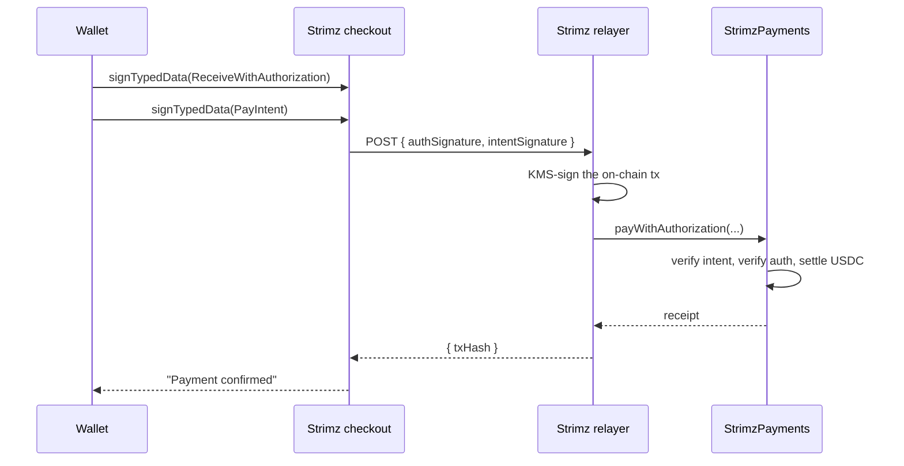

# Meta-tx flow

A one-shot payment or a subscription enrolment goes through two
off-chain signatures and one on-chain transaction. This page walks
through the primitive that makes that possible and exactly what the
wallet is signing.

## The pre-collapse flow (what we replaced)

A traditional on-chain checkout takes two transactions:

1. **`USDC.approve(strimzContract, amount)`.** The customer grants
   the contract permission to spend their USDC. This costs gas and
   produces a wallet prompt.
2. **`strimz.pay(merchantId, token, amount, ref)`.** The contract
   pulls the USDC and settles it. Second wallet prompt, second gas
   payment.

For payers who don't use crypto every day, the second prompt is where
checkout abandonment happens. Two prompts also means two opportunities
for the network to slow down, fail, or confuse the wallet's nonce
ordering.

## What Strimz does instead

USDC and EURC support signature schemes that let a third party submit
the transaction on the customer's behalf, as long as the customer's
signature authorises it. Strimz's relayer turns the signatures into
the on-chain transaction. The customer never broadcasts.

Every meta-tx flow needs a second signature. That signature is a
Strimz-native **intent**. It pins the merchant id and every other
routing field the token signature does not cover. Without it, an
intercepted token signature could be replayed against a different
merchant.

| Flow                   | Token signature                         | Strimz intent            | Used for                   |
| ---------------------- | --------------------------------------- | ------------------------ | -------------------------- |
| One-shot payment       | **EIP-3009** `ReceiveWithAuthorization` | `PayIntent`              | `/pay/:sessionId` checkout |
| Subscription enrolment | **EIP-2612** `Permit`                   | `SubscriptionIntent`     | `/sub/:planId` checkout    |

The token standards are not a Strimz invention. Circle's USDC
implements both natively. Strimz signs the token message and its own
intent with the same wallet, then routes both signatures to the
relayer.

## What the customer actually signs

The wallet shows structured EIP-712 typed-data, not an opaque blob.
For a one-shot payment the wallet shows two prompts.

**Prompt 1. Token authorization (USDC domain):**

```
USDC ReceiveWithAuthorization
  from:          0xYourCustomerWallet
  to:            0xStrimzPaymentsContract
  value:         50000000               (= 50.00 USDC)
  validAfter:    1715000000             (signature valid after)
  validBefore:   1715000300             (signature expires)
  nonce:         0x... (32 random bytes)
```

**Prompt 2. Strimz PayIntent (StrimzPayments domain):**

```
StrimzPayments PayIntent
  merchantId:    137                    (the merchant receiving funds)
  token:         0xUsdcOnArc
  amount:        50000000
  nonce:         0x... (matches the auth nonce above)
  validBefore:   1715000300
  ref:           0x... (session reference)
```

Subscription enrolment shows the same two-prompt shape. First an
EIP-2612 `Permit` in the token domain, then a `SubscriptionIntent` in
the StrimzSubscriptions domain covering `merchantId`, `amount`,
`interval`, `startAt`, `endAt`, and the permit's own `deadline`. Every
modern EIP-712 wallet renders both prompts as human-readable fields.

## The signature's security model

Two independent checks run on-chain.

1. **Token side.** The token contract recovers the signer from the
   EIP-3009 or Permit signature and verifies it matches `auth.from` or
   `permitData.owner`. Strimz has no way to bypass this. USDC and EURC
   enforce it directly.
2. **Strimz side.** `StrimzPayments` and `StrimzSubscriptions` recover
   the signer from the intent signature and verify it matches the same
   address the token signature came from. The intent's `nonce` is the
   same nonce the token authorization burns, so the two signatures are
   cryptographically bound.

This means:

- **Strimz cannot move a customer's funds without both signatures.**
  The relayer holds no authority. It only submits the pair the
  customer minted in their wallet.
- **Signatures are single-use.** EIP-3009 tracks a random `nonce`
  per-authorizer. EIP-2612 tracks a monotonic per-owner nonce. Either
  gets burned on first successful use.
- **Signatures expire.** `validBefore` (EIP-3009) and `deadline`
  (EIP-2612) bound the validity window. The Strimz intent expires with
  its paired token signature. Checkout defaults to 5 minutes for
  one-shot payments and 24 hours for subscription enrolment.
- **The intent names the merchant.** `merchantId` is inside the
  intent's signed struct. An intercepted token signature paired with a
  fabricated intent fails on-chain because the recovered signer will
  not match the payer.

## What Strimz does after the signatures



The relayer's signing key lives in a KMS-backed signer. Software for
v1, hardware-backed once funded. The key only authorises Strimz to
spend its own gas. The contracts authorise the customer's signatures,
not the relayer's, so a relayer compromise costs Strimz some gas and
nothing else. Customer funds stay where they are.

## What this means for your integration

You don't write any of this. The hosted checkout handles it all. Your
integration is:

1. Server: `strimz.paymentSessions.create({ amount, currency, ... })`
   returns a `checkoutUrl`.
2. Send the customer to `checkoutUrl`.
3. Webhook fires `payment.completed` with the on-chain tx hash.

No wallet plumbing, no signature handling. If you are building a
custom checkout (not using the hosted one), the SDK exposes the
EIP-712 builders directly. See [`@strimz/sdk/eip712`](/docs/sdks).

## Why not just a normal `transfer`?

A customer can already send USDC straight to your wallet. No contract,
no signature, no Strimz. What you get from the meta-tx path is
everything happening around the transfer:

- The fee split (platform fee to FeeCollector, net to your payout)
  settles in the same atomic transaction.
- On-chain merchant identity is bound through the registry, which
  gives you multi-account reconciliation and sub-tenancy for resellers.
- Subscription primitives are first-class: per-period charges,
  idempotent attempt ids, cancellation gating.
- Webhook events correlate cleanly back to your application via
  session metadata.

The two-prompt UX is what the customer notices. The list above is
what turns the transfer into a billing product.
