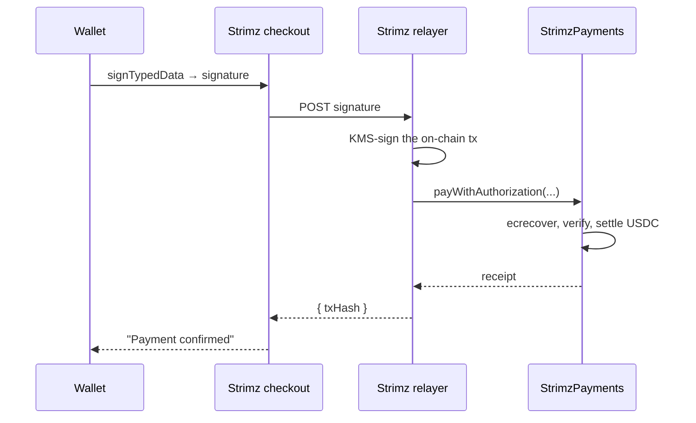

# Meta-tx flow

Strimz checkout asks the customer for one wallet prompt, whether
they're paying once or starting a subscription. This page walks
through the primitive that makes that possible and exactly what the
wallet is signing.

## The pre-collapse flow (what we replaced)

A traditional on-chain checkout takes two transactions:

1. **`USDC.approve(strimzContract, amount)`.** The customer grants
   the contract permission to spend their USDC. This costs gas and
   produces a wallet prompt.
2. **`strimz.pay(merchantId, token, amount, ref)`.** The contract
   pulls the USDC and settles it. Second wallet prompt, second gas
   payment.

For payers who don't use crypto every day, the second prompt is where
checkout abandonment happens. Two prompts also means two opportunities
for the network to slow down, fail, or confuse the wallet's nonce
ordering.

## What Strimz does instead

USDC and EURC natively support two signature schemes that let a third
party submit the transaction on the customer's behalf, as long as
the customer's signature authorises it. The customer signs once,
off-chain. Strimz's relayer turns the signature into the on-chain
transaction.

| Flow                   | Standard                                | Used for                   |
| ---------------------- | --------------------------------------- | -------------------------- |
| One-shot payment       | **EIP-3009** `ReceiveWithAuthorization` | `/pay/:sessionId` checkout |
| Subscription enrolment | **EIP-2612** `Permit`                   | `/sub/:planId` checkout    |

Neither is a Strimz invention. Both are Ethereum standards Circle's
USDC implements natively. Strimz routes the payer's signature into
them through its relayer instead of asking the wallet to send a
transaction.

## What the customer actually signs

The customer's wallet shows a structured message (EIP-712 typed-data),
not an opaque blob. For a one-shot payment the wallet displays:

```
USDC — ReceiveWithAuthorization
  from:          0xYourCustomerWallet
  to:            0xStrimzPaymentsContract
  value:         50000000               (= 50.00 USDC)
  validAfter:    1715000000             (signature valid after)
  validBefore:   1715000300             (signature expires)
  nonce:         0x… (32 random bytes)
```

For a subscription enrolment the wallet displays:

```
USDC — Permit
  owner:    0xYourCustomerWallet
  spender:  0xStrimzSubscriptionsContract
  value:    type(uint256).max           (unlimited allowance)
  nonce:    7                            (the customer's permit nonce)
  deadline: 1715086400                  (signature expires in 24h)
```

Wallets that support EIP-712 (every modern one does: MetaMask,
Rainbow, Coinbase Wallet, hardware wallets, Reown-connected mobile
wallets via QR) render this as human-readable fields. The customer
sees what they're signing.

## The signature's security model

The on-chain contract recovers the signer from the signature using
`ecrecover` and verifies it matches `auth.from` (3009) or
`permitData.owner` (2612). If the recovered address does not match,
the transaction reverts.

This means:

- **Strimz cannot move a customer's funds without their signature.**
  The relayer holds no authority to charge anyone. It only submits
  signatures the customer minted in their wallet.
- **Signatures are single-use.** EIP-3009 carries a random `nonce` the
  token tracks per-authorizer. EIP-2612 carries the customer's permit
  nonce which the token increments on every successful permit. A
  replayed signature reverts.
- **Signatures expire.** `validBefore` (EIP-3009) and `deadline`
  (EIP-2612) bound the validity window. Strimz uses 5 minutes for
  one-shot payments and 24 hours for subscription enrolment.
- **The signed message names the recipient.** `to` (3009) or
  `spender` (2612) must be the Strimz contract address. A signature
  Strimz routes cannot be redirected to a different recipient.

## What Strimz does after the signature



The relayer's signing key lives in a KMS-backed signer. Software for
v1, hardware-backed once funded. The key only authorises Strimz to
spend its own gas. The contracts authorise the customer's signature,
not the relayer's, so a relayer compromise costs Strimz some gas and
nothing else. Customer funds stay where they are.

## What this means for your integration

You don't write any of this. The hosted checkout handles it all. Your
integration is:

1. Server: `strimz.paymentSessions.create({ amount, currency, … })`
   → returns a `checkoutUrl`.
2. Send the customer to `checkoutUrl`.
3. Webhook fires `payment.completed` with the on-chain tx hash.

No wallet plumbing, no signature handling. If you're building a custom
checkout (not using the hosted one), the SDK exposes the EIP-712
builders directly. See [`@strimz/sdk/eip712`](/docs/sdks).

## Why not just a normal `transfer`?

A customer can already send USDC straight to your wallet. No
contract, no signature, no Strimz. What you get from the meta-tx
path is everything happening around the transfer:

- The fee split (platform fee to FeeCollector, net to your payout) settles in the same atomic transaction.
- On-chain merchant identity is bound through the registry, which gives you multi-account reconciliation and sub-tenancy for resellers.
- Subscription primitives are first-class: per-period charges, idempotent attempt ids, cancellation gating.
- Webhook events correlate cleanly back to your application via session metadata.

The single-signature UX is what the customer notices. The list above
is what turns the transfer into a billing product.
