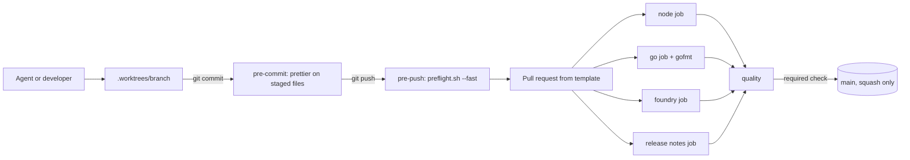

# ADR: AI governance and engineering standards

- **Status:** Accepted (merged in #105; zero-warning lint switched on in #106)
- **Date:** 2026-09-29
- **Scope:** repository tooling, CI, docs, and contributor rules. No runtime behaviour
  changes. The only source edit is `gofmt` whitespace in two indexer config files.

## Context

- Strimz is a polyglot monorepo: pnpm + Turborepo TypeScript workspaces, a Go indexer,
  and Foundry contracts. It moves money on Arc and is heading to an Arc mainnet launch.
- A full review of `main` at `729e4d7` found defects that a rulebook targets directly:
  producer and consumer drift across services (API enqueues agent-action jobs without
  the `type` field the scheduler parses), non-idempotent event projections, mainnet
  placeholders that silently reuse testnet addresses, and docs that describe code that
  does not exist.
- Contributors now include AI agents working in parallel with human developers. There
  is no `AGENTS.md`, `CLAUDE.md`, ADR practice, release-note practice, or local gate
  beyond pre-commit prettier.
- CI already has `node`, `go`, and `foundry` jobs, and `main` branch protection
  requires those three check names, squash merge only, and branch deletion on merge.
- Measured baseline on a clean `main` worktree: build, typecheck, and all tests pass
  (126 Foundry tests, Go unit tests, all Vitest suites). Prettier passes. ESLint has 0
  errors and about 600 warnings (api 271, scheduler 98, agent 87, web 65, others 7).
  `gofmt` flags two indexer files.

## Decision

1. Add `AGENTS.md` as the single rulebook for every agent and human, with five
   directives: worktree isolation, a two-ADR human approval gate, red-green bug fixing,
   no error swallowing, and a mandatory preflight. `CLAUDE.md` is one line,
   `@AGENTS.md`.
2. Add `.claude/skills/strimz-engineering-standards/SKILL.md` with the architecture
   (layer diagram, import direction, the cross-service contract table), correctness,
   contracts, frontend, comments, git, and tooling rules.
3. Add `scripts/preflight.sh`, one entry point for five gates across all three stacks:
   prettier and gofmt, ESLint and `go vet`, `tsc`, Vitest plus `go test` plus
   `forge test`, and the turbo plus `forge build` production build. `--fast` skips the
   build. Missing toolchains fail the run rather than skipping a gate.
4. Keep lefthook (already installed through `pnpm install`) instead of adding husky.
   Pre-commit keeps prettier on staged files; a new pre-push hook runs
   `./scripts/preflight.sh --fast`.
5. Add `scripts/check_release_notes.sh` and a `release notes` CI job that fails a pull
   request touching `apps/`, `packages/`, `infra/`, or a Dockerfile without a new file
   under `docs/release-notes/`. Dependency manifests and changelogs are exempt so
   Dependabot and changesets version PRs pass.
6. Add a `gofmt` step to the CI `go` job so CI and the preflight run the same checks.
7. Add a `quality` CI job that depends on `node`, `go`, `foundry`, and
   `release notes`, and fails if any of them failed or was cancelled. Existing job
   names are unchanged, so current branch protection keeps working until the
   maintainer switches the required check to `quality`.
8. Add `.github/pull_request_template.md` and `docs/{adr,plans,release-notes,scenarios,archive}`
   with templates.
9. Gitignore `.worktrees/`, root `/*.sh` ship scripts, and `.env*` while keeping every
   `*.env.example` tracked. Prettier ignores `.worktrees`.
10. Zero-warning lint is the rule, but it is not switched on in this PR. The roughly
    600 existing warnings are cleared in a separate `chore/lint-zero-warnings` PR,
    which also adds `--max-warnings 0` to every package's `lint` script and resolves
    the existing `forge build` lint notes (unsafe `uint96` casts in
    `StrimzSubscriptions.sol`). Until then
    the lint gate fails on errors only.

## Diagram

## Consequences

- Every push runs lint, typecheck, and all tests locally, about a few minutes on a warm
  turbo cache. Pushing needs Node, Go, and Foundry installed.
- Non-trivial work pauses for ADR approval. This slows starts and prevents building
  the wrong thing, which the review showed is the more expensive failure.
- Every app change carries a release note, which gives a changelog for the launch.
- Branch protection can later require only `quality`, so adding a job no longer
  requires a settings change.
- Until the zero-warning PR lands, warnings can still grow. That PR should land before
  Phase 1 fixes start.

## Alternatives considered

- **husky + lint-staged, as in the source guide.** Lost: lefthook is already installed
  and wired through `pnpm install`; two hook managers would conflict over
  `.git/hooks`.
- **Split the node job into checks, tests, and build jobs.** Lost: each would repeat
  the install and the `^build` dependency chain, adding minutes for no new signal. The
  existing Node, Go, and Foundry split already parallelises by stack.
- **Rename jobs and require only `quality` in this PR.** Lost: renaming breaks the
  three required checks and would block every open PR until protection is edited.
- **Enforce zero warnings now and fix the 600 warnings here.** Lost: it mixes a large
  code cleanup into a tooling PR and violates the rule that pre-existing failures get
  their own PR.

## Verification

- `./scripts/preflight.sh` passes in this worktree.
- `bash scripts/check_release_notes.sh` passes on this branch and warns on a branch
  with an app change and no note.
- On the PR, CI shows `node`, `go`, `foundry`, `release notes`, and `quality`, all
  green.
- After merge, the maintainer runs the branch-protection command in the release note
  to require `quality`, then confirms `git push` from a new branch runs the fast
  preflight.
