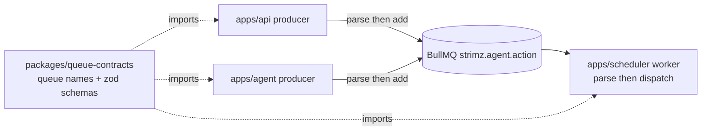

# ADR: One shared package for BullMQ queue names and job payloads

- **Status:** Accepted 2026-09-30
- **Date:** 2026-09-30
- **Scope:** new private workspace package `packages/queue-contracts`; `apps/api`,
  `apps/scheduler` and `apps/agent` import it. No database, contract, webhook or public
  API change.

## Context

- The scheduler parses every `strimz.agent.action` job with a zod discriminated union
  on `data.type` (`apps/scheduler/src/infra/queue/job-payloads.ts`).
- The API enqueues those jobs without a `type` field: `subscription.cancel-onchain` in
  `subscriptions.service.ts` and `job.create-onchain` in `agents.service.ts`. The type
  is passed as the BullMQ job name, which the worker does not read.
- Every such job fails validation in the worker. Merchant cancellations never reach the
  chain and approved agent jobs never fund their escrow. Issue #111.
- The agent app keeps its own copy of the `routing.cctp.settle` arm and its own copy of
  the queue names. Three apps hold three definitions of one contract.
- The engineering standards already require one zod schema imported by both sides of a
  job payload. The end-to-end suites did not catch this because the API suite stubs the
  queue and the scheduler suite hand-builds well-formed payloads.

## Decision

1. Create `packages/queue-contracts` (`@strimz/queue-contracts`, private, not
   published). It holds the queue names and the zod schemas and inferred types for every
   BullMQ payload: agent action, webhook delivery, subscription due, CCTP bridge. It
   depends on `zod` only.
2. The API, scheduler and agent import names and schemas from that package. The
   per-app copies are deleted.
3. Producers validate before they enqueue. A typed `enqueue` helper in each producer
   app parses the payload with the schema, so a malformed job fails at the call site
   with a clear error instead of in the worker.
4. The API sends the `type` field in every agent-action payload. The BullMQ job name
   stays equal to `type`.
5. Contract tests:
   - In the package: one fixture per job arm parses, and one malformed fixture per arm
     is rejected.
   - API e2e: the stub queue records payloads, and the cancel and agent-job tests parse
     what was recorded with the shared schema.
   - Scheduler e2e: the agent-action worker consumes the exact payload shape the API
     builds, taken from the same fixtures.

## Diagram

## Consequences

- Adding a job arm means editing one file and one fixture. Both sides fail to compile
  or to test until they agree.
- One more workspace package to build. It is tiny and its only runtime dependency is
  `zod`, which every app already has.
- Jobs already sitting in Redis without a `type` are not repaired. They are invalid
  today and stay invalid. The affected rows are cancelled subscriptions with no on-chain
  cancel and accepted agent jobs with no escrow; both are already tracked under #122.

## Alternatives considered

- **Put the schemas in `@strimz/shared-types`.** Lost: that package is published to
  npm for merchants. Queue payloads are internal and would become public API.
- **Import the scheduler's file from the API.** Lost: apps never import other apps.
- **Fix the two call sites and leave three copies.** Lost: the same drift happens again
  the next time an arm changes.

## Verification

- The two API e2e tests fail on `main` once they parse the recorded payload, and pass
  with the change.
- `pnpm exec turbo run typecheck` covers the three apps against the shared types.
- On testnet: cancel a subscription from the dashboard and confirm the on-chain cancel
  transaction; approve an agent job and confirm the escrow funding transaction.
