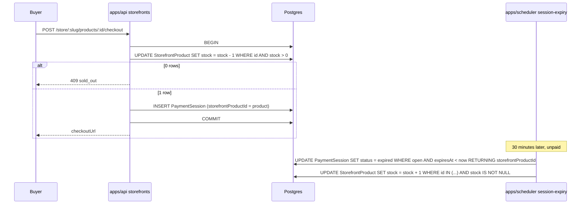

# ADR: Reserve storefront stock per session and link subscription products to a plan

- **Status:** Accepted 2026-09-30
- **Date:** 2026-09-30
- **Scope:** `packages/db` (one migration on `PaymentSession`), `packages/shared-types`
  and `@strimz/sdk` (one optional field on a published input schema), `apps/api`
  (storefront checkout, product create, session cancel and expire), `apps/scheduler`
  (session expiry cron), `apps/web` (dashboard product form). No contract, indexer,
  queue payload or webhook payload change.

## Context

- `StorefrontProduct.stock` is a nullable integer. `null` means unlimited.
- Public checkout (`checkoutFromProduct`) reads the product, rejects when
  `stock <= 0`, creates a live `PaymentSession`, then runs an unconditional
  `stock - 1`. The read and the decrement are separate statements, so two buyers of
  the last unit both pass the gate and the row lands at `-1`. A session that expires
  or is cancelled never gives the unit back, so abandoned checkouts sell out a product
  that nobody bought. Issue #124, part 2.
- The session is linked to the product only through the merchant-supplied `metadata`
  JSON bag (`source`, `productId`). Nothing in the scheduler or the API reads it, and a
  merchant can put the same keys on any session.
- Sessions leave the open set (`created`, `awaiting_payment`) in three places: the API
  cancel and expire endpoints, the scheduler's session-expiry cron, and the relay
  processor when it broadcasts (`submitted`). The indexer confirms a session from any
  status except `confirmed`, including `expired`.
- `createStorefrontProductInputSchema` in `@strimz/shared-types` omits `planId`. The
  API never sets it, so every subscription product is created without a plan and every
  checkout of one returns 400 `invalid_request`. The dashboard form sends
  `type: 'subscription'` with a fixed monthly interval and no plan. Issue #124, part 3.
- `SubscriptionPlan` already carries amount, currency, interval and interval count per
  merchant. A storefront subscription product duplicates those four fields.

## Decision

### Stock

1. Add `PaymentSession.storefrontProductId String?` with a relation to
   `StorefrontProduct` (`onDelete: SetNull`) and an index. One migration.
2. Checkout reserves the unit and creates the session in one transaction. The
   reservation is a single conditional statement:
   `UPDATE "StorefrontProduct" SET stock = stock - 1 WHERE id = $1 AND stock > 0`
   for finite stock, skipped for unlimited stock. Zero rows updated means sold out and
   the request returns 409 `sold_out` before any session exists. Stock can no longer
   go below zero.
3. A reserved unit is released exactly once, when its session leaves the open set
   without a payment. The release runs in the same transaction as the status flip, so
   it happens if and only if the flip happens:
   - API `cancel` and `expire`: the conditional status update from this branch's
     sibling PR gains `stock + 1` on the linked product when it updates one row.
   - Scheduler session-expiry cron: the `RETURNING` clause adds
     `storefrontProductId`, and the same transaction increments stock for each
     returned product that has finite stock.
4. A `submitted` session keeps its unit. It has a broadcast transaction that may still
   confirm. A `confirmed` session keeps its unit: the sale happened.
5. Not handled: a payment that confirms after the session expired. The indexer already
   confirms such a session, and the unit was released at expiry. The product is
   oversold by one and the merchant sees it as stock one higher than reality. This is
   the same outcome as today for any late payment, and it needs the indexer to learn
   about storefront products, which is a separate decision.
6. `StorefrontCheckoutResponse` is unchanged. The sold-out error code changes from
   `invalid_request` to `sold_out` so the store page can say so.

### Plan link

7. `createStorefrontProductInputSchema` gains `planId: idSchema.optional()` with a
   refinement: `type === 'subscription'` requires `planId`; `type === 'one_time'`
   forbids it. Published in `@strimz/shared-types`; `@strimz/sdk` re-exports the
   type. One changeset, minor for both.
8. `createProduct` in the API resolves the plan and rejects with 400
   `invalid_request` when the plan does not belong to the merchant, is not `active`,
   or its `amount`, `currency`, `interval` or `intervalCount` differ from the product
   input. The plan is the source of truth for what the buyer pays; the product carries
   copies for display and the two must agree at creation.
9. The dashboard product form, when the type is subscription, shows a required plan
   picker fed by the merchant's active plans, prefills price, currency and interval
   from the chosen plan, and sends `planId`. The picker is labelled `(required) *`.
10. `archiveProduct` and `retrieveProduct` are unchanged. Editing a product's plan is
    out of scope; archive and recreate.

## Diagram

## Consequences

- The store shows "Only N left" as units not currently reserved by an open checkout.
  During a rush the number dips while buyers are in checkout and recovers as sessions
  expire. This is the honest number.
- The reservation window equals the session lifetime, 30 minutes for storefront
  sessions. A merchant who wants a shorter hold changes one constant in the API.
- The cancel and expire paths in the API and the scheduler each gain one statement in
  an existing transaction. No new job, no new cron.
- Merchants who created subscription products through the SDK with no plan today have
  products that never worked. They are not migrated; the merchant archives them and
  creates new ones with a plan.
- `PaymentSession` grows one nullable column. Every other session leaves it null.

## Alternatives considered

- **Decrement stock only when the payment confirms.** Lost: many buyers can start
  checkout for one unit and all of them can pay, since the chain does not know the
  stock. The merchant then refunds by hand.
- **Compute availability as `stock - count(open sessions)` and never write stock.**
  Lost: it needs a count query on every store page render and a lock on the product
  row at checkout to be race-free, and the `stock` column changes meaning from
  "remaining" to "total listed", which breaks the dashboard's stock editor.
- **Keep the link in `metadata` JSON instead of a column.** Lost: the scheduler would
  match on a merchant-editable JSON key, and a merchant could inflate their own stock
  by putting `productId` on unrelated sessions. A column with a foreign key cannot
  point at another merchant's product by accident.
- **Auto-create a `SubscriptionPlan` from the product's interval and price.** Lost:
  it creates orphan plans the merchant did not ask for and hides the plan the buyer
  actually subscribes to.
- **A discriminated union input (`one_time` fields vs `subscription` fields).** Lost:
  a larger public API change for the same outcome. Can follow later without breaking
  anything this ADR ships.

## Verification

- API e2e, all failing on `main`:
  - two concurrent checkouts of a product with `stock: 1` yield one 201 and one 409,
    and stock is 0, not -1;
  - cancelling and expiring a storefront session each return the unit once; a second
    cancel returns 403 and does not touch stock;
  - a session with unlimited stock leaves stock `null` on reserve and release;
  - creating a subscription product without `planId` returns 400; with another
    merchant's plan returns 400; with a matching own plan returns 201 and checkout of
    that product returns the plan's checkout URL.
- Scheduler e2e: the expiry sweep returns the unit of an expired storefront session
  and leaves a non-storefront session's product untouched.
- Web: the product form unit test covers the plan picker being required for
  subscription products.
- On testnet after deploy: create a product with stock 2, start two checkouts, let
  one expire, confirm the store shows 1 left then 2 left.
