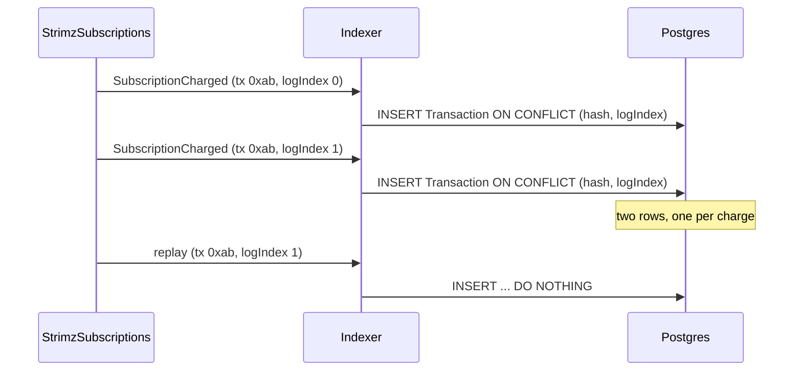

# ADR: Key `Transaction` rows by transaction hash and log index

- **Status:** Accepted 2026-09-30
- **Date:** 2026-09-30
- **Scope:** `packages/db` (one migration on `Transaction`), `apps/indexer` (two insert
  statements). No API, scheduler, agent, web or contract change.

## Context

- `Transaction.onchainTxHash` is `@unique`. The indexer inserts one-shot payments and
  subscription charges with `ON CONFLICT ("onchainTxHash") DO NOTHING`, which is how
  replays stay idempotent.
- `StrimzSubscriptions.batchCharge` charges up to `SUBSCRIPTION_BATCH_SIZE`
  subscriptions in one transaction. It emits one `SubscriptionCharged` event per
  subscription, all with the same transaction hash and different log indexes.
- The first event in a batch gets a `Transaction` row. Every later one hits the unique
  key and is silently dropped. Its `SubscriptionCharge` row is written, the period
  advances, and the `subscription.charged` webhook is emitted with a reference to a
  transaction that does not exist, so the outbox dispatcher fails to hydrate it.
- The Arc testnet scheduler batches charges today, so this is live data loss. Issue #110.
- Nothing in the API, scheduler, agent or web looks a transaction up by hash alone. The
  Prisma client's `findUnique` by `onchainTxHash` is not used anywhere.
- The repository rule for projections is idempotency on `(txHash, logIndex)`.

## Decision

1. Add a Prisma migration that drops the unique constraint on
   `Transaction.onchainTxHash` and adds a unique constraint on
   `(onchainTxHash, logIndex)`. A non-unique index on `onchainTxHash` is kept for
   lookups by hash. Applied migrations are not edited.
2. Change both indexer inserts to `ON CONFLICT ("onchainTxHash", "logIndex") DO NOTHING`.
   Replays of the same event stay no-ops. Distinct events in one transaction each get a
   row.
3. Do not backfill. Rows dropped before this change cannot be rebuilt from the
   database. They can be rebuilt by resetting the Payments and Subscriptions cursors to
   the deployment block, because every projection is idempotent. Whether to run that
   replay on the testnet deployment is a separate operational decision.
4. Add a store test: two `SubscriptionCharged` events with one hash and log indexes 0
   and 1 produce two `Transaction` rows and two `subscription.charged` events; replaying
   either event adds nothing.

## Diagram

## Consequences

- A transaction hash no longer identifies one `Transaction` row. Future code that needs
  "the" row for a hash must also know the log index or accept a list.
- Refund completion is unaffected. It keys on `Refund.refundTxHash`, a different table.
- The migration touches an index only. It is fast at the current row counts.

## Alternatives considered

- **Keep the unique hash and aggregate a batch into one `Transaction` row.** Lost: a
  row carries one amount, one customer and one charge id, and the dashboard shows one
  line per charge.
- **Key on `(onchainTxHash, subscriptionChargeId)`.** Lost: one-shot payments have no
  charge id, so the two insert paths would need different keys. The log index is the
  chain's own identity for an event and covers both.

## Verification

- The new store test fails on `main` and passes with the change.
- `prisma migrate deploy` applies on the e2e databases in CI, where every suite already
  runs the migrations.
- After deploy on testnet: run one batch with two due subscriptions and confirm two
  `Transaction` rows share the hash.
