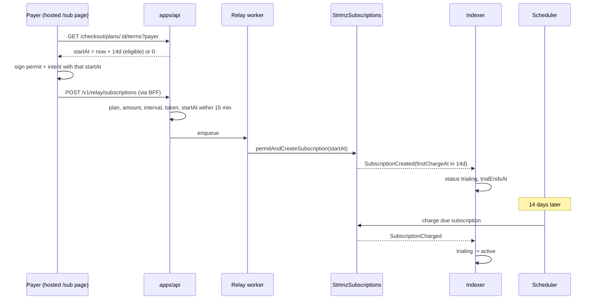

# ADR: Honour plan trial periods at enrolment and verify enrolment terms in the relay

- **Status:** Accepted 2026-10-02
- **Date:** 2026-10-02
- **Scope:** `packages/shared-types` and `@strimz/sdk` (one public response schema and one
  browser-client method), `apps/api` (public checkout endpoint, relay enrolment checks),
  `apps/web` (hosted subscribe page), `apps/indexer` (status and trial dates on
  `SubscriptionCreated`, trial ends on first charge), `apps/scheduler` (due sweep includes
  trialing subscriptions). No contract, migration, queue payload or webhook payload
  change.

## Context

- `SubscriptionPlan.trialPeriodDays` is stored and returned by the API but read nowhere
  in the relay, scheduler, indexer or web.
- `StrimzSubscriptions.permitAndCreateSubscription` takes a `startAt`. `0` means "charge
  now"; a future value makes the first charge due then. `startAt` is part of the
  payer-signed `SubscriptionIntent`, so it must be chosen before the payer signs and
  cannot be changed by the server afterwards. A past value reverts.
- The hosted subscribe page passes no `startAt`, and `useSubscriptionCheckout` defaults
  it to `0`. Every enrolment, trial plan or not, is charged at once. Issue #115.
- `POST /v1/relay/subscriptions` checks only that the wallet has no active subscription
  to the plan. It does not compare amount, interval, token, merchant or `startAt` with
  the plan named in `subscriptionInternalId`.
- The indexer writes every new subscription as `active` with
  `currentPeriodStartAt = nextChargeAt = startAt`, and never sets `trialEndsAt`. The
  `trialing` status and `trialEndsAt` column exist but are never written.
- The scheduler's due sweep selects only `active` and `at_risk`.

## Decision

1. **Terms come from the server.** New public endpoint
   `GET /checkout/plans/:id/terms?payer=0x…` returns
   `{ startAt: string, trialDays: number, trialEndsAt: string | null }`, computed from
   the server clock at request time. `startAt` is unix seconds, `"0"` when there is no
   trial. The response schema lives in `@strimz/shared-types`; `StrimzBrowserClient`
   gains `checkout.planTerms(planId, payer)`. One changeset, minor for both packages.
2. **One trial per payer per plan.** A payer gets the trial when
   `trialPeriodDays > 0` and they have no earlier `Subscription` on that plan in any
   status. Otherwise `startAt` is `0`. This stops cancel-and-resubscribe from repeating
   the trial.
3. **The hosted page signs those terms.** After the wallet connects, the subscribe page
   fetches the terms, shows "N-day free trial, first charge on DATE" or "charged
   today", and passes `startAt` to `useSubscriptionCheckout`. If the relay rejects the
   terms as stale, the page fetches fresh terms and asks the payer to sign again.
4. **The relay verifies terms against the plan.** When `subscriptionInternalId` is set,
   `POST /v1/relay/subscriptions` requires, before enqueueing:
   - the plan belongs to the calling merchant and is `active`;
   - `merchantId` is the merchant's on-chain id, `token` is the plan currency's token,
     `amount` equals the plan amount, `interval` equals the plan's interval in seconds,
     and `endAt` is `0`;
   - `startAt` is `0` when the payer is not trial-eligible, and otherwise within 15
     minutes of `now + trialPeriodDays` days.
     Any mismatch returns 400 `enrolment_terms_mismatch` naming the fields, and nothing
     is enqueued. Requests without `subscriptionInternalId` are unchanged: they are a
     merchant's own integration with its own terms, signed by the payer.
5. **The indexer records trials.** When `SubscriptionCreated` has a first charge later
   than the block timestamp, the row is written as `trialing` with
   `trialEndsAt = firstChargeAt`, `currentPeriodStartAt = block timestamp` and
   `currentPeriodEndAt = firstChargeAt`. Otherwise it is written as today. The first
   successful `SubscriptionCharged` moves `trialing` to `active`.
6. **The scheduler charges trials when they end.** The due sweep selects `trialing` as
   well as `active` and `at_risk`. Whether a charge is due is still decided by
   `nextChargeAt` and the on-chain check, so nothing is charged early.

## Diagram

## Consequences

- Trial plans stop charging at enrolment. The first charge happens when the trial ends.
- A payer who sits on the signature prompt for more than 15 minutes is asked to sign
  again. That is the price of the relay checking the trial length.
- Merchants calling `POST /v1/relay/subscriptions` with a `subscriptionInternalId` and
  terms that differ from the plan now get 400 instead of an enrolment the plan does not
  describe. The hosted page always sends matching terms.
- Trial eligibility uses `Subscription.planId`, which the indexer assigns by matching
  amount, currency and interval. Two plans with identical terms on one merchant can
  share history. That matching is unchanged here.
- Subscriptions already enrolled on trial plans were charged at once and are not
  refunded or adjusted automatically. The release note says how to find them.
- The terms endpoint is public and takes a wallet address. It reveals only whether that
  wallet has subscribed to that plan before, which the existing public
  `/plans/:id/subscription` endpoint already reveals for active subscriptions.

## Alternatives considered

- **Compute `startAt` in the browser from `trialPeriodDays`.** Lost: the payer's clock
  decides the trial length, and the relay cannot tell a skewed clock from a tampered
  value without the same tolerance check anyway.
- **Change the contract to take a trial length instead of a start time.** Lost: a
  contract change and redeploy for something the existing `startAt` already expresses.
- **Allow a trial on every enrolment.** Lost: a payer could cancel during the trial and
  resubscribe forever without paying. The rule can be loosened per plan later.
- **Keep `active` for trials and only set `trialEndsAt`.** Lost: the dashboard and
  webhooks already understand `trialing`, and merchants need to tell paying customers
  from trialists.

## Verification

- Red first, all failing on `main`:
  - API e2e: the terms endpoint returns `now + trial` for a new payer on a trial plan,
    `0` for a returning payer, `0` for a plan without a trial; the relay rejects
    `startAt = 0` on a trial plan for an eligible payer, a `startAt` outside the
    window, and a wrong amount or interval, and accepts matching terms.
  - Indexer store e2e: a `SubscriptionCreated` with a future first charge is written as
    `trialing` with the trial dates; the first charge moves it to `active`.
  - Scheduler e2e: a `trialing` subscription whose `nextChargeAt` has passed is picked
    up by the due sweep, and one still in trial is not.
  - shared-types: the terms schema accepts a valid response and rejects a non-numeric
    `startAt`.
- On testnet after deploy: subscribe to a plan with a 1-day trial and confirm no charge
  at enrolment, `trialing` in the dashboard, and one charge the next day.
