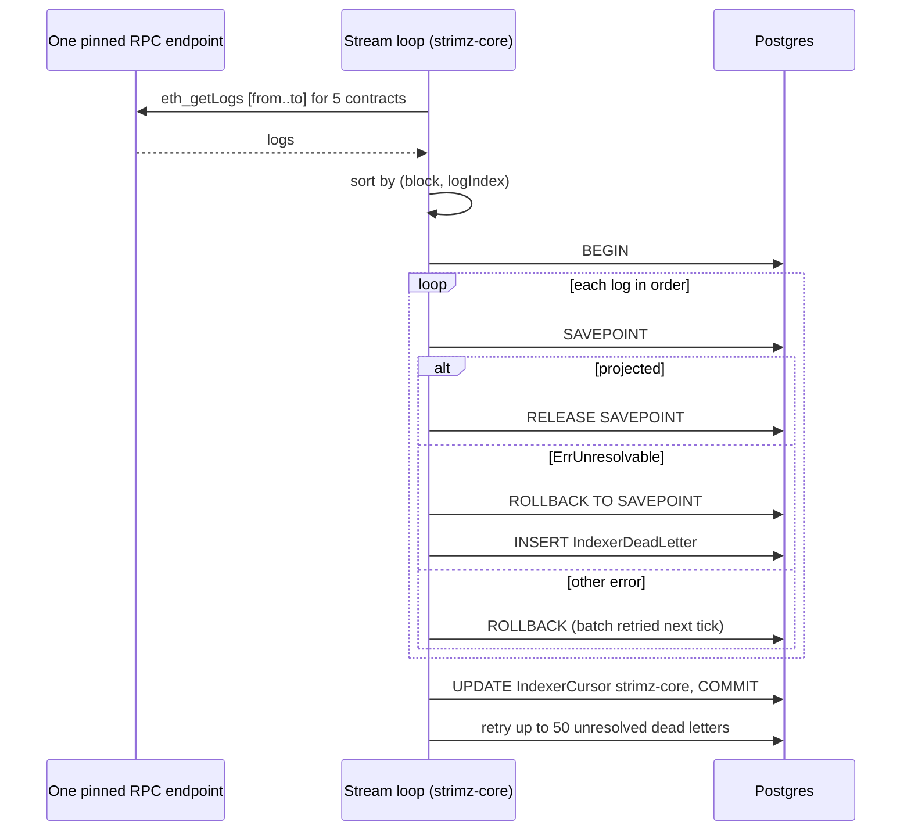

# ADR: Index the Strimz contracts as one ordered stream and park unprojectable logs

- **Status:** Accepted 2026-10-02
- **Date:** 2026-10-02
- **Scope:** `apps/indexer` (runner, projector, store, RPC client, health), `packages/db`
  (one migration adding `IndexerDeadLetter`). No contract, API, scheduler, web, queue
  payload or webhook payload change.

## Context

- The runner starts one polling loop per contract (Registry, Payments, Subscriptions,
  AgentEscrow, FeeCollector), each with its own `IndexerCursor`. The loops do not wait
  for each other. A heavy backfill on one contract never slows the others, but nothing
  guarantees that an event is projected after the events it depends on.
- When the Payments loop runs ahead of the Registry loop, `PaymentExecuted` for a
  merchant whose `MerchantRegistered` has not been projected yet returns `ErrSkipLog`.
  The runner logs it and advances the cursor. The payment is lost until someone resets
  the cursor by hand.
- `SubscriptionCreated` for a merchant not yet linked returns a plain error. The
  Subscriptions loop retries the same batch every tick and makes no progress until the
  Registry loop catches up. If the merchant never links, the loop is stuck for good.
- `InsertSubscriptionCharge` and `InsertSubscriptionChargeSkip` return success with no
  write when the subscription row is missing. `LogAgentJobEvent` and `LogFeeAccrued`
  do the same for a missing job or merchant. The cursor advances and nothing records
  that an event was dropped.
- `Projector.Apply` returns success on a decode failure for a topic the indexer owns.
- `FailoverClient` picks an endpoint per call. One batch can read logs from one node and
  block hashes and timestamps from another, which defeats the reorg check the batch
  hash exists for.
- A batch runs in one database transaction with no savepoints. A projection that fails
  after some statements leaves the transaction aborted, so the only options today are
  to fail the whole batch or to skip before writing anything.
- Indexer audit rows (`AuditLog`) carry no dedupe key, so replaying a range writes them
  twice.
- Issue #118.

## Decision

1. **One ordered stream for the Strimz contracts.** A single loop fetches the logs of
   all five Strimz contracts for a block range in one `eth_getLogs` call, sorts them by
   `(blockNumber, logIndex)`, and projects them in that order in one transaction with
   one cursor, stored in `IndexerCursor` under the key `strimz-core`. Every event is
   projected after every event the chain emitted before it, so a registration is always
   linked before a payment that names it. The stablecoin `Transfer` loops stay separate:
   they only complete refunds by transaction hash and do not depend on contract events.
2. **Cutover without replaying.** On the first run with no `strimz-core` cursor, the
   stream starts at the lowest of the five existing contract cursors plus one. Until it
   passes the highest of them, it drops any log from a contract whose old cursor already
   covers that block. Nothing is projected twice, so the non-idempotent audit rows are
   not duplicated. The old cursor rows are left in place, untouched, so a rollback to
   the previous release resumes where it was.
3. **Unprojectable logs are parked, never dropped.** A new `IndexerDeadLetter` table
   holds `environment`, `contractAddress`, `txHash`, `logIndex`, `blockNumber`,
   `blockTimestamp`, the raw `topics` and `data`, `reason`, `attempts`, `createdAt` and
   `resolvedAt`, unique on `(txHash, logIndex)`. Each log is projected inside its own
   savepoint. If the projection fails with an unresolvable error, the savepoint is rolled
   back, the log is written to `IndexerDeadLetter` in the same batch transaction, and
   the stream moves on. Any other error fails the batch and the cursor stays put, as
   today.
4. **What counts as unresolvable.** `ErrSkipLog` is renamed `ErrUnresolvable` and is
   returned, instead of a silent success or a plain error, by:
   - `PaymentExecuted` and `SubscriptionCreated` for an on-chain merchant with no linked
     row;
   - `SubscriptionCharged`, `SubscriptionChargeSkipped`, `SubscriptionCancelled` for an
     unknown subscription;
   - agent job events for an unknown job, and `FeeAccrued` for an unlinked merchant;
   - a log on an owned topic that fails to decode, and a token the indexer has no
     symbol for.
     Database, RPC and context errors are never unresolvable.
5. **Parked logs are retried.** After each successful batch, the stream retries up to 50
   unresolved dead letters, oldest first, each in its own savepoint. Success sets
   `resolvedAt`; failure increments `attempts`. A merchant linked later by the API, or a
   decode fixed by a new release, clears its letters without a cursor reset. Retried
   logs apply after later events, which every projection tolerates because each is
   idempotent and keyed on its own transaction and log index.
6. **One RPC endpoint per batch.** `FailoverClient` gains a pinned session. Every RPC
   call for one batch (logs, block timestamps, batch hash) goes to the same endpoint. An
   error fails the batch; the next attempt starts on the next endpoint.
7. **Health shows parked logs.** `/readyz` keeps returning 200 while fresh, with
   `{"status":"degraded","dead_letters":N}` when unresolved letters exist, so an
   orchestrator does not restart a healthy process but monitoring can alert. Each new
   dead letter is logged at error with its reason.

## Diagram

## Consequences

- Payments, subscriptions and charges can no longer be lost or wedged by one contract
  running ahead of another.
- A backfill of one contract now moves at the pace of the whole stream. At Strimz
  volumes one `eth_getLogs` over five addresses costs about the same as one over a
  single address.
- Every event that cannot be projected is visible in one table and on `/readyz`, and
  most clear themselves once the missing data appears.
- The freshness monitor watches the `strimz-core` cursor and the stablecoin cursors
  instead of five contract cursors.
- One migration adds a table. Nothing existing changes shape.

## Alternatives considered

- **Keep per-contract loops and make Payments and Subscriptions wait for the Registry
  cursor.** Lost: it needs a dependency graph between loops that must be kept in step
  with every new event, and still leaves agent and fee events racing.
- **Halt the stream on an unresolvable log.** Lost: one orphan payment would stop every
  later payment, charge and refund until a person intervened.
- **Replay from the lowest cursor at cutover and rely on idempotency.** Lost: the
  indexer's audit rows are not idempotent and would be written twice.
- **A separate CLI to replay dead letters.** Lost for now: automatic retry covers the
  common case of data arriving late. A CLI can be added if letters ever need manual
  editing.

## Verification

- Red first, failing on `main`:
  - Store e2e: `PaymentExecuted` and `SubscriptionCreated` before their merchant is
    linked, in one ordered batch with the `MerchantRegistered` after them in a later
    block, are projected once the registration lands; a charge for an unknown
    subscription produces a dead letter, not a silent success; a dead letter clears on
    retry once its row exists.
  - Runner tests with a fake chain: logs from two contracts in one range are applied in
    `(block, logIndex)` order regardless of fetch order; a failing projection that is
    not unresolvable leaves the cursor unchanged; cutover drops logs already covered by
    an old contract cursor and applies the rest.
  - Chain client test: a pinned session sends every call to one endpoint and does not
    fail over mid-batch.
  - Health test: `/readyz` reports `degraded` with the count.
- `prisma migrate diff` against a fresh database shows no drift.
- On testnet after deploy: confirm the `strimz-core` cursor appears at the lowest old
  cursor and catches up, and that `/readyz` reports `ready` or `degraded` with a count
  that matches `IndexerDeadLetter`.
