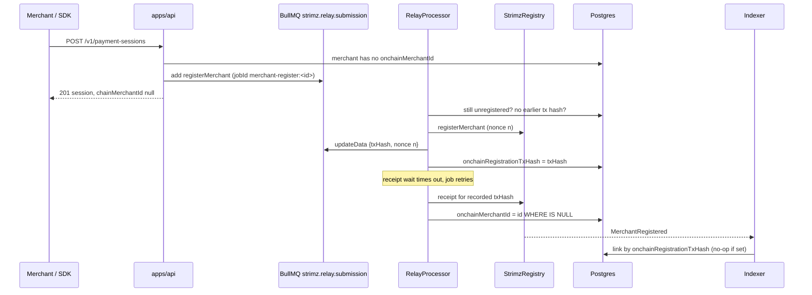

# ADR: Register merchants on chain through the relay queue, broadcasting each job once

- **Status:** Accepted 2026-10-02
- **Date:** 2026-10-02
- **Scope:** `packages/db` (one migration on `Merchant`), `packages/queue-contracts`
  (relay job schema with a new arm), `apps/api` (merchant chain service, relay worker,
  session, plan, invoice and onboarding call sites), `apps/indexer` (how
  `MerchantRegistered` links to a merchant), `apps/web` (hosted checkout polls while
  the merchant is not ready). No contract, webhook payload or published-package
  change.

## Context

- `MerchantChainService.ensureRegistered` runs inside `POST /v1/payment-sessions`,
  `POST /v1/subscription-plans` and `POST /v1/invoices`. On first use it signs
  `registerMerchant`, broadcasts it, waits up to 60 seconds for the receipt, then
  writes `Merchant.onchainMerchantId`. A concurrent caller polls for up to 60 more
  seconds. The request is blocked for the whole time.
- If the receipt wait times out or the process dies after broadcasting, nothing is
  saved. The next request registers again. `StrimzRegistry.registerMerchant` has no
  duplicate check: each call mints a new merchant id. A merchant can end up with
  several on-chain ids, only one of which is linked.
- `submitTx` takes a nonce from the shared `NonceManager` counter but never resyncs. A
  broadcast that fails after the nonce is taken leaves a gap. Every later relay
  transaction from the same signer waits behind that gap until someone resyncs.
- The relay worker (`RelayProcessor`, concurrency 1) is the only other user of that
  counter. On retry it resyncs and signs a new transaction with a new nonce, even when
  the first attempt was broadcast and is still pending. For payments and subscriptions
  the token's own nonce stops a double charge. For registration nothing does.
- The indexer links `MerchantRegistered` to the first `Merchant` row with the same
  payout address. Payout addresses are not unique, so a duplicate or a shared payout
  address can link the wrong row.
- The hosted checkout already shows a "not ready" state when `chainMerchantId` is
  null, but does not refresh, so the payer must reload.
- The relay job payload (`RelayJobData`) is a TypeScript interface in the API with no
  runtime schema, unlike every other queue since ADR-2026-09-30-shared-queue-contracts.
- Issue #123.

## Decision

1. **Migration.** `Merchant` gains `onchainRegistrationTxHash String? @db.VarChar(66)`
   and `onchainRegistrationRequestedAt DateTime?`. Applied migrations are untouched.
2. **Requests never wait for the chain.** `ensureRegistered` is replaced by
   `requestRegistration(merchantId)`:
   - returns at once when `onchainMerchantId` is set;
   - throws 412 `merchant_not_eligible_for_onchain_registration` when wallet, payout
     address or onboarding is missing, as today;
   - otherwise enqueues one relay job with BullMQ `jobId`
     `merchant-register:<merchantId>`, stamps `onchainRegistrationRequestedAt`, and
     returns. BullMQ drops a second add with the same job id, so concurrent requests
     produce one job.
     Sessions, plans and invoices are created and returned with `chainMerchantId: null`
     until the registration lands. The Redis lock, the sibling poll and `submitTx` are
     deleted.
3. **Registration starts at onboarding.** `MerchantsService.onboard` calls
   `requestRegistration` after it sets `onboardingCompleted`, so most merchants are
   registered before their first checkout.
4. **Relay job schema.** The relay payload moves into `@strimz/queue-contracts` as a
   zod discriminated union on `reason`, with a new arm
   `{ reason: 'registerMerchant', merchantInternalId }`. The worker builds the
   registration calldata itself from the merchant row at run time, so the job never
   carries a stale fee or address. The producer parses before it adds, as for every
   other queue.
5. **Each relay job broadcasts at most once per nonce.** Before waiting for a receipt
   the worker writes `{ txHash, nonce }` into the job with `job.updateData`. On a
   retry with a recorded broadcast it does not sign anew. It:
   - uses the receipt if the transaction was mined;
   - waits again if the node still knows the transaction;
   - re-signs the same calldata with the same nonce if the transaction was dropped
     and the signer's confirmed nonce has not passed it, which fills the gap instead of
     leaving one;
   - only when the confirmed nonce has passed the recorded one without our
     transaction does it resync and take a new nonce.
     A retry with no recorded broadcast resyncs and takes a new nonce, as today. This
     applies to every relay reason.
6. **Registration bookkeeping in the worker.** For `registerMerchant` the worker:
   - skips the job when `onchainMerchantId` is already set;
   - checks the receipt of an existing `onchainRegistrationTxHash` before signing, so
     a job re-enqueued after the first was removed cannot register twice;
   - writes `onchainRegistrationTxHash` in the same step that records the broadcast on
     the job;
   - on a successful receipt decodes `MerchantRegistered` and sets `onchainMerchantId`
     where `id = merchantInternalId AND onchainMerchantId IS NULL`;
   - treats a reverted receipt as permanent, as today, and logs it with the merchant id.
7. **Indexer links by transaction hash.** `LinkOnchainMerchant` matches
   `LOWER("onchainRegistrationTxHash") = LOWER($txHash)` instead of the payout address.
   Replaying old events is a no-op because those rows are already linked. A
   `MerchantRegistered` that matches no row is logged at warn with its id and hash, so
   orphan registrations are visible.
8. **Checkout refreshes.** The pay and subscribe pages refetch the session or plan
   every 3 seconds while the phase is `not_ready`, and stop once `chainMerchantId`
   arrives.

## Diagram

## Consequences

- No API request waits on the chain. The first checkout of a brand-new merchant shows
  "not ready" for a few seconds and then proceeds without a reload.
- One writer to the signer's nonce counter. A gap can only come from a dropped
  transaction, and the worker fills it with the same nonce.
- Payments and subscriptions get the same broadcast-once rule. A retried payment no
  longer sends a second transaction that the token would have rejected anyway, which
  saves gas and noise.
- Merchants already registered twice keep their orphan ids on chain. The registry's
  `setActive` can deactivate an orphan; the release note gives the query to find them.
  This ADR does not do it automatically.
- `chainMerchantId: null` on a freshly created session or plan becomes normal for a
  few seconds. SDK users who read the field right after create must expect it.

## Alternatives considered

- **Keep the synchronous call and save the tx hash before waiting.** Lost: requests
  still block for up to a minute, and two code paths still write the nonce counter.
- **Make the registry reject a second registration for the same owner.** Lost here: a
  contract change and redeploy, and one owner may legitimately hold several merchants
  once sub-merchants ship. Worth considering later as defence in depth under its own
  ADR.
- **A separate registration queue and worker.** Lost: it would sign from the same key
  as the relay worker, so the two would need a shared nonce lock. One worker with
  concurrency 1 is the lock.
- **Keep the payout-address match in the indexer as a fallback.** Lost: it is exactly
  what links the wrong row when payout addresses repeat.

## Verification

- Red first, all failing on `main`:
  - API e2e: three concurrent session creates for an eligible, unregistered merchant
    return 201 with `chainMerchantId: null` and enqueue exactly one
    `registerMerchant` relay job, which parses with the shared schema; an ineligible
    merchant still gets 412; onboarding enqueues the job.
  - Relay worker tests against a fake chain client: a receipt timeout followed by a
    retry does not broadcast again and confirms the recorded hash; a dropped
    transaction is re-signed with the same nonce; a broadcast that throws resyncs; a
    registration job for an already-linked merchant sends nothing; a successful
    registration writes the decoded id.
  - Indexer store test: two merchants with the same payout address, only the one whose
    `onchainRegistrationTxHash` matches is linked; a non-matching event links nothing.
  - queue-contracts: one valid and one malformed fixture per relay arm.
- `prisma migrate diff` against a fresh database shows no drift.
- On testnet after deploy: onboard a new merchant and confirm one
  `MerchantRegistered` and a linked id within seconds; create a session immediately
  after onboarding and confirm the checkout moves from "not ready" to payable without a
  reload.
