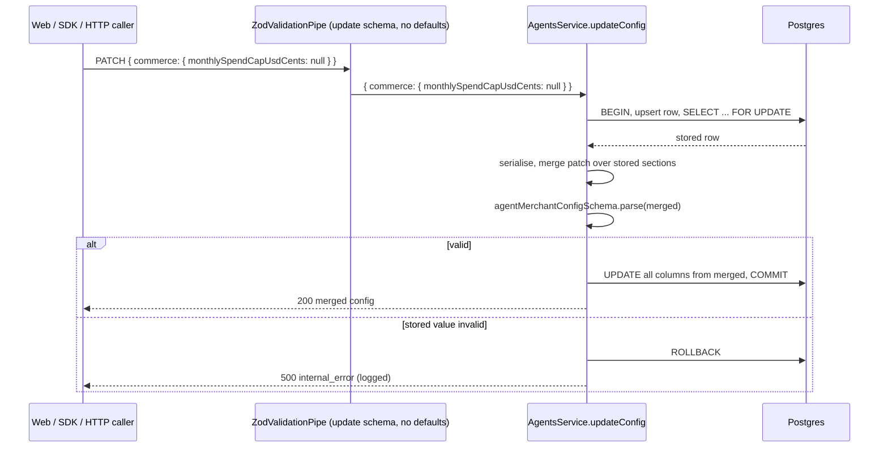

# ADR: Agent config PATCH is a deep partial merged onto the stored config

- **Status:** Accepted 2026-10-04
- **Date:** 2026-10-03
- **Scope:** `packages/shared-types` (`updateAgentConfigInputSchema` and its two types),
  `apps/api` (`AgentsService.updateConfig`), `packages/sdk` (version bump and one type
  test only, no code change). No database migration, no change to `apps/agent`,
  `apps/web`, the stored config shape, `GET /v1/agents/config` or any response body.

## Context

- `updateAgentConfigInputSchema` is
  `agentMerchantConfigSchema.omit({ merchantId, updatedAt }).partial()`. `.partial()`
  only makes the four top-level keys optional. Inside `recovery`, `cashflow` and
  `commerce`, every field with `.default()` still gets its default, and the fields
  without one (`recovery.notificationTemplate`, `commerce.monthlySpendCapUsdCents`) are
  still required.
- Verified against the built `@strimz/shared-types` 0.7.0 on `main` (`c19b4f2`):

  | Body                                              | Parsed result                                                                                                           |
  | ------------------------------------------------- | ----------------------------------------------------------------------------------------------------------------------- |
  | `{}`                                              | `{}`                                                                                                                    |
  | `{ cashflow: { digestEnabled: true } }`           | `digestEnabled: true`, `anomalySensitivity: 'medium'`, `autoConvertToYield: false`, `minimumLiquidReserveCents: 100000` |
  | `{ commerce: { monthlySpendCapUsdCents: 5000 } }` | `requireHumanApprovalAboveUsdCents: 100000`, `approvedVendors: []`, `monthlySpendCapUsdCents: 5000`                     |
  | `{ recovery: { strategy: 'once' } }`              | rejected: `recovery.notificationTemplate` Required                                                                      |
  | `{ recovery: { notificationTemplate: null } }`    | `gracePeriodHours: 48`, `strategy: 'twice'`, `notificationTemplate: null`                                               |

- The global `ZodValidationPipe` hands the parsed object to `AgentsService.updateConfig`,
  which maps each field to its column in one Prisma `update`. Prisma skips `undefined`,
  so untouched sections survive, but every field of a section that was sent is written,
  defaults included. Two columns are written as `input.x ?? undefined`
  (`recoveryNotificationTemplate`, `commerceMonthlySpendCapUsdCents`), so an explicit
  `null` becomes "do not write". Neither can be cleared once set.
- The worst case is `commerce`. `createJob` treats an empty `approvedVendors` as "any
  vendor allowed" and auto-approves jobs below `requireHumanApprovalAboveUsdCents`. A
  PATCH that only changes the spend cap empties the allowlist and resets the approval
  threshold to $1,000.
- Callers today:
  - `apps/web` settings dialogs (`components/dashboard/agents/settings-dialogs.tsx`)
    always send a whole section, so they do not hit the sibling reset. They do send
    `notificationTemplate: null` and `monthlySpendCapUsdCents: null` when the merchant
    empties the field, which the API silently ignores: the dialog closes and the old
    value stays.
  - The capability toggle on `app/agents/page.tsx` sends only `enabledCapabilities`,
    which is unaffected.
  - `@strimz/sdk` `agents.updateConfig` runs `updateAgentConfigInputSchema.parse(input)`
    client-side as a check, then sends the caller's raw `input`, not the parsed value.
    Since 0.7.0 (published 2026-10-03, ADR-2026-10-03-sdk-input-types) its type accepts
    `{ cashflow: { digestEnabled: true } }`, so a typed SDK call can now trigger the
    reset. A `recovery` or `commerce` section without its nullable field still throws in
    the SDK before any request.
  - Raw HTTP and API-key integrations could always send a partial section.
- Readers of the stored config: `AgentsService.retrieveConfig` and `createJob` in the
  API, and the six capability services in `apps/agent`, which read the columns directly
  with Prisma. None reads the update schema. The database columns carry their own
  defaults, which match the schema defaults.
- There is no audit trail of config changes. The service writes no `AuditLog` row and
  the table keeps only `updatedAt`.
- Issue #197; first recorded as finding 1 of ADR-2026-10-03-sdk-input-types.

## Decision

1. **The update schema is written by hand and has no defaults.** `updateAgentConfigInputSchema`
   keeps its name and becomes an explicit object whose four keys are optional and whose
   three sections are objects with every field optional. Each field reuses the same
   field schema as `agentMerchantConfigSchema`, extracted once in `agents.ts` (for
   example `recoveryGracePeriodHoursSchema`), so the full schema adds `.default(...)`
   and the update schema adds `.optional()` to the same base. No field in the update
   schema has a default, so the parsed output contains exactly the keys the caller sent.
   Recommended over a generic helper; see Alternatives.
2. **Absent keeps, null clears, only where the stored field is nullable.** A key that is
   absent leaves the stored value. `recovery.notificationTemplate` and
   `commerce.monthlySpendCapUsdCents` accept `null`, which clears them. Every other field
   rejects `null` with `400 invalid_request`, as it does today; `null` never means
   "reset to default". These are the semantics of JSON Merge Patch (RFC 7396) except that
   `null` on a non-nullable field is an error rather than a delete. The request stays
   `application/json`; no `application/merge-patch+json` content type is introduced.
3. **Arrays are replaced, not merged.** `enabledCapabilities` and
   `commerce.approvedVendors` are written as sent. `[]` clears them. There is no
   add/remove-element syntax. This matches what the web dialogs already send.
4. **Empty objects are no-ops.** `{}` and `{ cashflow: {} }` are accepted and change no
   value. The response is the stored config.
5. **The service merges onto the stored config, then validates the result.**
   `updateConfig` runs in one interactive Prisma transaction:
   1. ensure the row exists (the existing upsert), then lock it with
      `SELECT ... FROM "AgentMerchantConfig" WHERE "merchantId" = $1 FOR UPDATE`;
   2. read it and serialise it to `AgentMerchantConfig` with the existing
      `serialiseConfig`;
   3. apply the patch: for each section present, spread the patch fields over the stored
      section; replace top-level `enabledCapabilities` if present;
   4. parse the merged value with `agentMerchantConfigSchema`. A failure here cannot come
      from the request, which already passed the update schema, only from a stored value
      the schema rejects (the `recoveryStrategy` and `cashflowAnomalySensitivity` columns
      are free `String`). It is logged with the merchant id and returned as
      `500 internal_error`, and nothing is written;
   5. write every column from the merged, parsed value and return it serialised.

   The row lock makes two concurrent PATCHes to different fields serialise instead of the
   second overwriting the first with values it read before the first committed. The
   merge is a private function in `apps/api/src/modules/agents`, unit-tested on its own,
   not exported from `@strimz/shared-types`.

6. **`?? undefined` goes.** With no defaults in the parsed patch, the column mapping no
   longer needs it, and removing it is what makes `null` reach the database.
7. **No web change is required.** The dialogs' whole-section bodies are valid patches and
   keep working; their `null` for an emptied template or spend cap starts taking effect.
   Narrowing the dialogs to send only changed fields is not part of this change.
8. **No data migration.** Rows already reset cannot be told apart from merchants who chose
   the defaults (see Consequences). The release note asks merchants who changed agent
   settings through the API or SDK to review them, and calls out the commerce allowlist
   and approval threshold by name.
9. **Versioning.** One changeset: `@strimz/shared-types` minor and `@strimz/sdk` minor.
   - `UpdateAgentConfigInput` (`z.input`) only widens: every nested field becomes
     optional, nullable fields stay nullable. Any value that compiled before still
     compiles and is still valid at runtime.
   - `UpdateAgentConfigParsed` (`z.output`) narrows: nested fields that were always
     present become optional. Code that reads `parsed.cashflow.anomalySensitivity` as a
     `string` stops compiling. In this repo only `AgentsService` reads it. That is a
     breaking change to a published type, which on a 0.x package is a minor bump.
   - The SDK's runtime check (`updateAgentConfigInputSchema.parse(input)`) accepts more
     bodies than before; it rejects nothing it used to accept. The SDK is bumped minor
     with shared-types so the two stay on matching versions, as in 0.7.0.
   - The fix itself is on the server, so SDK 0.7.0 and older callers get the correct
     merge as soon as the API deploys, without upgrading.

## Diagram

## Consequences

- A PATCH changes exactly the fields it names. The commerce allowlist and approval
  threshold can no longer be widened by an unrelated edit.
- Merchants can clear the recovery template and the monthly spend cap, from the web and
  the API.
- Every request costs one extra locked read inside a transaction. The endpoint is a
  settings form, so the cost does not matter.
- Adding a config field now means adding it in three places in `agents.ts` (the base
  field schema, the full schema, the update schema) plus the column mapping, instead of
  two. The shared base keeps the rules from drifting; a type test asserts the update
  schema's keys equal the full schema's keys minus `merchantId` and `updatedAt`.
- A stored value the schema rejects now blocks PATCH with a 500 until it is fixed in the
  database, where today it would be written around. That surfaces corruption instead of
  hiding it; no such rows are expected, since every write path goes through the schema.
- **Rows already reset cannot be found.** A reset writes the schema defaults, which are
  also the database defaults and a legitimate merchant choice. There is no change history
  to compare against. A query for merchants with `commerce` enabled, an empty
  `commerceApprovedVendors` and a threshold of exactly `100000` lists candidates for
  outreach, but cannot prove any of them was reset. Exposure is limited: the web always
  sent whole sections, and the typed SDK could only send a partial section since 0.7.0,
  released the same day as this ADR.
- Templates and spend caps a merchant tried to clear from the web are still stored. Those
  are not detectable either; the merchant sees the old value in the dialog and can clear
  it again once this ships.

## Alternatives considered

- **Zod 3's `.deepPartial()`.** It wraps every nested field in `ZodOptional`, and in Zod 3
  an optional field short-circuits on `undefined`, so defaults would stop applying. Lost:
  `.deepPartial()` is deprecated in Zod 3 and was removed as a method in Zod 4 (Zod 4.5
  brings back a functional `z.deepPartial(schema)`). More important, the fact that it
  removes defaults depends on Zod 3 behaviour that Zod 4 reversed: in Zod 4, `.partial()`
  keeps defaults, so `{}` would parse to the defaults again. The same reversal means the
  current top-level `.partial()` would start resetting `enabledCapabilities` to `[]` on a
  Zod 4 upgrade. A hand-written schema with no `.default()` anywhere behaves the same on
  both majors.
- **A generic `deepPartialNoDefaults(schema)` helper** that walks the schema and unwraps
  `ZodDefault`. Lost: it reads Zod internals (`_def.innerType`, `_def.typeName`) that
  change between majors, and one schema with three sections does not justify a recursive
  utility. Worth revisiting if a second nested PATCH appears.
- **Write only the columns present in the patch, with no read.** Prisma skips `undefined`,
  so a defaults-free patch mapped column by column is already a correct merge and has no
  lost-update window. Lost narrowly: it cannot validate the resulting config as a whole,
  which the next cross-field rule (for example a spend cap not below the approval
  threshold) will need. If the maintainer prefers fewer moving parts, this is acceptable
  today and the tests below pass with it as well.
- **Read-merge-write without a row lock.** Lost: two dialogs saved at once can lose one
  merchant's edit.
- **Require whole sections (PUT semantics per section) and reject partial ones.** Lost: it
  undoes the 0.7.0 type that callers now rely on, and the web already works with whole
  sections under the chosen design.
- **`null` resets a non-nullable field to its default.** Lost: it gives `null` two meanings
  depending on the field, and nobody has asked for "reset to default".
- **Reject unknown keys (`.strict()`) on the update schema.** Not chosen here: every other
  input schema strips unknown keys, and changing that belongs to its own decision. A
  misspelt key stays a silent no-op, as today.
- **A one-off migration restoring "probably reset" rows.** Lost: there is no evidence to
  restore from, and guessing would overwrite real choices.

## Verification

- Red first, failing on `main` (`c19b4f2`), in
  `apps/api/test/e2e/agents-config-patch.e2e.test.ts`. Each case seeds a config with every
  field off its default, then PATCHes and checks both the response and a fresh GET:
  - `{ cashflow: { digestEnabled: true } }` keeps the other three cashflow fields and the
    other sections. Fails on `main`: `anomalySensitivity`, `autoConvertToYield`,
    `minimumLiquidReserveCents` come back as defaults.
  - `{ commerce: { monthlySpendCapUsdCents: 750000 } }` keeps `approvedVendors` and
    `requireHumanApprovalAboveUsdCents`. Fails on `main`: allowlist `[]`, threshold
    `100000`.
  - `{ recovery: { strategy: 'until_grace_ends' } }` is accepted and keeps the template.
    Fails on `main`: 400.
  - `{ cashflow: {} }` changes nothing. Fails on `main`: the cashflow section resets.
  - `{ recovery: { notificationTemplate: null } }` clears the template and keeps grace and
    strategy. Fails on `main`: template kept, grace and strategy reset.
  - `{ commerce: { monthlySpendCapUsdCents: null } }` clears the cap and keeps the rest.
    Fails on `main`: cap kept, allowlist and threshold reset.
  - `{ cashflow: { digestEnabled: null } }` is rejected with 400 and changes nothing.
    Passes on `main`; kept as a guard for decision 2.
- Added with the fix:
  - shared-types unit tests: the update schema's parse output for a one-field section has
    exactly that key; `null` is accepted only on the two nullable fields; a type test that
    the update schema's section keys equal the full schema's.
  - API unit test for the merge function, including array replacement.
  - API e2e: a stored value the full schema rejects returns 500 and writes nothing.
  - SDK type test: `agents.updateConfig({ recovery: { strategy: 'once' } })` and
    `{ commerce: { monthlySpendCapUsdCents: null } }` compile.
- The existing `agents.e2e.test.ts` cases pass unchanged.
- In the web dashboard: set a recovery template, save, empty it, save, reopen the dialog;
  the field is empty. Same for the commerce spend cap.
