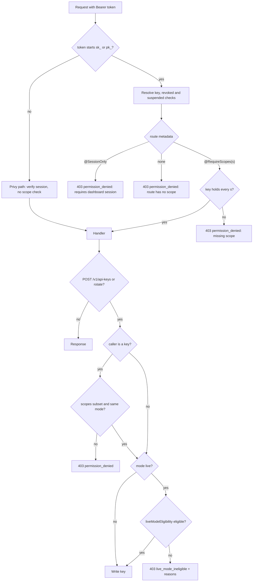

# ADR: Enforce API key scopes on every merchant route and gate live key minting

- **Status:** Accepted 2026-10-03
- **Date:** 2026-10-03
- **Scope:** `apps/api` (merchant auth guards, a new route marker decorator, the
  merchants, customers, analytics, notifications, storefronts and api-keys controllers,
  `ApiKeysService`), `packages/shared-types` (new scope names in `apiKeyScopeSchema`),
  `packages/db` (one migration adding values to the `ApiKeyScope` enum, one backfill
  migration), `packages/sdk` (two methods deprecated, see Decision 3),
  `apps/web/content/docs` (authentication and api-keys pages). No contract, indexer,
  scheduler, queue payload or webhook payload change. Issue #127.

## Context

Verified on `origin/main` at `5dab4db`.

### How scopes are enforced today

- Scopes are declared once in `@strimz/shared-types`
  (`packages/shared-types/src/api-keys.ts`, `apiKeyScopeSchema`, 19 values) and mirrored
  in the Prisma enum `ApiKeyScope` (`packages/db/prisma/schema/enums.prisma`). The
  column is `MerchantApiKey.scopes ApiKeyScope[]`. `@strimz/shared-types` is a
  published package (0.4.0), so adding a scope is a change to a published public API
  and needs a changeset. Earlier scope additions (`relay_*`, `api_keys_*`) were shipped
  as `ALTER TYPE "ApiKeyScope" ADD VALUE` migrations.
- `@RequireScopes(...)` (`apps/api/src/common/decorators/scopes.decorator.ts`) sets
  route metadata. Two guards read it, with identical copies of the check:
  `MerchantAuthGuard` (`common/guards/merchant-auth.guard.ts`, accepts an `sk_` key or a
  Privy access token) and `ApiKeyGuard` (`common/guards/api-key.guard.ts`, keys only,
  used by the relay controller).
- Both guards treat a route with no `@RequireScopes` metadata as open to any valid
  secret key: `if (required.length > 0) { ...check... }`. Enforcement is opt-in, so a
  route that forgets the decorator fails open.
- The Privy (dashboard) path skips scope checks entirely, by design. There is no global
  guard (`APP_GUARD` is not registered); each controller picks its guard with
  `@UseGuards`.

### Routes that accept any secret key

26 routes guarded by `MerchantAuthGuard` carry no scope, so any valid secret key of the
merchant, whatever its scopes, reaches them. All 26 were confirmed by the red test in
Verification (each returned 200, 201, 404 or 500 to a key holding only `sessions_read`,
never 403).

The worst of them:

- `POST /v1/merchants/me/onboard` writes `payoutAddress` and then calls
  `MerchantChainService.startRegistrationIfEligible`, which enqueues the on-chain
  `registerMerchant` relay job with that address (`merchants/registration.ts`,
  `registerMerchantCallData`). A leaked narrow key (for example a checkout server key
  with only `sessions_write`) can, before the merchant registers on chain, choose the
  address the Registry will pay out to.
- `PATCH /v1/merchants/me` overwrites `payoutAddress` in the database. After on-chain
  registration the contract's payout address is authoritative, but the database copy
  still drives live-mode eligibility, the dashboard, and the agent assessor fallback in
  `AgentsService.createJob`. The red test shows the write succeeds with an unrelated key.
- `POST /v1/merchants/me/tier` sets any tier, including `enterprise`, with no billing
  step. The tier selects the fee in `effectiveFeeBps` for new sessions, invoices and the
  registration call. This ADR stops API keys from calling it; the separate fact that the
  dashboard path also has no billing gate is called out under Consequences.
- `GET /v1/customers`, `GET /v1/stats/ltv` expose payer emails, wallet addresses and
  spend to any key.

### Key minting

- `ApiKeysService.create` (`modules/api-keys/api-keys.service.ts:10`) writes whatever
  `kind`, `mode` and `scopes` the body asks for. A key holding only `api_keys_write` can
  mint a key with every scope. A test-mode key can mint a live-mode key.
- `rotate`, `revoke`, `retrieve` and `list` look keys up by `merchantId` only. A
  test-mode key with `api_keys_write` can rotate a live-mode key and receive the new
  live secret, or revoke every live key.
- `MerchantsService.liveModeEligibility` (email verified, MFA enrolled, onboarding
  completed, payout address set) is only exposed as a read endpoint. Nothing calls it
  before minting. The dashboard disables the Live option in the New key dialog
  (`apps/web/src/app/(dashboard)/app/api-keys/page.tsx`, "Live mode unlocks when Arc
  Mainnet launches"), but the API mints live keys for any session or key that asks.
- Public docs already promise behaviour the API does not have:
  `apps/web/content/docs/authentication.mdx` says "The API enforces the list on every
  request", lists `customers_read`, `customers_write` and `transactions_write` scopes
  that do not exist, and says live keys cannot be issued until eligibility passes.

### Route inventory

Auth today: **Key+Session** is `MerchantAuthGuard`, **Key** is `ApiKeyGuard`,
**Session** is `PrivyAuthGuard`, **Admin** is `AdminAuthGuard`, **Public** is
`@Public()` or no guard. "Proposed" for Key+Session routes is what an API key needs; a
Privy session keeps reaching every Key+Session route. **Session only** means an API key
gets 403 `permission_denied` whatever its scopes.

| Route                                                       | Auth today  | Scope today         | Proposed                                        |
| ----------------------------------------------------------- | ----------- | ------------------- | ----------------------------------------------- |
| `GET /v1/merchants/me`                                      | Key+Session | none                | `merchants_read` (new)                          |
| `PATCH /v1/merchants/me`                                    | Key+Session | none                | Session only (D3)                               |
| `POST /v1/merchants/me/onboard`                             | Key+Session | none                | Session only                                    |
| `POST /v1/merchants/me/tier`                                | Key+Session | none                | Session only (D3)                               |
| `GET /v1/merchants/me/live-mode-eligibility`                | Key+Session | none                | `merchants_read`                                |
| `GET /v1/merchants/me/chain-status`                         | Key+Session | none                | `merchants_read`                                |
| `GET /v1/merchants/me/onchain-state`                        | Key+Session | none                | `merchants_read`                                |
| `GET /v1/merchants/me/balance`                              | Key+Session | none                | `merchants_read`                                |
| `POST /v1/customers`                                        | Key+Session | none                | `customers_write` (new)                         |
| `GET /v1/customers`, `GET /v1/customers/:id`                | Key+Session | none                | `customers_read` (new)                          |
| `GET /v1/stats/{conversion,churn,mrr,ltv,forecast}`         | Key+Session | none                | `analytics_read` (new)                          |
| `GET /v1/notifications`                                     | Key+Session | none                | Session only                                    |
| `POST /v1/notifications/mark-all-read`                      | Key+Session | none                | Session only                                    |
| `GET /v1/storefront`, `GET /v1/storefront/products[/:id]`   | Key+Session | none                | `storefronts_read` (exists, unused today)       |
| `POST /v1/storefront`, `/publish`, `/archive`               | Key+Session | none                | `storefronts_write` (exists, unused today)      |
| `POST /v1/storefront/products`, `/products/:id/archive`     | Key+Session | none                | `storefronts_write`                             |
| `POST /v1/api-keys`                                         | Key+Session | `api_keys_write`    | `api_keys_write` + subset, same mode, live gate |
| `GET /v1/api-keys`, `GET /v1/api-keys/:id`                  | Key+Session | `api_keys_read`     | `api_keys_read`, caller's mode only             |
| `POST /v1/api-keys/:id/revoke`                              | Key+Session | `api_keys_write`    | `api_keys_write`, caller's mode only            |
| `POST /v1/api-keys/:id/rotate`                              | Key+Session | `api_keys_write`    | as revoke, + subset, + live gate                |
| `/v1/payment-sessions/*` (5 routes)                         | Key+Session | `sessions_*`        | unchanged                                       |
| `/v1/subscription-plans/*` (4 routes)                       | Key+Session | `subscriptions_*`   | unchanged                                       |
| `/v1/subscriptions/*` (3 routes)                            | Key+Session | `subscriptions_*`   | unchanged                                       |
| `/v1/refunds/*` (4 routes)                                  | Key+Session | `refunds_*`         | unchanged                                       |
| `/v1/transactions/*` (2 routes)                             | Key+Session | `transactions_read` | unchanged                                       |
| `/v1/invoices/*` (5 routes)                                 | Key+Session | `invoices_*`        | unchanged                                       |
| `/v1/webhook-endpoints/*`, `/v1/webhook-deliveries/*` (9)   | Key+Session | `webhooks_*`        | unchanged                                       |
| `/v1/agents/*` (7 routes)                                   | Key+Session | `agents_*`          | unchanged                                       |
| `/v1/relay/*` (3 routes)                                    | Key         | `relay_*`           | unchanged                                       |
| `GET /v1/auth/me`, `GET /v1/compliance/logs`                | Session     | n/a                 | unchanged                                       |
| `/v1/admin/*`                                               | Admin       | n/a                 | unchanged                                       |
| `/v1/auth/sync`, `/v1/auth/turnstile/verify`, privy webhook | Public      | n/a                 | unchanged                                       |
| `/v1/checkout/*`, `/store/:slug[...]`, `/v1/tokens/*`       | Public      | n/a                 | unchanged                                       |
| `/v1/contact`, `/health`, `/ready`                          | Public      | n/a                 | unchanged                                       |

## Decision

1. **Fail closed.** The API-key path of `MerchantAuthGuard` and `ApiKeyGuard` rejects
   with 403 `permission_denied` any route that has neither `@RequireScopes(...)` nor a
   new `@SessionOnly()` marker. A route that forgets both is unreachable by keys
   instead of open to them. The scope check moves into one function both guards call,
   so the two copies cannot drift.
2. **`@SessionOnly()`.** A new decorator in `apps/api/src/common/decorators`. On a
   `MerchantAuthGuard` route it makes the API-key path return 403 `permission_denied`
   with message `route requires a dashboard session`. The Privy path is unaffected.
3. **Route classification as in the table above.** Merchant profile writes that change
   where money goes or what it costs (`PATCH /me`, `onboard`, `tier`) and the
   dashboard notification bell are session only. Everything else gets a scope.
   Consequence for the published SDK: `MerchantsResource.update` and
   `MerchantsResource.changeTier` (`packages/sdk/src/resources/merchants.ts`) stop
   working with a secret key. They are marked deprecated in a changeset and removed in
   the next minor release.
4. **Four new scopes:** `merchants_read`, `customers_read`, `customers_write`,
   `analytics_read`, added to `apiKeyScopeSchema` and to the `ApiKeyScope` enum with
   `ALTER TYPE ... ADD VALUE`. The dashboard's New key dialog picks them up
   automatically because it lists `apiKeyScopeSchema.options`.
5. **Backfill so full-access keys stay full access.** A second migration (Postgres
   cannot use a new enum value in the transaction that adds it) appends the four new
   scopes to every unrevoked key that already holds all 19 current scopes. Narrower
   keys get nothing and lose access to the 26 routes, which is the point of the fix.
6. **No privilege escalation through `api_keys_write`.** When the caller is an API key:
   - `create`: every requested scope must be held by the calling key, and `mode` must
     equal the calling key's mode. Otherwise 403 `permission_denied`.
   - `rotate`, `revoke`, `retrieve`, `list`: only keys of the calling key's mode are
     visible; another mode's key is 404 `not_found`, so a test key cannot learn that a
     live key exists. `rotate` also requires the target's scopes to be a subset of the
     caller's.
   - A Privy session keeps full control over both modes and any scopes.
7. **Live-mode eligibility at mint time.** `create` with `mode: 'live'`, and `rotate` of
   a live key, call `MerchantsService.liveModeEligibility` first, for both callers. If
   not eligible, 403 with code `live_mode_ineligible` and the same `reasons` array the
   eligibility endpoint returns, and nothing is written. Eligibility is not rechecked
   on every request made with an existing live key.
8. **Docs match the code.** `authentication.mdx` lists the real scopes (drops
   `transactions_write`, adds the four new ones) and names the session-only routes;
   `dashboard/api-keys.mdx` states the subset and same-mode rules.

## Decisions the maintainer must make

Each has a recommendation; the Decision section above assumes the recommendation.

- **D1. Fail closed (Decision 1)?** Recommend yes. The bug exists because enforcement
  is opt-in. The alternative, decorating the 26 routes and keeping opt-in, fixes today
  and leaves the next new controller open.
- **D2. Which routes are session only?** Recommend: `PATCH /me`, `onboard`, `tier`,
  both notifications routes. Payout address and tier decide where money goes and what
  it costs; a server-to-server key has no reason to change them. Notifications are the
  dashboard bell.
- **D3. Break `strimz.merchants.update` and `changeTier` in `@strimz/sdk` 0.4.0?**
  Recommend yes, with deprecation in a changeset. Alternative: a `merchants_write`
  scope that allows `PATCH /me` without `payoutAddress`, and keep `tier` session only.
  That keeps `update` working for branding fields at the cost of a field-level rule in
  the controller.
- **D4. New scope names.** Recommend `merchants_read`, `customers_read`,
  `customers_write`, `analytics_read`. The customers pair is already promised in the
  public docs.
- **D5. Backfill policy for existing keys (Decision 5).** Options: (a) no backfill,
  every existing key loses the 26 routes; (b) give all four scopes to every active key,
  which keeps today's exposure for leaked narrow keys; (c) only keys that hold every
  current scope. Recommend (c). Pre-launch, live mode is closed in the dashboard, so
  the blast radius is test-mode integrations only.
- **D6. Subset and same-mode rule for key-minted keys (Decision 6).** Recommend yes,
  as specified. The open question is whether a key may mint keys at all in live mode
  once live opens; the recommendation allows it within these rules, which is what the
  `api_keys_*` scope comment in shared-types describes (partner sub-tenant onboarding).
- **D7. What "live-mode eligibility" means at mint time (Decision 7).** Recommend the
  existing four checks, enforced on create and rotate, not on every request. Also
  decide whether live minting stays closed server-side until Arc mainnet is
  configured, matching the dashboard's disabled Live option. Recommend yes: a
  `live_mode_unavailable` 403 while no mainnet deployment is configured, so the API
  agrees with the dashboard instead of relying on a disabled select.
- **D8. Error code for an ineligible live mint.** Recommend `live_mode_ineligible`
  with `reasons`, so the dashboard can route to the missing step, and add it to the
  error catalogue in `errors.mdx`.

## Diagram

## Consequences

- A leaked narrow key can no longer redirect the on-chain payout address, change the
  fee tier, read customer data, or mint itself a wider key. Every new route must state
  its access rule or it is closed to keys.
- Integrations that call the 26 routes with narrow keys start getting 403. Pre-launch
  this is test mode only. The release note must list the routes and the new scopes.
- `@strimz/sdk` users lose `merchants.update` and `merchants.changeTier` with a secret
  key (if D3 is accepted). This needs a changeset for `@strimz/shared-types` and
  `@strimz/sdk`.
- Two migrations: enum values, then backfill. Neither changes a table shape. The
  indexer does not read `MerchantApiKey`, so `apps/indexer/internal/store` is
  unaffected.
- Out of scope, flagged for separate issues:
  - The dashboard path takes its mode from the `x-strimz-mode` header with no
    eligibility check, so a session can act in live mode before it is eligible.
  - `POST /v1/merchants/me/tier` has no billing step for dashboard sessions either; any
    merchant can pick `enterprise` and its fee.
  - `ApiKeyGuard` and `MerchantAuthGuard` duplicate the whole key resolution path, not
    only the scope check. Decision 1 shares the scope check; merging the guards is left
    for later.

## Alternatives considered

- **Decorate the 26 routes and keep opt-in enforcement.** Lost: it fixes today's list
  and repeats the bug with the next controller. Fail-closed costs one marker per
  session-only route.
- **One coarse `merchant_admin` scope for all profile, customer, analytics and
  storefront routes.** Lost: a key that only needs to read customers would also be
  able to change the payout address.
- **Make every key a session-equivalent and drop scopes.** Lost: scopes are documented,
  sold to merchants as the least-privilege control, and already enforced on the money
  routes.
- **Check eligibility on every live-key request.** Lost for now: it adds a merchant row
  read to every live call and turns an MFA reset into a production outage. Mint-time
  checks match what the docs promise.
- **Let `api_keys_write` grant any scope but log it.** Lost: logging does not stop a
  leaked key from minting a full-access key and covering its tracks by revoking others.

## Verification

- Red first, failing on `main`:
  `apps/api/test/e2e/api-key-scope-enforcement.e2e.test.ts`, run with
  `cd apps/api && DOCKER_HOST=unix://$HOME/.docker/run/docker.sock pnpm exec vitest run --config vitest.e2e.config.ts test/e2e/api-key-scope-enforcement.e2e.test.ts`.
  On `5dab4db`: 31 failed, 4 passed.
  - 26 cases, one per route above that has no scope, call it with a key holding only
    `sessions_read` and expect 403 `permission_denied`. On `main` they return 200, 201,
    404 or 500, never 403. These hold for either answer to D2 and D3, because a key
    without the proposed scope is rejected whether the route is scoped or session only.
  - `PATCH /v1/merchants/me` with that key leaves `payoutAddress` unchanged. On `main`
    it is overwritten.
  - A key holding only `api_keys_write` cannot mint a key with `refunds_write`; a test
    key cannot mint a live key; a test key cannot rotate a live key (and the live key
    stays unrevoked). On `main` all three return 201.
  - A Privy session for an ineligible merchant cannot mint a live key: 403
    `live_mode_ineligible`, no row written. On `main`, 201.
  - Guards that pass on `main` and must keep passing: a session reaches
    `GET /v1/merchants/me`; a key may mint a subset of its scopes in its own mode; an
    eligible merchant mints a live key; an ineligible merchant mints a test key.
- Added during implementation:
  - A unit test that walks every controller registered in `AppModule` and asserts each
    `MerchantAuthGuard` or `ApiKeyGuard` handler carries `@RequireScopes` or
    `@SessionOnly`, so a new route without a rule fails CI.
  - Positive cases per new scope (`merchants_read`, `customers_*`, `analytics_read`,
    `storefronts_*`) returning 200 or 201.
  - Migration test: after the backfill, a key that held all 19 scopes holds 23, a
    narrower key is unchanged, a revoked key is unchanged. `prisma migrate diff`
    against a fresh database shows no drift.
  - Existing e2e suites (`api-keys`, `merchants`, `storefronts`, `storefront-checkout`,
    `analytics`) stay green; they use Privy sessions on the affected routes.
- `./scripts/preflight.sh` passes in full.
- By hand on a local stack: mint a test key with only `sessions_write` in the
  dashboard, confirm `PATCH /v1/merchants/me` and `POST /v1/merchants/me/onboard`
  return 403 with it and still work from the dashboard; confirm the dashboard can still
  read analytics, customers, storefront and notifications.
