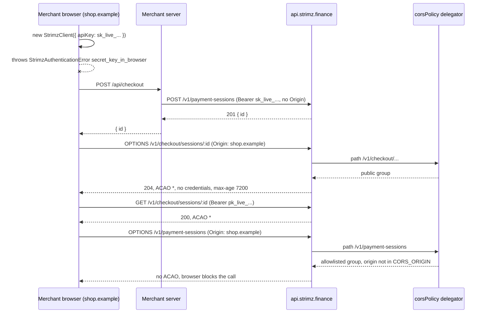

# ADR: Refuse secret keys in browser runtimes and split the API CORS policy

- **Status:** Accepted 2026-10-04
- **Date:** 2026-10-03
- **Scope:** `packages/sdk` (`StrimzClient` constructor, runtime detection, one new
  error code), `apps/api` (CORS registration moves out of `main.ts` into a shared
  policy used by `main.ts` and the e2e test app), merchant docs in
  `apps/web/content/docs`. No contract, Prisma schema, queue payload, webhook payload,
  guard or route change. `@strimz/sdk-react` and `StrimzBrowserClient` keep their
  behaviour.

## Context

Issue #136. A tester called `paymentSessions.create` with a secret key from browser
React code and hit a CORS error on `api.strimz.finance`. CORS did its job. Opening
it to every origin would invite `sk_live_` keys into frontends.

### CORS today

- One policy for every route, registered in `bootstrap()` in `apps/api/src/main.ts`
  with `app.enableCors(...)`:
  - `origin`: `CORS_ORIGIN.split(',')`, or `true` (reflect any origin) when
    `CORS_ORIGIN` is `*`. `CORS_ORIGIN` defaults to `*` in `env.schema.ts`; boot fails
    in production when it is `*`. `docker-compose.yml` and `apps/api/.env.example`
    set `http://localhost:3000`.
  - `credentials: true` on every route.
  - `methods`: GET, HEAD, POST, PATCH, PUT, DELETE, OPTIONS.
  - `allowedHeaders`: authorization, content-type, accept, x-strimz-mode,
    x-strimz-sdk, x-strimz-sdk-version, x-strimz-sdk-runtime,
    x-strimz-idempotency-key, x-strimz-request-id. `exposedHeaders`:
    x-strimz-request-id. No `maxAge`, so browsers preflight every few seconds.
- In production a browser on a merchant's own domain therefore cannot call any route,
  including the public `/v1/checkout/*` and `/v1/tokens/*` routes that
  `StrimzBrowserClient` and `@strimz/sdk-react` (`useStrimzSession`) exist to call.
  The browser SDK only works today from origins in `CORS_ORIGIN`, which is the Strimz
  web app.
- In development (`CORS_ORIGIN=*`) every origin is reflected with
  `Access-Control-Allow-Credentials: true` on every route.
- `createTestApp()` (`apps/api/test/helpers/test-app.factory.ts`) never calls
  `enableCors`, so no e2e test can observe CORS at all.
- The API sets no cookies and reads none. Every caller authenticates with an
  `Authorization: Bearer` header (secret key, Privy access token, admin JWT).
  `credentials: true` is not used by any caller in the repo.

### Public routes today (`@Public()`)

| Group            | Routes                                                                                                                                                                                                                                                      | Called by                                                                            |
| ---------------- | ----------------------------------------------------------------------------------------------------------------------------------------------------------------------------------------------------------------------------------------------------------- | ------------------------------------------------------------------------------------ |
| Checkout         | `GET /v1/checkout/merchants/:id`, `GET /v1/checkout/sessions/:id`, `GET /v1/checkout/plans/:id`, `GET /v1/checkout/plans/:id/subscription`, `GET /v1/checkout/plans/:id/terms`, `POST /v1/checkout/sessions/:id/payer`, `POST /v1/checkout/plans/:id/payer` | hosted checkout, `StrimzBrowserClient.checkout`, `useStrimzSession`                  |
| Tokens           | `GET /v1/tokens/:address`, `GET /v1/tokens/:address/permit-nonce`                                                                                                                                                                                           | `StrimzBrowserClient.tokens`                                                         |
| Storefront       | `GET /store/:slug`, `POST /store/:slug/products/:productId/checkout`                                                                                                                                                                                        | Strimz web app only (`public-store.ts` server-side, `buy-button.tsx` in the browser) |
| Web app only     | `POST /v1/contact`, `POST /v1/auth/turnstile/verify`, `POST /v1/auth/sync`                                                                                                                                                                                  | Strimz web app                                                                       |
| Server to server | `POST /v1/auth/privy-webhook`, `GET /health`, `GET /ready`                                                                                                                                                                                                  | Privy, load balancer                                                                 |

Everything else is behind `ApiKeyGuard`, `MerchantAuthGuard`, `PrivyAuthGuard` or the
admin guards. The relayer (`/v1/relay/*`) is behind `ApiKeyGuard`; hosted checkout
reaches it through the web app's server-only BFF (`apps/web/src/lib/strimz-bff.ts`)
with `STRIMZ_INTERNAL_API_KEY`.

### Publishable keys today

The review note was correct: **no route accepts a publishable key.**

- `ApiKeyGuard` and `MerchantAuthGuard` both throw `401 authentication_error`
  "invalid api key kind" when `kindFromKey(token) !== 'secret'`.
  `MerchantAuthGuard` routes `pk_` tokens into its API-key path only to reject them
  there. `apps/api/test/e2e/api-keys.e2e.test.ts` asserts the 401 for a seeded
  publishable key on `/v1/subscriptions`.
- `StrimzBrowserClient` only calls `@Public()` routes. Both guards return `true` for
  `@Public()` before they read `Authorization`, so the `Bearer pk_...` header it sends
  is never looked up. Any string with a `pk_test_` or `pk_live_` prefix works,
  including a revoked key, another merchant's key, or the web app's fallback
  `pk_test_placeholder` (`apps/web/src/lib/env.ts`).
- The only effect of a publishable key is client-side: `StrimzBrowserClient.mode` is
  read from its prefix.
- Merchants can mint publishable keys in the dashboard (`api-keys.service.ts` accepts
  `kind: 'publishable'`), with scopes that nothing enforces.
- The docs promise more than exists. `glossary.mdx` says a publishable key has "read
  access plus the ability to create a payment session"; `dashboard/api-keys.mdx` says
  it "grants a narrow slice of the API surface used by the checkout SDK".

### SDK runtimes today

- `StrimzClient` (`packages/sdk/src/client.ts`) refuses publishable keys and accepts
  any secret key in any runtime. `detectRuntime()` returns `edge`, `node-<version>`,
  `browser` (when `navigator.userAgent` is set and `process.versions.node` is not) or
  `unknown`, and is used only for the `X-Strimz-Sdk-Runtime` header.
- `StrimzBrowserClient` (`@strimz/sdk/browser`) refuses secret keys and exposes only
  `checkout` and `tokens`.
- `@strimz/sdk-react` builds a `StrimzBrowserClient` in `StrimzProvider`; checkout
  itself runs in a Strimz-hosted popup or iframe.
- The `.` export of `@strimz/sdk` has no `browser` condition, so bundlers ship
  `StrimzClient` to the browser without complaint.
- Server docs already say "server-side only" (`sdks/server.mdx`, `checkout/embed.mdx`,
  `quickstart.mdx`, `recipes/reown-checkout.mdx`); nothing enforces it.

## Decision

### 1. `StrimzClient` refuses a secret key in a browser runtime

1. The constructor runs a runtime check after the key-kind and mode checks, before any
   other work. In a browser runtime it throws `StrimzAuthenticationError` with
   `code: 'secret_key_in_browser'`, `httpStatus` undefined, and a message that names
   the fix and never contains the key:
   "StrimzClient cannot run in a browser: secret keys must stay on your server. Create
   payment sessions from a server route and pass the session id to the browser. See
   https://strimz.finance/docs/checkout/server-sessions".
   The existing class is reused so `instanceof StrimzAuthenticationError` handlers
   keep working; `secret_key_in_browser` is added to `StrimzErrorCode`.
2. Runtime classification, first match wins:

   | Order | Signal                                                                                                | Verdict                                                                                                  |
   | ----- | ----------------------------------------------------------------------------------------------------- | -------------------------------------------------------------------------------------------------------- |
   | 1     | `typeof EdgeRuntime !== 'undefined'` (Vercel Edge, Next.js middleware)                                | server                                                                                                   |
   | 2     | `typeof Deno !== 'undefined'`                                                                         | server                                                                                                   |
   | 3     | `typeof Bun !== 'undefined'`                                                                          | server                                                                                                   |
   | 4     | `navigator.userAgent === 'Cloudflare-Workers'`                                                        | server                                                                                                   |
   | 5     | `process.versions.electron` set and `process.type === 'renderer'`                                     | browser                                                                                                  |
   | 6     | `process.versions.node` set                                                                           | server (covers Node with a jsdom or happy-dom test environment)                                          |
   | 7     | `window` and `document` defined                                                                       | browser                                                                                                  |
   | 8     | `WorkerGlobalScope` defined and `self instanceof WorkerGlobalScope` (web, shared and service workers) | browser                                                                                                  |
   | 9     | `navigator.product === 'ReactNative'`                                                                 | browser (an app bundle is as extractable as a web bundle, and React Native has no CORS to stop the call) |
   | 10    | anything else                                                                                         | server                                                                                                   |

   Unknown runtimes are allowed, so a new server runtime is not broken by a release.
   `detectRuntime()` reuses the same classification for the telemetry header, and
   reports `deno`, `bun`, `workerd`, `electron-renderer`, `react-native` in place of
   `unknown`.

3. **No escape hatch.** There is no `dangerouslyAllowBrowser` option. The people who
   would need one are covered by rule 6 (Node test environments that install a DOM).
   Electron renderers and React Native should call the merchant's own server like any
   browser. Adding an option later is a minor release; removing one is a breaking
   release. Recommendation: none.
4. `StrimzBrowserClient` is unchanged and keeps refusing secret keys.

### 2. The API CORS policy is split into two route groups

1. **Public group: any origin, no credentials.** Requests whose path starts with
   `/v1/checkout/` or `/v1/tokens/`:
   - `Access-Control-Allow-Origin: *` for every origin, including allowlisted ones.
   - No `Access-Control-Allow-Credentials` (browsers reject `*` with credentials).
   - Methods: GET, HEAD, POST, OPTIONS.
   - Allowed headers: authorization, content-type, accept, x-strimz-sdk,
     x-strimz-sdk-version, x-strimz-sdk-runtime, x-strimz-request-id,
     x-strimz-idempotency-key. `authorization` stays allowed because
     `StrimzBrowserClient` sends `Bearer pk_...` (decision 3).
   - Exposed headers: x-strimz-request-id.
   - `Access-Control-Max-Age: 7200` (Chromium's cap; Firefox allows more).
2. **Allowlisted group: everything else.** Same as today:
   - Origin reflected only when it is in `CORS_ORIGIN`; any other origin gets no
     `Access-Control-Allow-Origin`, so the browser blocks the preflight and the
     request never reaches a guard. `Vary: Origin` is set.
   - `credentials: true` is kept. Nothing uses it today, but dropping it is a change
     to the dashboard's contract that this ADR does not need.
   - Methods and allowed headers as today. `Access-Control-Max-Age: 600`.
   - `CORS_ORIGIN` keeps its name and its production rule (no `*`). Its meaning
     narrows to "origins allowed on non-public routes"; `apps/api/README.md`,
     `apps/api/.env.example` and `infra/lightsail/env.example` say so.
3. **`/store/*` stays in the allowlisted group.** Only the Strimz web app calls it, and
   `POST /store/:slug/products/:productId/checkout` creates a payment session. Opening
   it to every origin is a product decision (merchant-built storefronts) for a later
   ADR. Recommendation: allowlisted.
4. `/v1/contact`, `/v1/auth/*`, `/health`, `/ready` stay allowlisted. They are public
   to authentication, not to every website.
5. **Classification is by path, not by `@Public()` metadata.** A preflight `OPTIONS`
   request is answered by `@fastify/cors` before Nest resolves a handler, so the policy
   cannot read decorator metadata. The policy is a `@fastify/cors` `delegator` that
   takes the pathname of `req.url` (query string removed) and matches it against
   `PUBLIC_CORS_PREFIXES = ['/v1/checkout/', '/v1/tokens/']`.
6. A consistency test walks every registered route and fails if a route under a public
   prefix is not `@Public()`. A secret-key route added under `/v1/checkout/` later
   would otherwise become callable from any origin.
7. **One seam for production and tests.** The policy lives in
   `apps/api/src/common/http/cors-policy.ts` as `corsPolicy(env)` returning the
   `@fastify/cors` options. `main.ts` and `createTestApp()` both call
   `app.enableCors(corsPolicy(env))`, so the e2e suite tests the production policy.

### 3. Publishable-key semantics

1. **Now:** a publishable key is a client-side mode marker and nothing more. The public
   group does not read `Authorization`, as today. Secret-key routes keep rejecting it
   with `401 authentication_error`; the message changes from "invalid api key kind" to
   "publishable keys can only call /v1/checkout and /v1/tokens; use a secret key from
   your server". Status and code do not change.
2. Docs are corrected to say exactly that: `glossary.mdx`, `dashboard/api-keys.mdx`,
   `authentication.mdx`, `sdks/react.mdx`.
3. **Later (separate ADR, recommended together with decision 4):** the public group
   validates a publishable key when one is sent: it must exist, not be revoked,
   belong to the merchant that owns the session, plan or token lookup, and match its
   mode. That turns revocation and per-merchant origins into real controls.
4. **Rejected:** letting a publishable key create payment sessions from the browser.
   The amount, currency and metadata would be set by code the payer controls.

### 4. Per-merchant allowed origins: later

Recommendation: **not in this change.**

- The public group serves data that is already public to anyone holding the checkout
  URL. An origin list adds anti-embedding value, not secrecy, and CORS never stops a
  non-browser client.
- A preflight carries no body and no `Authorization`. Resolving the merchant needs a
  database lookup from the path id on every preflight, plus a cache, and does not work
  for `/v1/tokens/*`, which has no merchant.
- It only means something once publishable keys are validated (decision 3.3).
- The web-security-headers ADR (2026-10-03) already defers the same list for
  `frame-ancestors` on `/pay` and `/sub`. One `MerchantAllowedOrigin` model should
  serve both, in one follow-up ADR with a Prisma migration.

### 5. Server-side session creation docs

1. New page `apps/web/content/docs/checkout/server-sessions.mdx`: why the secret key
   stays on the server, a Next.js route handler and an Express handler that call
   `paymentSessions.create` and return `{ id }`, the browser half with
   `useStrimzCheckout().open(id)`, and a short "Seeing a CORS error?" section that
   says the error is expected and points at the route handler.
2. `sdks/server.mdx`: the runtime rule table and the `secret_key_in_browser` error.
3. `errors.mdx`: `secret_key_in_browser`.
4. `authentication.mdx`: a "Calling Strimz from a browser" section listing the public
   group and stating that every other route refuses non-allowlisted origins.
5. `packages/sdk/README.md`: one paragraph on the guard.

### 6. Release and semver

- `@strimz/sdk`: **minor** changeset (0.7.0 to 0.8.0). Throwing where the constructor
  used to succeed is breaking for anyone running `StrimzClient` in a browser; under
  0.x a minor bump is the breaking bump, and the changeset and release note say
  "breaking". Adding a member to `StrimzErrorCode` can break an exhaustive `switch` in
  a consumer; it is listed in the same note.
- `@strimz/sdk-react`: no change, no changeset.
- `apps/api`: not published. Release note `docs/release-notes/2026-10-03-browser-keys-cors.md`
  with `scenario-impact: none`, stating that merchant browsers can now call
  `/v1/checkout/*` and `/v1/tokens/*` from any origin.
- Deploy: no env change needed. `CORS_ORIGIN` on Lightsail stays as is.

## Diagram

## Consequences

- `useStrimzSession` and `StrimzBrowserClient` work on merchant domains in production
  for the first time.
- A developer who puts `StrimzClient` in a browser bundle gets a clear error at
  construction instead of a CORS error at the first call, and in React Native, where
  there is no CORS, gets an error instead of a working leaked key.
- The SDK check is a guard rail, not a control. The key is already in the bundle when
  the constructor throws; it stops the habit, not a determined leak. CORS on the
  allowlisted group stays the server-side backstop for browsers; nothing stops `curl`.
- Public routes become reachable from any website's JavaScript. Their data and rate
  limits are unchanged (600 requests per minute per IP), and they were already
  reachable from any non-browser client.
- Path-based classification couples the CORS policy to URL prefixes. The consistency
  test in decision 2.6 is what keeps that safe.
- Publishable keys stay unvalidated until the follow-up ADR. The docs stop claiming
  otherwise.

## Alternatives considered

- **`Access-Control-Allow-Origin: *` everywhere.** Lost: invites secret keys into
  frontends, which is the problem in the issue.
- **Keep one allowlisted policy.** Lost: the browser SDK cannot work on merchant
  domains.
- **Classify by `@Public()` metadata in a Nest guard or interceptor.** Lost: preflights
  never reach Nest handlers.
- **A `browser` export condition that maps `@strimz/sdk` to a throwing stub.** Lost as
  the only control: it depends on the bundler honouring the condition and gives no
  runtime protection in React Native or workers. It can be added later on top.
- **`dangerouslyAllowBrowser: true` escape hatch** (the OpenAI SDK's approach). Lost
  for now: it is the first thing a developer pastes to make the error go away. Can be
  added later as a minor release.
- **Reject `Bearer sk_` requests that carry an `Origin` header in the API.** Deferred:
  some server runtimes send `Origin`, and a false positive takes down a merchant's
  checkout. Worth a log-only counter first.
- **Per-merchant allowed origins now.** Lost for this change, see decision 4.

## Verification

Red tests, written with this ADR before any implementation:

- `packages/sdk/tests/browser-runtime-guard.test.ts`: stubs globals with
  `vi.stubGlobal` to simulate each runtime. Expects `secret_key_in_browser` in a
  browser main thread, a web worker, React Native and an Electron renderer, for both
  `sk_test_` and `sk_live_`, with the key absent from the message. Expects no error in
  Node with a DOM shim, Deno, Cloudflare Workers, Vercel Edge and plain Node, and
  expects `StrimzBrowserClient` to keep accepting a publishable key in a browser.
  On `main`: 4 failed (the browser cases, "expected undefined to be an instance of
  StrimzAuthenticationError"), 6 passed (the allow cases, which pin today's behaviour).
- `apps/api/test/e2e/cors-policy.e2e.test.ts`: sets `CORS_ORIGIN` to one dashboard
  origin before booting the test app. Expects `ACAO: *` without credentials,
  methods without DELETE, the SDK headers and `max-age 7200` on checkout and token
  reads and preflights from an arbitrary origin and from the dashboard origin; no
  `ACAO` for an arbitrary origin on `/v1/payment-sessions` and `/store/*`; and the
  reflected dashboard origin with credentials, `Vary: Origin`, PATCH and DELETE and
  `max-age 600` on `/v1/payment-sessions`.
  On `main`: 7 failed, 3 passed. The failures are the public-group and allowlisted
  positive cases (preflights return 404 and responses carry no CORS headers, because
  the test app registers no CORS policy at all). The 3 passes are the "no ACAO for a
  non-allowlisted origin" cases, which hold on `main` only because nothing is
  registered; they become meaningful once decision 2.7 wires the policy in.

Added during implementation:

- The route consistency test from decision 2.6.
- `packages/sdk/tests/client.test.ts` keeps passing unchanged.
- `apps/api/test/e2e/api-keys.e2e.test.ts`: the publishable-key case asserts the new
  message.

By hand:

- From a page on a non-allowlisted origin, `useStrimzSession` loads and polls a test
  session; `fetch('/v1/payment-sessions')` with a secret key fails the preflight.
- The Strimz dashboard on the allowlisted origin works as before, including PATCH and
  DELETE calls.
- A Next.js client component that constructs `StrimzClient` throws
  `secret_key_in_browser` in the browser console; the same file in a route handler
  works.
