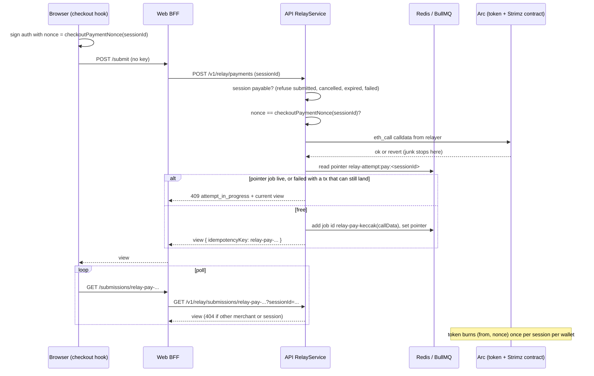

# ADR: Server-issued relay keys, one EIP-3009 nonce per checkout session, and safe retries

- **Status:** Accepted 2026-10-03
- **Date:** 2026-10-03
- **Scope:** `apps/api` relay module (service, controller, DTO, types), `apps/web` checkout
  hooks and checkout BFF routes (`lib/strimz-bff.ts`, `api/checkout/sessions/...`),
  `packages/shared-crypto` (one new exported function, changeset), the public relay
  HTTP API documented in `apps/web/content/docs/api-reference.mdx`. No contract, Prisma
  migration, BullMQ job schema, webhook payload or `@strimz/sdk` change.

## Context

- The hosted checkout builds the relay idempotency key in the browser. One-shot payments
  use the session id (`use-pay-checkout.ts`), subscriptions use
  `${planId}-${payerAddress}` (`use-subscription-checkout.ts`). Both are public: the
  session id is in the checkout URL, the plan id is in the plan link, and a payer's
  address is on-chain.
- The BFF route `POST /api/checkout/sessions/:id/submit` is unauthenticated and forwards
  the client key unchanged to `POST /v1/relay/payments` or `/v1/relay/subscriptions`
  with the server-only internal key. Every checkout therefore shares one merchant
  context on the API side.
- `RelayService.enqueue` uses the key as the BullMQ job id. A duplicate id returns the
  existing job's view. Failed jobs are kept for an hour (`removeOnFail: { age: 3600 }`).
- Attack: anyone who knows a session id posts a junk body (any signature) with that key.
  `assertSessionPayable` only checks the session exists, its merchant and its amount,
  all of which are public on the checkout page. The junk job is enqueued, broadcast, and
  reverts. For the next hour the real payer's submission returns the junk job's
  `failed` view and never reaches the chain. The same works for a subscription with the
  plan id and the payer's address.
- "Try again" on the checkout page calls `submit()` again. It signs a new authorization
  but sends the same key, so it gets back the previous failure. A payer whose first
  attempt failed for any reason cannot pay that session for an hour.
- `GET /v1/relay/submissions/:key` returns any job by key to any caller with
  `relay_read`, regardless of merchant. The BFF route
  `GET /api/checkout/sessions/:sessionId/submissions/:key` ignores `sessionId`.
- Money facts the design relies on, verified in source:
  - `StrimzPayments.payWithAuthorization` calls the token's `receiveWithAuthorization`,
    which burns the EIP-3009 `(from, nonce)` pair. The contract keeps no per-`ref`
    record, so two different authorizations for the same session both execute today.
    The browser picks a random nonce on every attempt (`randomBytes32()`), so a retry
    is a second, independent authorization.
  - `StrimzSubscriptions.permitAndCreateSubscription` calls `permit` without
    `try/catch`. EIP-2612 nonces are sequential per owner, so two permits signed over
    the same nonce are mutually exclusive on-chain.
  - `RelayJobRunner` records `{ txHash, nonce }` on the job before sending
    (`broadcast`), and stamps the session `submitted` only after a successful receipt.
    A job can end `failed` while its transaction is still pending in the mempool.
  - `assertSessionPayable` refuses `cancelled`, `expired`, `failed`; it accepts
    `submitted`. `alreadyPaidView` short-circuits only `confirmed`.
  - BullMQ 5 rejects custom job ids containing `:`.
- Issue #126.

## Decision

1. **The API issues the key, from the signed payload.** For `payWithAuthorization` and
   `permitAndCreateSubscription` the job id is `relay-pay-<hex>` or `relay-sub-<hex>`,
   where `<hex>` is `keccak256(callData)` without `0x`. The calldata contains both payer
   signatures, so the key cannot be predicted without them. The identical signed
   payload always maps to the same job, so a client retrying the same request still gets
   the existing submission and the relayer never broadcasts it twice. Any newly signed
   attempt maps to a new job. The key is returned as `idempotencyKey` in the POST
   response and is the only handle for polling.
2. **The body's `idempotencyKey` stops being the job id.** It becomes optional on both
   POST endpoints, is accepted and ignored, and is documented as deprecated. The BFF and
   the hooks stop sending it. The job payload field `idempotencyKey` keeps its name and
   type and carries the server-issued key, so `relayJobSchema` does not change.
3. **Simulate before enqueueing.** `RelayService` runs `eth_call` of the exact calldata
   from the relayer address against the latest block before adding the job. A revert
   (bad signature, used or expired authorization, stale permit nonce, inactive merchant,
   wrong intent) is refused with `400 relay_simulation_failed` and the decoded revert
   name. Junk never enters the queue, never burns relayer gas and never occupies a slot.
   Simulation is a filter, not the money guarantee; decisions 4 to 6 are.
4. **One EIP-3009 nonce per payment session.** `@strimz/shared-crypto` exports
   `checkoutPaymentNonce(sessionId)` =
   `keccak256(abi.encode("strimz.checkout.payment-nonce.v1", sessionId))`. The checkout
   hook signs with it instead of a random nonce. The relay refuses a submission that
   carries a `sessionId` and any other nonce with `400 auth_nonce_mismatch`. Every
   authorization a wallet ever signs for one session shares one `(from, nonce)` pair,
   which the token burns on first use. A retry is therefore mutually exclusive on-chain
   with every earlier attempt from the same wallet, whatever state the relay jobs are in.
   The nonce needs no secrecy: using it requires the payer's signature.
5. **A mined payment closes the session to new attempts.** `assertSessionPayable` also
   refuses `submitted` with `409 session_already_submitted`. This covers a second wallet
   paying the same session after the first payment mined and before the indexer marks
   it `confirmed`. `confirmed` keeps returning the synthetic confirmed view.
6. **One live attempt per checkout.** On enqueue the service writes a Redis pointer,
   `relay-attempt:pay:<sessionId>` or `relay-attempt:sub:<planId>:<payer>`, to the new
   job id with a 2 hour TTL. A new attempt with a different key is accepted only when
   the pointer is absent or names a job that is `failed` and whose transaction cannot
   land any more:
   - no `broadcast` recorded on the job; or
   - the recorded transaction has a final receipt (a successful receipt means the
     payment or enrolment happened, so the new attempt is refused with
     `409 already_settled`); or
   - payments only: the earlier authorization's `validBefore` has passed, so the token
     rejects it even if the transaction is still pending (at most 5 minutes with the
     checkout's default window).
     Subscriptions do not wait for the permit deadline (24 hours by default): the new
     permit is simulated against the owner's current nonce, so it either shares the
     pending permit's nonce and excludes it, or the pending permit was already consumed,
     which the receipt check catches. Otherwise the request is refused with
     `409 attempt_in_progress` and the current view, which the client polls. The pointer
     is set only after simulation passes, so only a payer's own signature can hold it.
7. **Submissions are scoped.** `getByIdempotencyKey(key, scope)` returns `null` unless
   the job's `merchantInternalId` equals the caller's merchant and, when the scope
   carries a `sessionId`, the job's `sessionId` or `subscriptionInternalId` equals it.
   `GET /v1/relay/submissions/:key` passes the caller's merchant and an optional
   `?sessionId=` query; the BFF passes the path's session id. A mismatch is a `404`, the
   same answer as an unknown key.
8. **Try again works.** Both hooks re-sign on retry and poll the key the POST returned.
   The pay hook re-signs over the same session nonce with a fresh `validBefore`; the
   subscription hook re-reads the permit nonce as today.

## Diagram

## Consequences

- A stranger can no longer block a checkout: without the payer's signatures they cannot
  produce the key, and an unsigned or wrongly signed body fails simulation.
- Try again creates a new attempt. For one wallet it can never become a second charge,
  because every attempt for a session shares one EIP-3009 nonce, or for subscriptions
  one permit nonce at a time. For a second wallet, decisions 5 and 6 refuse the attempt
  while the first can still land.
- Each submission costs one extra RPC `eth_call`. The relayer stops spending gas on
  junk.
- Breaking for direct API callers: a client that polls `GET /v1/relay/submissions/:key`
  with its own key gets `404`; it must use the key from the POST response. A caller
  that relied on reusing its own key to read another merchant's submission loses that.
  Only the hosted checkout uses these endpoints today; the docs page is updated and the
  change is in the release note.
- A payer whose earlier payment transaction is stuck pending waits up to the
  authorization window (5 minutes) before Try again is accepted.
- Unit tests in `relay-service.test.ts` that assert the job id equals the client key
  (`is idempotent on the idempotencyKey`, the `queue._jobs.get(input.idempotencyKey)`
  lookups, `getByIdempotencyKey` with `'idem-lookup'`) encode the defect and are
  rewritten to use the returned key. Their fixtures gain real signatures or a
  simulation fake.
- Comments that become false and need a human rewrite when this is implemented:
  `relay.service.ts` class JSDoc ("Idempotency: every submission carries an
  `idempotencyKey` (typically the upstream session id ...)") and the comment above
  `queue.add` in `enqueue`; `relay.controller.ts` header ("the body's `idempotencyKey`
  is the durable handle") and `GET` description; `relay.types.ts`
  `PayWithAuthorizationInput` JSDoc ("`idempotencyKey` MUST be stable across
  retries"); `use-pay-checkout.ts` header ("nonce is random"); the
  `SubscriptionCheckoutInputs.sessionId` JSDoc and the comment above `idempotencyKey`
  in `use-subscription-checkout.ts`; the trust-model comment in the BFF
  `submissions/[idempotencyKey]/route.ts` ("The idempotency key is opaque enough ...").

## Alternatives considered

- **Random key minted by a new `POST /attempts` endpoint and stored in Redis.** Lost:
  one more round trip and one more store, and it still needs decisions 4 to 6 to make a
  retry safe. A content-derived key is as unguessable and needs no storage.
- **Store attempts in a Prisma `RelaySubmission` table.** Lost for now: a migration and
  a second source of truth beside BullMQ for a 1 hour window. It remains the right
  home for long retention and is not blocked by this design.
- **Keep the client key but namespace it by merchant.** Lost: every checkout goes
  through the BFF's single internal merchant, so namespacing changes nothing for the
  attack in the issue.
- **Delete the failed job so Try again can reuse the key.** Lost: a job can fail while
  its transaction is pending; deleting it removes the only record of that transaction
  and opens a double charge with a fresh random nonce.
- **Verify EIP-712 signatures in the API instead of simulating.** Lost: it needs the
  token's domain name and version per token and still misses used nonces, inactive
  merchants and contract-side checks that the `eth_call` catches in one step.
- **Add a per-`ref` used flag to `StrimzPayments`.** Lost for this issue: a contract
  upgrade for a guarantee the token nonce already provides per wallet. Worth its own ADR
  if one session must never be paid by two wallets even under a relayer failure.

## Verification

- Red first, failing on `main` (written with this ADR):
  `apps/api/test/unit/modules/relay/relay-checkout-idempotency.test.ts`, 9 tests, 8
  failing on `main`, each for the reason named:
  - a junk payment carrying the session id as key does not block the payer's own
    authorization;
  - the issued key is not the client key, does not contain the session id, and has no
    `:`;
  - after the first attempt fails, a newly signed attempt is a new `queued` job;
  - an authorization whose nonce is not `checkoutPaymentNonce(sessionId)` is refused
    and nothing is enqueued;
  - nothing is enqueued for a session already `submitted`;
  - subscriptions: a junk enrolment with the `plan-payer` key does not block the payer,
    and a retry after failure is a new job;
  - `getByIdempotencyKey` returns `null` for another session and another merchant.
  - Guard, passing on `main` and kept passing: resubmitting the identical signed
    payload returns the same submission and enqueues once.
    When implemented, the test fakes may gain an `eth_call` stub and a Redis pointer
    fake; the assertions do not change.
- Added with the implementation: the pointer rules in decision 6 (live job, failed with
  pending tx inside and past `validBefore`, failed with a final successful receipt,
  aged-out job); `relay_simulation_failed` on a revert; controller passes the caller's
  merchant and `?sessionId=`; BFF submit no longer forwards a key and BFF GET forwards
  the session; `checkoutPaymentNonce` vector test shared by api and web.
- On Arc testnet: pay a session, force the first relay attempt to fail (stop the
  scheduler after enqueue so the job times out), press Try again, confirm one
  `PaymentExecuted` and one token transfer for the session, and that a POST with the
  session id as key from another client changes nothing.
