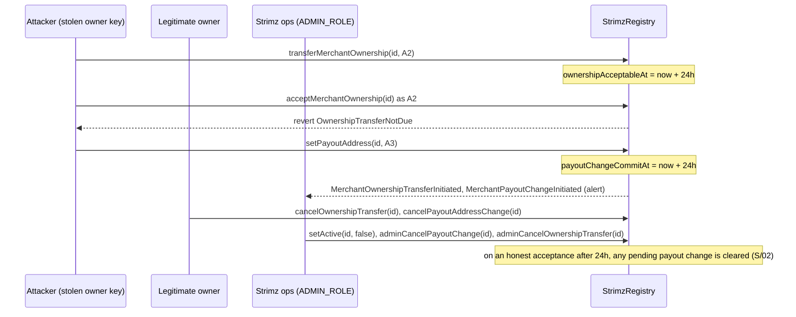

# ADR: Close the registry, agent and subscription permission gaps before the redeploy

- **Status:** Accepted 2026-10-03
- **Date:** 2026-10-03
- **Scope:** `packages/contracts` (`StrimzRegistry`, `StrimzAgentRegistry`,
  `StrimzAgentEscrow`, `StrimzSubscriptions`), the ABI copies in `apps/indexer` and
  `apps/api`, `@strimz/sdk` (`eip712/subscription-intent.ts`), the web subscription
  checkout hook and merchant on-chain policy panel, the merchant ownership transfer
  runbook. No Prisma, queue payload or webhook payload change. `StrimzPayments`,
  `TokenWhitelist` and `FeeCollector` do not change.

## Context

Issue #130 lists six permission gaps found in review and in the Buantum operational
notes. Each was read against `main` at `73c53d1` and reproduced by a test in
`packages/contracts/test/ContractPermissionGaps.t.sol` that asserts the safe behaviour
and fails on `main`.

Deployment facts that shape the fixes:

- `StrimzRegistry`, `StrimzAgentRegistry` and `StrimzAgentEscrow` are UUPS proxies with
  ERC-7201 namespaced storage (`Storage` struct at a fixed slot). New state must be
  appended at the end of that `Storage` struct. Appending is upgrade-safe.
- `StrimzSubscriptions` is deployed directly with a constructor and cannot be upgraded.
  Any change to it ships only through the redeploy in #142.
- Agent escrow launch scope is undecided (#145). The escrow items below are written so
  they can be dropped from this change if agent escrow is hidden for launch.
- The external re-review (#147) must see the final diff, so all items that are accepted
  land in one branch before the redeploy.

### Finding 1. Instant ownership transfer defeats the 24 hour payout delay

`StrimzRegistry.setPayoutAddress` (`src/core/StrimzRegistry.sol:150-158`) only marks a
change pending for `PAYOUT_CHANGE_DELAY` (24 hours, line 18). The stated purpose (lines
15-17) is that a compromised owner key "has this window to be noticed and revoked".
Revocation is `cancelPayoutAddressChange` (lines 173-180), callable only by `m.owner`.

`transferMerchantOwnership` (lines 185-192) and `acceptMerchantOwnership` (lines
195-205) have no delay. A holder of the stolen owner key nominates a second address it
controls and accepts in the same block. From then on the legitimate owner is no longer
`m.owner`: it cannot cancel the pending payout change, cannot cancel a later one, and
cannot nominate itself back. `commitPayoutAddress` (lines 161-170) is permissionless
and does not check `active`, so the change lands after 24 hours whatever happens.

The 24 hour timer itself is not skipped. What is bypassed is the remediation it was
meant to buy: nobody who is entitled to cancel the change is still in control. The only
counter today is `setActive(merchantId, false)` by `ADMIN_ROLE`, which stops new
payments but does not cancel the pending change, does not return ownership, and must be
undone eventually, at which point payouts flow to the attacker.

- **Impact:** a stolen merchant owner key becomes a permanent loss of the merchant
  record and, after 24 hours, of every later payment and subscription charge.
- **Severity:** High. It needs a key compromise, which is exactly the threat the delay
  exists for.
- **Test:** `test_ownershipAcceptanceCannotSkipTheDelay`. On `main` the immediate
  `acceptMerchantOwnership` succeeds: `next call did not revert as expected`.

### Finding 2. Buantum S/02: a pending payout change survives ownership acceptance

`acceptMerchantOwnership` (lines 195-205) sets `owner` and clears `pendingOwner`. It
does not touch `pendingPayoutAddress` or `payoutChangeCommitAt`. The previous owner can
call `setPayoutAddress(X)` before or during the transfer; after acceptance, X stays
pending and anyone can call `commitPayoutAddress` once the delay passes. Payments then
route to an address the new owner never chose. The new owner can cancel it, but only if
it notices: the dashboard shows the pending address, nothing forces a look.

- **Impact:** in a sale or hand-over of a merchant, the seller can keep receiving the
  buyer's revenue. In an honest hand-over a forgotten rotation still misroutes funds.
- **Severity:** High (no key compromise needed; the previous owner is a legitimate
  actor).
- **Test:** `test_acceptingOwnershipCancelsPendingPayoutChange`. On `main` the first
  assertion fails: `pending payout change must not survive acceptance:
0x1391...08d3 != 0x0000...0000`.

### Finding 3. Admin-deactivated agents can reactivate themselves

`StrimzAgentRegistry.deactivate` (`src/agent/StrimzAgentRegistry.sol:84-91`) and
`activate` (lines 94-101) both accept the controller or `AGENT_ADMIN_ROLE`, and record
only `active`. A deactivation by the admin (for example for compliance) is undone by
the agent's controller in one call. The interface NatSpec
(`IStrimzAgentRegistry.sol:41-43`) describes this as intended ("same standing as
`deactivate`"), so the code matches its documentation; the documented rule is the
problem.

- **Impact:** an admin suspension of an agent is not enforceable. Today no contract or
  app gates funds on `isActive` (the escrow does not read the agent registry and no app
  imports it), so the practical effect is a misleading on-chain status, not lost funds.
- **Severity:** Low today; Medium once anything gates on `isActive`.
- **Test:** `test_controllerCannotReactivateAfterAdminDeactivation`. On `main` the
  controller's `activate` succeeds: `next call did not revert as expected`.

### Finding 4. Escrow exits are blocked by pause

In `src/agent/StrimzAgentEscrow.sol` every function carries `whenNotPaused`, including
the four that move escrowed funds out: `approveAndRelease` (line 171), `cancelJob`
(line 197), `resolveDispute` (line 220) and `reclaimAfterTimeout` (line 248). The header
promises that funds "always have a path out" (lines 14-15). While paused there is none.

Pause also stops `dispute` (line 186) and `submitDeliverable` (line 161) but not the
clocks, which read `statusChangedAt` against `block.timestamp`. A pause longer than
`APPROVAL_TIMEOUT` (14 days) lets the vendor reclaim a delivered job the client was
blocked from disputing; a pause longer than `DELIVERY_TIMEOUT` (30 days) lets the client
reclaim a job the vendor was blocked from delivering. Pause changes who wins.

- **Impact:** a pause (or a lost admin key while paused) freezes all escrowed funds, and
  a long pause shifts outcomes between the parties.
- **Severity:** Medium (needs admin action or admin key loss).
- **Test:** `test_escrowReclaimStillWorksWhilePaused`. On `main` the reclaim reverts
  with `EnforcedPause()`.

### Finding 5. The client takes 100% of a delivered job after an unanswered dispute

`dispute` (lines 186-194) is open to the client from `Delivered`. `reclaimAfterTimeout`
(lines 268-273) lets only the client leave `Disputed`, with the whole amount, once
`DISPUTE_TIMEOUT` (30 days) passes. A client who receives the deliverable disputes it at
once; if the resolver does not act within 30 days the client recovers every unit, and
the vendor has no path. The same holds when the vendor is the one who disputed.

Before the dispute, the default outcome of a `Delivered` job was payment to the vendor
after `APPROVAL_TIMEOUT`. The dispute reverses that default instead of pausing it.

- **Impact:** delivered work can be taken for free whenever the resolver is slow. The
  current test `test_clientReclaimsDisputedAfterDisputeTimeout`
  (`test/StrimzAgentEscrow.t.sol:276`) encodes this behaviour on purpose.
- **Severity:** Medium (needs a silent resolver; Strimz is the resolver).
- **Test:** `test_clientCannotReclaimDeliveredJobAfterSilentDispute`. On `main` the
  client's reclaim succeeds: `next call did not revert as expected`.

### Finding 6. Subscription intent replay and permit front-run DoS

`SUBSCRIPTION_INTENT_TYPEHASH` (`src/core/StrimzSubscriptions.sol:43-45`) signs
`merchantId, token, amount, interval, startAt, endAt, permitDeadline`. There is no nonce
and nothing in storage marks an intent used. `permitAndCreateSubscription` (lines
172-232) relies on the token's `permit` (lines 203-209) to stop a second use.

1. **Replay.** Any later valid permit from the same owner to this contract with the
   same deadline revives the old intent. The web checkout derives the deadline as
   `now + 24h` (`apps/web/src/hooks/use-subscription-checkout.ts:150`), so a second
   checkout in the same second, or any integrator that uses a fixed deadline, produces
   a matching pair. Whoever sees the second permit in the mempool can submit it with the
   first intent and create a duplicate subscription the payer did not ask for, billed
   every period against the payer's (typically unlimited) allowance.
2. **Front-run DoS.** The permit signature is public once submitted. Anyone can call
   `token.permit` directly with it first. The allowance is then in place, but the
   relayer's `permitAndCreateSubscription` reverts inside `permit` because the nonce is
   spent, and the subscription is never created. The payer must sign again; an attacker
   can repeat this indefinitely.

The obvious DoS fix (tolerate a failed `permit` when the allowance is already enough)
turns the replay from "needs a matching second permit" into "needs nothing": the intent
alone would enrol the payer again. The two must be fixed together.

- **Impact:** duplicate recurring charges the payer did not consent to (replay);
  griefing of every relayed enrolment (DoS).
- **Severity:** Medium for replay (preconditions are narrow but the result is
  unauthorised recurring billing); Medium for DoS (cheap, repeatable, no funds lost).
- **Tests:** `test_subscriptionIntentCannotBeReplayedWithLaterPermit`: on `main` the
  replay succeeds, `next call did not revert as expected`.
  `test_frontRunPermitDoesNotBlockSubscriptionEnrolment`: on `main` the enrolment
  reverts with `ERC2612InvalidSigner(...)` from the token.

### Related gap found while reading, not in this scope

The indexer projects the legacy `MerchantOwnerTransferred` event
(`apps/indexer/internal/processor/projector.go:98`), which the current registry never
emits. `MerchantOwnershipTransferAccepted`, `MerchantPayoutChangeInitiated` and
`MerchantPayoutChangeCancelled` are in the indexer's ABI JSON but are not decoded or
projected. Ownership changes reach the database only through the API reading
`getMerchant`. This should be its own issue; the decisions below do not depend on it.

## Decision

Items 1 and 2 are required for the redeploy. Items 3 and 6 are recommended for the
redeploy. Items 4 and 5 depend on #145: if agent escrow is out of launch scope they are
deferred together with the escrow, and the escrow is not redeployed.

1. **Ownership acceptance waits for the same delay as a payout change.**
   - `transferMerchantOwnership` records `ownershipAcceptableAt[merchantId] = now +
PAYOUT_CHANGE_DELAY`. `acceptMerchantOwnership` reverts with a new error
     `Registry__OwnershipTransferNotDue()` before that time. `cancelOwnershipTransfer`
     and acceptance clear it.
   - `ADMIN_ROLE` gains `adminCancelPayoutChange(merchantId)` and
     `adminCancelOwnershipTransfer(merchantId)`. They can only cancel, never set an
     address. They emit the existing `MerchantPayoutChangeCancelled` and
     `MerchantOwnershipTransferCancelled`.
   - Why both: the delay alone gives a legitimate owner the chance to cancel, but an
     attacker holding the same key can cancel the owner's own move to a fresh key, so
     the merchant is stuck in a stalemate. A cancel-only guardian lets Strimz operations
     end the stalemate on an alert without being able to redirect funds.
   - Storage: append `mapping(uint256 merchantId => uint64 acceptableAt)
ownershipAcceptableAt` to `StrimzRegistry.Storage`. The `Merchant` struct does not
     change, so `getMerchant` and `requireActiveMerchant` keep their return shape and
     the deployed Payments and Subscriptions keep decoding it. Add a view
     `pendingOwnerAcceptableAt(uint256)`.
   - Upgrade or redeploy: a UUPS upgrade of the registry implementation is enough.
     Because #142 redeploys anyway, it ships in the fresh proxy.
   - Pending transfers at upgrade time have `ownershipAcceptableAt == 0`. Acceptance
     must treat 0 with a live `pendingOwner` as "not due" and require a fresh
     nomination, so an in-flight transfer cannot slip past the new rule.

2. **Acceptance cancels any pending payout change (S/02).** `acceptMerchantOwnership`
   clears `pendingPayoutAddress` and `payoutChangeCommitAt` and, when one was pending,
   emits `MerchantPayoutChangeCancelled(merchantId)` before
   `MerchantOwnershipTransferAccepted`. No new storage. Upgrade suffices.

3. **Admin deactivation of an agent sticks.** Append
   `mapping(address agent => bool) suspended` to `StrimzAgentRegistry.Storage`.
   `deactivate` called by an `AGENT_ADMIN_ROLE` holder sets `suspended`; `activate` by
   the controller reverts with a new error `AgentRegistry__Suspended(agent)` while
   suspended; `activate` by the admin clears it. A controller's own deactivate and
   reactivate keep working. `isActive` additionally returns false while suspended. Add a
   view `isSuspended(address)`. The `Agent` struct and its events do not change.
   Upgrade suffices. The interface NatSpec at `IStrimzAgentRegistry.sol:41-43` becomes
   false and must be corrected by a person.

4. **Pause stops new escrow, not existing escrow** (depends on #145). Keep
   `whenNotPaused` on `createJob` and `fundJob` only. Remove it from `startJob`,
   `submitDeliverable`, `approveAndRelease`, `dispute`, `cancelJob`, `resolveDispute`
   and `reclaimAfterTimeout`. Every job that already holds funds can then progress and
   exit during a pause, and no party is blocked while its counterparty's clock runs.
   No storage change, no ABI change. Upgrade suffices.

5. **An unanswered dispute keeps the pre-dispute default** (depends on #145).
   - Append `mapping(uint256 jobId => JobStatus) disputedFrom` to
     `StrimzAgentEscrow.Storage`, written by `dispute`.
   - After `DISPUTE_TIMEOUT`: a dispute raised from `Delivered` pays the vendor, who is
     the only caller allowed; a dispute raised from `InProgress` refunds the client, who
     is the only caller allowed. Raising a dispute therefore never improves the raiser's
     outcome when the resolver is silent, and `resolveDispute` stays the way to split.
   - Jobs already `Disputed` at upgrade time have `disputedFrom == None` and keep
     today's rule (client), so the upgrade does not change an in-flight dispute.
   - `JobReclaimed(jobId, to, amount, fromStatus)` keeps its signature; `to` may now be
     the vendor for `fromStatus == Disputed`. The indexer already records `to` without
     assuming the client (`projector.go:341-357`). The `Job` struct does not change.
   - Upgrade suffices.

6. **Subscription intents carry a nonce, and a front-run permit no longer blocks
   enrolment.**
   - `SubscriptionIntent` gains `bytes32 nonce`:
     `SubscriptionIntent(uint256 merchantId,address token,uint256 amount,uint32
interval,uint64 startAt,uint64 endAt,uint256 permitDeadline,bytes32 nonce)`.
     `permitAndCreateSubscription` takes the nonce as a new argument and
     `subscriptionIntentDigest` gains it as a parameter. The contract stores
     `mapping(address payer => mapping(bytes32 nonce => bool used)) usedIntentNonces`,
     appended to its `Storage`, rejects a used nonce with
     `Subscriptions__IntentAlreadyUsed(bytes32)` and marks it used before any external
     call. This matches the random-nonce model of `PayIntent` in `StrimzPayments`.
   - The `permit` call is wrapped: if it reverts, enrolment continues only when
     `allowance(owner, this) >= permitData.value`; otherwise the original revert data is
     re-raised unchanged, so no reason is hidden. With the nonce in place this is the
     pattern OpenZeppelin documents for front-run-safe permits.
   - Upgrade or redeploy: redeploy only. The contract is immutable; this lands in the
     #142 redeploy, and existing subscriptions on the old contract are unaffected.

### ABI, event and consumer impact

| Item | ABI change                                                                                                          | Events                                                                  | Consumers to update in the same PR                                                                                                                                                                                                                                                                                                                                                    |
| ---- | ------------------------------------------------------------------------------------------------------------------- | ----------------------------------------------------------------------- | ------------------------------------------------------------------------------------------------------------------------------------------------------------------------------------------------------------------------------------------------------------------------------------------------------------------------------------------------------------------------------------- |
| 1    | new error, two admin functions, one view                                                                            | none new                                                                | `apps/indexer/internal/abi/StrimzRegistry.abi.json`, `apps/api/src/modules/merchants/registry.abi.ts`, `apps/web/src/components/dashboard/onchain-policy-section.tsx` (show "can accept after", disable Accept until then)                                                                                                                                                            |
| 2    | none                                                                                                                | existing `MerchantPayoutChangeCancelled` now also emitted on acceptance | none decode it today; the web panel already reads `pendingPayoutAddress` live                                                                                                                                                                                                                                                                                                         |
| 3    | new error, one view                                                                                                 | none new                                                                | no app consumes the agent registry                                                                                                                                                                                                                                                                                                                                                    |
| 4    | none                                                                                                                | none                                                                    | none                                                                                                                                                                                                                                                                                                                                                                                  |
| 5    | none                                                                                                                | `JobReclaimed.to` may be the vendor from `Disputed`                     | indexer already generic; `apps/web` docs on escrow timeouts                                                                                                                                                                                                                                                                                                                           |
| 6    | `permitAndCreateSubscription` and `subscriptionIntentDigest` signatures change; new error; EIP-712 typehash changes | none                                                                    | `packages/sdk/src/eip712/subscription-intent.ts`, `apps/web/src/hooks/use-subscription-checkout.ts`, `apps/api/src/modules/relay/{abi.ts,relay.dto.ts,relay.types.ts,relay.service.ts}`, `packages/queue-contracts/src/fixtures.ts`, `apps/indexer/internal/abi/StrimzSubscriptions.abi.json`, docs pages under `apps/web/content/docs` that show the intent; `@strimz/sdk` changeset |

Existing tests whose expectations change and must be updated with the fix (their
comments become false and are listed for a person to rewrite):
`test/StrimzRegistry.t.sol` `test_onlyNomineeCanAccept`,
`test_secondNominationOverwritesFirst` (accept immediately);
`test/StrimzAgentEscrow.t.sol` `test_clientReclaimsDisputedAfterDisputeTimeout` and the
file header table (lines 17-22); `test/StrimzSubscriptionsPermit.t.sol` intent helpers
and `test/Helpers.t.sol` `_signSubscriptionIntent` (new nonce argument).

### Runbook: merchant ownership transfer (S/02)

Added as `docs/runbooks/merchant-ownership-transfer.md` with the fix:

1. Before nominating, the current owner opens the on-chain policy panel and confirms
   there is no pending payout change. If there is one, cancel it or let it commit first;
   do not hand over with a change pending.
2. Nominate the new owner. Strimz operations confirm the
   `MerchantOwnershipTransferInitiated` event matches the agreed address.
3. Wait 24 hours (enforced on-chain after item 1). During the wait, either party, or
   Strimz operations through `adminCancelOwnershipTransfer`, can stop the transfer.
4. The new owner accepts. Confirm on the panel that the owner changed and that
   "pending payout change" is empty (after item 2 it always is; until the fix ships on
   the live registry, the new owner must cancel any pending change immediately).
5. The new owner sets its own payout address and waits 24 hours for it to commit.
6. On any unexpected `MerchantOwnershipTransferInitiated` or
   `MerchantPayoutChangeInitiated` for a merchant, operations freeze the merchant
   (`setActive(false)`), cancel the pending change with the admin cancel functions, and
   contact the owner out of band before unfreezing.

## Diagram

## Consequences

- A stolen owner key can no longer take a merchant away in one block. Every change of
  who controls or receives a merchant's money takes 24 hours and is visible and
  cancellable for that time.
- Honest ownership transfers take 24 hours instead of minutes. The dashboard must show
  when acceptance becomes possible.
- `ADMIN_ROLE` gains a cancel-only power over merchant changes. It cannot redirect
  funds, but it can delay a merchant's legitimate change; this is a trust increase the
  maintainer must accept (decision D1).
- A buyer of a merchant can no longer inherit the seller's payout rotation.
- Admin suspension of an agent means something.
- Pausing the escrow stops new jobs but never traps or reallocates existing escrow.
- A slow resolver no longer hands delivered work to the client for free; it leaves the
  outcome where it was before the dispute.
- Every relayed subscription signature becomes single use, and a public permit can no
  longer be used to grief enrolment. The SDK's typed data changes, which is a breaking
  change for any integrator signing intents directly (pre-launch, so acceptable now and
  not later).

## Alternatives considered

- **Item 1: delay only, no admin cancel.** Lost: an attacker holding the same key can
  cancel the owner's move to a fresh key forever, so the merchant never recovers.
- **Item 1: admin can force a new owner.** Lost: gives the admin key the power to
  redirect funds, which is the risk the delay exists to bound.
- **Item 1: block payout changes for 24h after any ownership change instead of delaying
  acceptance.** Lost: the legitimate owner is still locked out instantly and can never
  return.
- **Item 1: store `ownershipAcceptableAt` inside `Merchant`.** Lost: it changes the
  return shape of `getMerchant`/`requireActiveMerchant` that deployed Payments and
  Subscriptions decode, and the API and web ABIs.
- **Item 2: require the new owner to confirm the pending change instead of cancelling.**
  Lost: adds a state for no gain; the new owner can set the same address again.
- **Item 3: separate `suspend`/`unsuspend` functions.** Viable, larger ABI. Kept the
  existing functions and keyed the rule on the caller's role.
- **Item 4: freeze the clocks during pause (track paused time).** Lost: more storage
  and arithmetic in every timeout path for a rare event; letting existing jobs proceed
  is simpler and keeps the "always a path out" promise.
- **Item 5: split 50/50 after an unanswered dispute.** Viable. Lost on fairness: it
  still rewards a client disputing finished work with half of it, and rewards a vendor
  disputing unfinished work with half of it.
- **Item 5: let either party reclaim to themselves.** Lost: a race, decided by gas.
- **Item 6: bind the intent to the token's permit nonce instead of a Strimz nonce.**
  Lost: incompatible with tolerating a front-run permit, because the front-run spends
  that nonce.
- **Item 6: fix only the DoS by tolerating a failed permit.** Lost: makes the replay
  trivially exploitable (see Finding 6).

## Decisions for the maintainer

- **D1.** Accept the cancel-only `ADMIN_ROLE` guardian over merchant payout and
  ownership changes (recommended), or ship the 24h acceptance delay alone.
- **D2.** Delay length for ownership acceptance: reuse 24h (recommended, one constant)
  or a separate constant.
- **D3.** Escrow items 4 and 5: in this change if #145 keeps agent escrow for launch;
  deferred with the escrow otherwise (recommended to follow #145).
- **D4.** Item 5 rule: pre-dispute default (recommended) or 50/50 split.
- **D5.** Item 3 now (recommended, small) or deferred with the agent work.

## Verification

- Red, run on `main` with `forge build && forge test --match-contract
ContractPermissionGapsTest`: 7 tests, 7 fail, each for the reason quoted under its
  finding.
- Green, after the fix: the same 7 pass, plus new tests for every new revert path,
  access check and event: `Registry__OwnershipTransferNotDue` before the delay and
  success after; a transfer pending at upgrade time cannot be accepted without a fresh
  nomination; admin cancel functions are `ADMIN_ROLE` only and cannot set addresses;
  `MerchantPayoutChangeCancelled` emitted on acceptance only when a change was pending;
  controller self-deactivate and reactivate still works; agent admin reactivation
  clears suspension; every escrow exit works while paused and `createJob`/`fundJob`
  still revert; dispute from `InProgress` refunds the client after the timeout and
  dispute from `Delivered` pays the vendor; a used intent nonce reverts; a front-run
  permit with insufficient allowance re-raises the token's revert.
- `test/Upgradeability.t.sol` extended to upgrade a populated registry, agent registry
  and escrow to the new implementations and read back every existing field.
- `test/invariant/PaymentsInvariants.t.sol` keeps passing. If items 4 and 5 ship, a new
  escrow invariant suite (there is none today) asserts that the escrow balance equals
  the sum of funded, open jobs, with pause toggled by the handler.
- `./scripts/preflight.sh` passes in full, including the SDK and relay tests updated
  for the new intent typed data, with a test pinning the SDK typehash to the contract.
- On Arc testnet after the #142 redeploy: enrol through the web checkout and through
  the relay with a front-run permit submitted first; transfer a test merchant's
  ownership with a pending payout change and confirm the change is cancelled on
  acceptance; record the transaction hashes in the PR.
