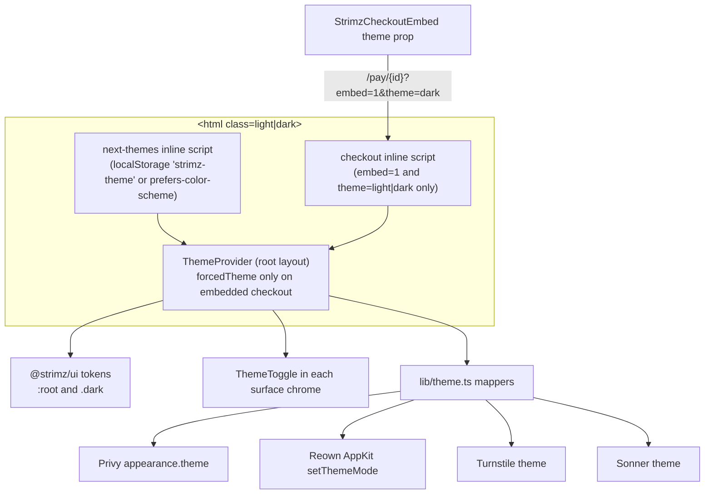

# ADR: Light and dark theme with a user-visible toggle on every web surface

- **Status:** Accepted 2026-10-03
- **Date:** 2026-10-03
- **Scope:** `packages/ui` (theme tokens in `globals.css`, a dark token set, the
  `Toaster`, every primitive that hardcodes a colour, a new `ThemeProvider` and
  `ThemeToggle` export), `apps/web` (root provider, a toggle in each surface's chrome,
  replacement of hardcoded colour utilities with tokens, Privy, Reown AppKit, Turnstile
  and driver.js theming, Fumadocs theme switch, embedded checkout theme),
  `packages/sdk-react` (one new optional prop on `StrimzCheckoutEmbed`, so a changeset).
  No api, scheduler, agent, indexer, contract, database, queue or webhook change.
  `apps/demo-merchant` already ships a theme toggle and is only touched by Decision 11.
  Issue #151.

## Context

Verified on `origin/main` at `7358b01`.

### The rule

`AGENTS.md` checklist item 10 and the engineering standards say every web surface ships
a user-visible light/dark toggle and uses theme tokens, never hardcoded light colours.
`apps/web` breaks that rule on every surface today.

### What exists

- `packages/ui/src/styles/globals.css` defines shadcn semantic tokens (`--background`,
  `--foreground`, `--card`, `--muted`, `--border`, ...) under `:root` only. Its header
  comment says the `.dark` selector and `@custom-variant dark` were removed on purpose.
  `--color-primary` (`#050020`) and `--color-accent` (`#02C76A`) are direct hex values,
  and the brand neutrals `--color-brand-*` are direct hex values, so none of them can
  change with a theme.
- There is no dark palette anywhere in `apps/web` or `packages/ui`. Choosing one is a
  design decision, which is why this ADR exists.
- `next-themes@0.4.6` is already a dependency of `@strimz/ui` (unused there) and of
  `apps/demo-merchant`, which already has a working `ThemeProvider` and `ThemeToggle`
  (default theme `dark`). The `@strimz/ui` README documents a `ThemeProvider` export
  that does not exist.
- `apps/web/src/app/layout.tsx` already sets `suppressHydrationWarning` on `<html>` and a
  light and dark `themeColor`, and paints `<body>` with `bg-background text-foreground`;
  `apps/web/src/styles/globals.css` then overrides the body with `#ffffff` and `#050020`.
- Third-party widgets are pinned to light: Privy `appearance.theme: 'light'`
  (`components/providers.tsx`), Reown AppKit `themeMode: 'light'`
  (`components/checkout-providers.tsx`, set once at module load), Turnstile
  `theme: 'light'` (`app/(auth)/signup/page.tsx`), Sonner `theme="light"` plus hardcoded
  toast colours (`packages/ui/src/components/sonner.tsx`), and the driver.js tour skin
  (`styles/globals.css`).
- Docs use Fumadocs with `RootProvider theme={{ enabled: false }}`, which hides the
  Fumadocs theme switch; `styles/docs.css` overrides only the light `--fd-*` variables.
- `StrimzCheckoutEmbed` (`packages/sdk-react`, published, 0.1.9) loads
  `/pay/{id}?embed=1` in an iframe. It has no theme option, and the checkout pages do
  not read `embed` today. `/pay` and `/sub` are the only routes allowed in a frame
  (`frame-ancestors *`, report-only CSP with `'unsafe-inline'` scripts).

### Size of the conversion

The red test `apps/web/src/__tests__/theme-surfaces.test.ts` finds 800 hardcoded colour
utilities (hex arbitrary values, `white`, `black`, greys; `text-white` and translucent
white or black overlays are allowed). Six literals account for 768 of them:

| Literal     | Count | Where it is used                                      |
| ----------- | ----- | ----------------------------------------------------- |
| `#02C76A`   | 276   | accent: CTAs, active states, badges, icons            |
| `#050020`   | 157   | 134 text (headlines), 18 backgrounds, 5 borders       |
| `#58556A`   | 145   | secondary text                                        |
| `#E5E7EB`   | 72    | borders, dividers                                     |
| `white`     | 67    | page, card, nav and input backgrounds                 |
| `#F9FAFB`   | 51    | soft panels, table heads, secondary buttons           |
| other greys | 19    | `#D1D5DB`, `#F3F4F6`, `#8E8C9C`, `#8B8896`, `#BCBAC4` |
| decorative  | 13    | window dots, step colours, gradient bars, hovers      |

By surface: marketing 382, dashboard 163, store 38, checkout 30, admin 41, auth 19,
shared components 13, `@strimz/ui` primitives 114.

## Decision

1. **Tokens first.** `@strimz/ui/globals.css` restores `@custom-variant dark
(&:where(.dark, .dark *));` and defines every `:root` token again under `.dark`.
   `--color-primary`, `--color-primary-foreground` and the `--color-brand-*` neutrals
   become variable-driven. A new pair `--color-ink` and `--color-ink-foreground` names
   the brand navy surface that stays navy in both themes.
2. **Light palette realigned to the brand**, so replacing literals with tokens is
   pixel-identical in light mode (today the shadcn defaults differ slightly from what
   the pages hardcode):

   | Token                     | Light (new)           | Light (today) | Dark (new)            |
   | ------------------------- | --------------------- | ------------- | --------------------- |
   | `background`              | `#FFFFFF`             | `#FFFFFF`     | `#0B0B12`             |
   | `foreground`              | `#050020`             | `#0A0A0A`     | `#F5F5F7`             |
   | `card`, `popover`         | `#FFFFFF`             | `#FFFFFF`     | `#14141D`             |
   | `muted`                   | `#F9FAFB`             | `#F5F5F5`     | `#1C1C27`             |
   | `secondary`               | `#F3F4F6`             | `#F5F5F5`     | `#1C1C27`             |
   | `muted-foreground`        | `#58556A`             | `#737373`     | `#A09DB0`             |
   | `border`                  | `#E5E7EB`             | `#E5E5E5`     | `#2A2A37`             |
   | `input`                   | `#D1D5DB`             | `#E5E5E5`     | `#3A3A49`             |
   | `ring`                    | `#050020`             | `#0A0A0A`     | `#02C76A`             |
   | `primary` / `-foreground` | `#050020` / `#FFFFFF` | same          | `#F5F5F7` / `#050020` |
   | `accent` / `-foreground`  | `#02C76A` / `#FFFFFF` | same          | unchanged             |
   | `ink` / `-foreground`     | `#050020` / `#FFFFFF` | (new)         | `#050020` / `#FFFFFF` |
   | `destructive`             | unchanged             |               | `#EF4444`             |
   | `chart-1..5`              | unchanged             |               | shadcn dark chart set |

   Values are written in the file in the existing `H S% L%` form. Contrast, computed:
   `muted-foreground` on `background` is 7.2:1 light and 7.4:1 dark; `accent` on dark
   `background` is 8.8:1. White text on `accent` is 2.2:1 in both themes; that is the
   existing brand choice and is not changed here.

3. **Mechanical mapping**, applied to every file the scan reports: `#02C76A` to
   `accent`; `#050020` text to `foreground`; `#050020` backgrounds and borders to `ink`
   when the element is a brand panel (footer, CTA band, stats band, features section,
   auth side panel, store banner, code windows) and to `primary` when it is a control
   (buttons, badges); `#58556A` to `muted-foreground`; `#E5E7EB` to `border`; `white`
   backgrounds to `background` (pages, nav) or `card` (cards, popovers, inputs);
   `#F9FAFB` to `muted`; `#F3F4F6` to `secondary`; `#D1D5DB` to `input`; the three
   placeholder greys to `muted-foreground`. Decorative literals become named tokens
   with a dark value: `accent-bright`, `accent-soft` (exist), `accent-hover` and
   `primary-hover` (button hovers), `window-close`, `window-minimize`, `window-zoom`
   (fixed in both themes), `step-blue`, `step-purple`, `step-red` (lighter in dark).
4. **One provider at the root.** `@strimz/ui` exports `ThemeProvider` (a thin
   `next-themes` wrapper) and `ThemeToggle`. `apps/web/src/app/layout.tsx` mounts it
   once, around `Providers` and the `Toaster`, with `attribute="class"`,
   `defaultTheme="system"`, `enableSystem`, `disableTransitionOnChange` and
   `storageKey={THEME_STORAGE_KEY}` (`'strimz-theme'`, from `apps/web/src/lib/theme.ts`).
   A single root provider keeps one preference across marketing, auth, dashboard,
   admin, store, checkout and docs. The hardcoded body colours in `apps/web/src/styles/globals.css`
   are removed so the `bg-background text-foreground` body classes apply, and the dark
   `themeColor` in the root layout becomes `#0B0B12`.
5. **No flash of the wrong theme.** `next-themes` renders a blocking inline script that
   sets the `dark` class on `<html>` from `localStorage` or `prefers-color-scheme`
   before first paint. The CSP already allows inline scripts (`'unsafe-inline'`, report
   only), so no CSP change is needed. Any component whose output depends on the theme
   (the toggle icon and label) renders after mount.
6. **Toggle placement**, one keyboard-accessible `<button>` with an `aria-label` of
   "Switch to dark theme" or "Switch to light theme" and a visible focus ring:
   - marketing: `components/marketing/nav.tsx`, before the sign-in button, and in the
     mobile menu;
   - auth: `app/(auth)/layout.tsx`, top right of the form column;
   - dashboard: `components/dashboard/topbar.tsx`, left of the notifications bell;
   - admin: `components/admin/admin-shell.tsx`, in the header;
   - hosted checkout: `app/(checkout)/layout.tsx`, right of the logo, hidden when
     `embed=1`;
   - store: a new `app/store/[slug]/layout.tsx` header shared by the store and product
     pages;
   - docs: the built-in Fumadocs switch, enabled by dropping `theme={{ enabled: false }}`
     and adding `.dark` values for the `--fd-*` overrides and the inline code chip in
     `styles/docs.css`.
7. **Embedded checkout.** `StrimzCheckoutEmbed` gains an optional
   `theme?: 'light' | 'dark'` prop that appends `&theme=<value>` to the iframe URL;
   omitted, no parameter is sent and the checkout follows the payer's system
   preference. Inside `/pay` and `/sub`, `embedForcedTheme(searchParams)` returns the
   theme only when `embed=1` and `theme` is exactly `light` or `dark`, so a shared
   non-embedded link cannot pin a visitor's theme. Because `next-themes` ignores a
   nested provider (it renders children only when a provider already exists), the root
   provider receives `forcedTheme` from a client wrapper that reads
   `window.location.search` once on mount for checkout paths, and the checkout layout
   emits a small inline script, generated from the same function, that sets the class
   before paint. A forced theme is never written to `localStorage`, which is also
   partitioned inside third-party iframes.
8. **Third-party widgets follow the resolved theme** through pure mappers in
   `lib/theme.ts`: Privy `appearance.theme` from `privyAppearanceTheme`; Reown AppKit
   `setThemeMode(reownThemeMode(resolved))` on change (AppKit is created at module
   load); Turnstile re-renders its widget with `turnstileTheme(resolved)`, `auto` until
   the theme resolves on the client, accepting that a theme change during signup
   resets the challenge; Sonner receives the resolved theme and token classes; the
   driver.js tour skin uses token variables.
9. **Out of scope, stays light:** the invoice PDF (`lib/invoice-pdf.tsx`, a printed
   document), Open Graph images, and email templates.
10. **Guard rails.** The red tests in this branch become the regression suite:
    `lib/__tests__/theme.test.ts` (pure logic), `__tests__/theme-surfaces.test.ts`
    (token parity, no hardcoded colour utilities in web routes, web components and ui
    primitives, a toggle in each surface's chrome, no widget pinned to light) and
    `packages/sdk-react/tests/StrimzCheckoutEmbed.test.tsx`.
11. **demo-merchant** switches `defaultTheme` from `dark` to `system` so it also
    respects `prefers-color-scheme` by default. Its toggle stays.
12. **Delivery in one pull request** that closes #151, because the scan test covers
    every surface at once. If the maintainer prefers smaller reviews, the alternative is
    four pull requests (foundation and ui primitives; marketing and docs; dashboard,
    admin and auth; checkout, store and sdk-react), with the scan's directory list
    growing per pull request and only the last one closing #151.

## Diagram

## Consequences

- Light mode changes very slightly where pages already used shadcn tokens: foreground
  moves from `#0A0A0A` to `#050020`, muted text from `#737373` to `#58556A`, borders
  from `#E5E5E5` to `#E5E7EB`. Pages that hardcode literals are unchanged.
- The conversion touches the 83 files the scan reports, plus the new store layout. It is mechanical, but every surface needs a
  visual pass in both themes before merge; the scan proves tokens are used, not that
  the result looks right.
- New UI work must use tokens; the scan fails the build otherwise.
- `@strimz/sdk-react` gets a minor version for the new optional prop. Existing embeds
  keep working and start following the payer's system preference instead of always
  rendering light; merchants who need light pass `theme="light"`.
- The brand navy panels stay navy in dark mode; on a `#0B0B12` page they read as a
  distinct, slightly blue surface rather than disappearing.

## Alternatives considered

- **Invert the brand navy in dark mode everywhere.** Lost: the navy sections, footer
  and auth panel are brand surfaces designed with white text on navy; inverting them
  produces light grey bands on a dark page.
- **A navy-tinted dark background (near `#050020`).** Lost: the navy brand panels and
  code windows would disappear into the page.
- **`dark:` variants next to each literal instead of tokens.** Lost: doubles 800 class
  lists, keeps colour decisions scattered, and contradicts the "use theme tokens" rule.
- **A theme provider per route group** (so the checkout group could own a forced
  theme). Lost: Privy and React Query live above the route groups; moving them would
  remount them on every cross-surface navigation.
- **Reading `searchParams` or headers at the root to force the embed theme on the
  server.** Lost: it makes every route dynamic, including the static marketing pages.
- **A toggle inside the embedded checkout.** Not proposed: the merchant's page owns the
  look of the embed. This is an exception to "every surface ships a toggle" and needs
  the maintainer's explicit agreement (see the companion ADR).

## Verification

- `pnpm exec vitest run` in `apps/web`: `theme.test.ts` (24 cases) and
  `theme-surfaces.test.ts` (19 cases) pass; today 16 of them fail and `theme.test.ts`
  cannot load because `lib/theme.ts` does not exist.
- `pnpm exec vitest run` in `packages/sdk-react`: the two theme cases in
  `StrimzCheckoutEmbed.test.tsx` pass; today they fail with `theme` absent from the
  iframe URL.
- `./scripts/preflight.sh` passes in full.
- By hand, in a browser, each surface in light, dark and system mode, with the OS
  switched between light and dark: marketing home, pricing, about, customers, legal;
  login, signup (Turnstile), onboarding; dashboard pages including the tour and a
  toast; admin pages; `/pay/{id}` and `/sub/{id}` hosted and embedded with
  `theme=dark`, `theme=light` and no theme (Reown modal); `/store/{slug}` and a
  product page; docs. Reload in dark mode with the cache disabled and a throttled
  network to confirm no light flash. Tab to each toggle and operate it with Enter and
  Space.
- Confirm that `fumadocs-ui` and `apps/web` resolve the same `next-themes` module
  instance (the lockfile has two `next-themes@0.4.6` peer variants), otherwise the
  docs switch would not see the root provider.
