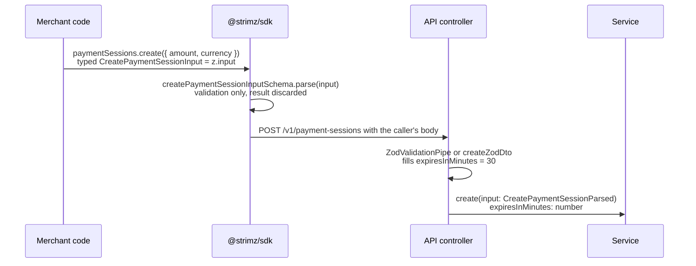

# ADR: Request input types describe what the caller sends, not what the server parses

- **Status:** Accepted 2026-10-03
- **Date:** 2026-10-03
- **Scope:** `packages/shared-types` (exported `*Input` type aliases, new `*Parsed`
  aliases), `packages/sdk` (resource method parameter types, re-exports, a type-level
  test and the vitest typecheck config), `apps/api` (type annotations on services and
  controllers that receive parsed bodies), `packages/shared-types/README.md`. No zod
  schema changes behaviour, no route, wire format, Prisma column, queue payload or
  webhook payload changes. `@strimz/sdk-react` gets a dependency bump only. Removing
  `supportedSourceChains` is a separate, conditional item (Decision 7) that waits on
  issue #145.

## Context

- Every request type in `@strimz/shared-types` is declared as
  `export type XInput = z.infer<typeof xInputSchema>`. `z.infer` is `z.output`: the
  shape after parsing, with every `.default()` already filled in. A field with a
  default is therefore required in `XInput`, although the caller may omit it and the
  server fills it.
- The tester report on issue #156: `strimz.paymentSessions.create({ amount, currency })`
  does not compile, because `CreatePaymentSessionInput` requires `expiresInMinutes`,
  which the schema defaults to 30.
- The SDK resource methods are typed with these aliases
  (`create(input: CreatePaymentSessionInput)`). At runtime they call
  `xInputSchema.parse(input)` only to validate, discard the parsed value, and send the
  caller's original object. The body on the wire is the input shape, and the API fills
  the defaults. So the runtime already treats the parameter as the input shape; only
  the type is wrong.
- The API validates bodies in two ways. `createZodDto(schema)` from nestjs-zod 4.3.1
  produces a class whose instance type is the schema's output (`new (): TOutput`), so
  DTO-typed handlers are correct today and stay correct. Controllers that use the local
  `ZodValidationPipe` get `z.output<T>` at runtime but annotate the parameter with the
  shared alias, for example
  `@Body(new ZodValidationPipe(createPaymentSessionInputSchema)) input: CreatePaymentSessionInput`.
  Services then take the alias too (`payment-sessions.service.ts`,
  `subscription-plans.service.ts`, `invoices.service.ts`, `storefronts.service.ts`,
  `agents.service.ts`, `admin.service.ts`). Several of those services repeat the default
  by hand (`input.expiresInMinutes ?? 30`, `input.intervalCount ?? 1`,
  `input.dueInDays ?? 7`, `input.socialLinks ?? []`, `input.sortOrder ?? 0`), so the
  default lives in two places.
- zod is 3.25.76 across the workspace. In zod 3 a `.transform()` changes the output
  type only when the callback returns a different type. The transforms in
  `shared-types` (`evmAddressSchema` lower-cases a string, `emailSchema` trims and
  lower-cases a string) return `string` for `string`, so they do not make input and
  output types differ. No input schema transforms to `bigint`, `Date` or a number;
  token amounts stay decimal strings on both sides. `metadataSchema` carries
  `.default({})`, but every input schema uses it as `metadataSchema.optional()`, whose
  output is still optional, except `updateMerchantInputSchema`, which wraps the object
  in `.partial()`, so it is optional there too.
- The SDK paginates with its own `PaginationParams` interface (`limit?: number`), not
  with `PaginationInput`. `PaginationInput` has no consumer in the monorepo.
- `@strimz/shared-types` and `@strimz/sdk` are published at 0.5.0. Under npm caret
  ranges, `^0.5.0` accepts only `0.5.x`, so a 0.6.0 release is not picked up
  automatically by existing consumers.

### Audit of every exported `*InputSchema`

The table was produced by comparing `z.input` and `z.output` of every export whose name
ends in `InputSchema`, using the TypeScript checker against `packages/shared-types/src`
at `origin/main` (73c53d1). 27 schemas are exported; 9 differ.

| Export (type / schema)                                                | Field(s) where input differs from output                                                                                                                                                                                                  | Today (`z.infer`, what callers must send) | Proposed `XInput` (`z.input`) | SDK method                                 |
| --------------------------------------------------------------------- | ----------------------------------------------------------------------------------------------------------------------------------------------------------------------------------------------------------------------------------------- | ----------------------------------------- | ----------------------------- | ------------------------------------------ |
| `CreatePaymentSessionInput` / `createPaymentSessionInputSchema`       | `expiresInMinutes` (`.default(30)`)                                                                                                                                                                                                       | `expiresInMinutes: number` required       | `expiresInMinutes?: number`   | `paymentSessions.create`                   |
| `CreateSubscriptionPlanInput` / `createSubscriptionPlanInputSchema`   | `intervalCount` (`.default(1)`)                                                                                                                                                                                                           | required                                  | optional                      | `subscriptionPlans.create`                 |
| `CreateSubscriptionInput` / `createSubscriptionInputSchema`           | `gracePeriodHours` (`.default(48)`)                                                                                                                                                                                                       | `24 \| 48 \| 72` required                 | optional                      | `subscriptions.create`                     |
| `CreateInvoiceInput` / `createInvoiceInputSchema`                     | `dueInDays` (`.default(7)`)                                                                                                                                                                                                               | required                                  | optional                      | `invoices.create`                          |
| `CreateStorefrontInput` / `createStorefrontInputSchema`               | `socialLinks` (`.default([])`, inherited through `storefrontSchema.pick`)                                                                                                                                                                 | `string[]` required                       | optional                      | `storefronts.upsert`                       |
| `CreateStorefrontProductInput` / `createStorefrontProductInputSchema` | `sortOrder` (`.default(0)`, inherited through `storefrontProductSchema.omit`)                                                                                                                                                             | required                                  | optional                      | `storefronts.createProduct`                |
| `UpdateAgentConfigInput` / `updateAgentConfigInputSchema`             | inside `recovery`: `gracePeriodHours`, `strategy`; inside `cashflow`: `digestEnabled`, `anomalySensitivity`, `autoConvertToYield`, `minimumLiquidReserveCents`; inside `commerce`: `requireHumanApprovalAboveUsdCents`, `approvedVendors` | each required once its section is present | each optional                 | `agents.updateConfig`                      |
| `CreateBroadcastInput` / `createBroadcastInputSchema`                 | `audience` (`.default('all')`)                                                                                                                                                                                                            | required                                  | optional                      | none (admin API, web admin client)         |
| `PaginationInput` / `paginationInputSchema`                           | `limit` (`.default(25)`)                                                                                                                                                                                                                  | required                                  | optional                      | none (SDK uses its own `PaginationParams`) |

The other 18 have identical input and output types and are listed so the decision covers
them explicitly: `CreateMerchantInput`, `UpdateMerchantInput`, `ChangeTierInput`,
`OnboardMerchantInput`, `InviteMemberInput`, `LoginInput`, `CreateApiKeyInput`,
`RotateApiKeyInput`, `UpsertCustomerInput`, `SubmitPaymentSessionInput`,
`CancelSubscriptionInput`, `CreateRefundInput`, `SubmitRefundSignatureInput`,
`CreateWebhookEndpointInput`, `ReplayDeliveryInput`, `CreateAgentJobInput`,
`StorefrontCheckoutInput`, `ContactRequestInput`.

The worst cases for a merchant integrating with the SDK are `paymentSessions.create`
(the first call of almost every integration), `subscriptionPlans.create`,
`invoices.create`, and `agents.updateConfig`, where updating one cashflow flag forces
the caller to restate every other cashflow field.

Entity and response types (`PaymentSession`, `Storefront`, `StorefrontProduct`,
`AgentMerchantConfig`, `ComplianceLog`, and everything with `metadata: metadataSchema`)
also contain defaults, but they describe values the SDK has already parsed with
`schema.parse`, so `z.output` is correct for them and they do not change.

### Findings outside this decision

These were found during the audit. They are not fixed here; each needs its own issue.

1. `updateAgentConfigInputSchema` is `agentMerchantConfigSchema.omit(...).partial()`.
   `.partial()` is shallow, so the nested defaults still apply on the server. Verified
   with the built package: parsing `{ cashflow: { digestEnabled: true } }` yields
   `{ cashflow: { digestEnabled: true, anomalySensitivity: 'medium', autoConvertToYield: false, minimumLiquidReserveCents: 100000 } }`,
   and `AgentsService.updateConfig` writes every one of those columns. A PATCH of one
   field silently resets its siblings to their defaults. `recovery.notificationTemplate`
   is also required whenever `recovery` is sent, and `?? undefined` in the service means
   it cannot be cleared to `null`. This is a data bug, not a typing bug.
2. `SubscriptionsResource.create` in the SDK posts to `POST /v1/subscriptions`. The API's
   `SubscriptionsController` has no such route (only `GET /:id`, `GET /`,
   `POST /:id/cancel`), so the method cannot succeed. Subscriptions are created through
   the relay and hosted checkout.
3. `createPaymentSessionInputSchema.supportedSourceChains` is accepted and validated but
   never read by the API: no service, Prisma column or response field uses it. A
   merchant who sets it today gets no restriction. See Decision 7.
4. `submitPaymentSessionInputSchema` and `SubmitPaymentSessionInput` are exported but no
   code in the monorepo imports them.
5. The SDK's existing `tests/client.test.ts` and `tests/eip712.test.ts` have type errors
   (an unused `@ts-expect-error` at `client.test.ts:28`, and a `string` passed where
   `` `0x${string}` `` is required at `eip712.test.ts:74`). They were never type-checked
   because `packages/sdk/tsconfig.json` excludes `tests`. The new test config below
   includes only `*.test-d.ts` so these stay out of scope.

## Decision

1. **`XInput` becomes the caller-facing type.** For every exported `*InputSchema`, the
   matching `XInput` alias changes from `z.infer<typeof xInputSchema>` to
   `z.input<typeof xInputSchema>`. All 27 change, not only the 9 that differ today, so
   a default added to any schema later cannot reintroduce the bug.
2. **Add `XParsed` for the server-side shape.** Each schema gains
   `export type XParsed = z.output<typeof xInputSchema>` next to its `XInput`, named by
   dropping the `Input` suffix and adding `Parsed` (`CreatePaymentSessionParsed`,
   `PaginationParsed`, `UpdateAgentConfigParsed`, and so on, 27 in total). `Output` is
   not used as the suffix because `CreateApiKeyOutput`, `CreateWebhookEndpointOutput`,
   `ContactRequestOutput` and `LoginOutput` already name response bodies.
3. **SDK parameters use `XInput`.** Every SDK resource method that takes a request body
   keeps its current parameter name and type alias, which now resolves to `z.input`.
   No runtime change: the SDK already validates with `.parse` and sends the caller's
   object. The SDK's existing re-exports keep their names and now carry the input shape.
4. **API code that holds a parsed body uses `XParsed`.** Controller parameters bound
   through `ZodValidationPipe` and the service methods they call are annotated with
   `XParsed` (or the existing `createZodDto` class), because that is what the pipe
   returns. The hand-written fallbacks that repeat a schema default
   (`?? 30`, `?? 1`, `?? 7`, `?? []`, `?? 0`) are removed where the value now comes
   typed as present, so each default lives only in the schema.
5. **Type-level test.** `packages/sdk/tests/input-types.test-d.ts` asserts, with
   vitest's `expectTypeOf`: each SDK method accepts a body without its defaulted fields;
   each SDK method's first parameter equals `z.input` of its schema; every `XInput`
   equals `z.input`; every `XParsed` equals `z.output`. `packages/sdk/vitest.config.ts`
   enables `typecheck` for `tests/**/*.test-d.ts` with a new
   `packages/sdk/tsconfig.test.json`, so the existing `test` gate in preflight and CI
   runs these assertions. The `README` example in `packages/shared-types` that assigns
   `schema.parse(req.body)` to `CreatePaymentSessionInput` is changed to
   `CreatePaymentSessionParsed`.
6. **Release.** One changeset: `@strimz/shared-types` minor (0.5.0 to 0.6.0) and
   `@strimz/sdk` minor (0.5.0 to 0.6.0). `@strimz/sdk-react` uses no input type and
   receives the automatic patch bump for its dependency. The changeset text states that
   `XInput` now means the request shape before defaults, names the 9 affected types, and
   tells server-side users to switch to `XParsed`.
7. **`supportedSourceChains` waits on #145 (question for the maintainer).** The field is
   a no-op today (finding 3). Two outcomes:
   - If #145 decides to hide CCTP funding for launch: remove `supportedSourceChains`
     from `createPaymentSessionInputSchema` in the same 0.6.0 release, so one minor
     version carries both type changes. zod objects strip unknown keys by default, so a
     caller still sending it gets a compile error in TypeScript but no runtime failure.
   - If #145 decides to finish CCTP: keep the field and wire it through the API in the
     CCTP work, with its own test. Do not remove a field that is about to become real.

   The same question covers `SubmitPaymentSessionInput.sourceChain`, the
   `PaymentSession.sourceChain` and `bridgeTxHash` response fields, and the
   `SourceChain` Prisma column; this ADR does not propose touching those.

## Diagram

## Consequences

- Merchants can omit every field the API defaults. Code that passed those fields keeps
  compiling, because the new parameter types are wider.
- Code that read a defaulted field from an `XInput` value and relied on it being present
  stops compiling, for example `const m: number = input.expiresInMinutes`. That is the
  breaking part, and the reason for a minor bump on a 0.x package. Inside the monorepo
  this is the API services in Decision 4. `apps/web` passes request bodies into the
  aliases and reads `CreateInvoiceInput['lineItems']`, which does not change, so web is
  expected to compile unchanged; the implementation PR confirms it with preflight.
- Each schema exports one more type. The pair `XInput` / `XParsed` is consistent across
  all 27 and is guarded by the type test.
- `pnpm test` in `packages/sdk` now also runs `tsc` over the type test. Vitest prints
  that typecheck mode is experimental; vitest is pinned to `^2.1.8` already.

## Alternatives considered

- **Keep `XInput` as the parsed type and add `XRequest` (or `XParams`) as `z.input` for
  the SDK.** Purely additive, so no breaking change to `XInput`. Lost because the name
  that every caller already uses keeps the wrong meaning: `apps/web` and any merchant
  that annotates a request object as `CreatePaymentSessionInput` keeps hitting this bug,
  and a reader cannot tell from `Input` versus `Request` which one includes defaults.
- **Change `XInput` to `z.input` and add nothing.** Smallest surface. Lost because the API
  then writes `z.output<typeof createPaymentSessionInputSchema>` inline in a dozen places,
  or imports DTO classes into services, and the shared package no longer names the type
  the server actually works with.
- **Add `XParsed` only for the 9 schemas that differ.** Fewer exports. Lost because the
  next `.default()` added to any of the other 18 would silently make that `XInput` wrong
  again unless someone remembers to add the alias, and server code would mix `XInput`
  and `XParsed` for the same role.
- **Remove the `.default()` calls and make the fields optional in the schema.** Moves
  every default into service code, which is where the duplicated `?? 30` already shows the
  drift risk. Lost because the schema is the single source of the API contract.
- **Make the SDK send `schema.parse(input)` instead of `input`.** Would fill defaults
  client-side and change the wire body, including lower-casing addresses. It does not fix
  the parameter type and changes behaviour for no gain.

## Verification

- Red, run on `origin/main` (73c53d1) after building `@strimz/shared-types` and
  `@strimz/sdk`: `packages/sdk/node_modules/.bin/vitest run` in `packages/sdk` exits 1
  with 10 of 10 type tests in `tests/input-types.test-d.ts` failing and the 44 existing
  runtime tests passing. `tsc --noEmit -p tsconfig.test.json` in `packages/sdk` lists
  50 errors, all of them the ones this ADR predicts and no others:
  - 7 `toBeCallableWith` failures: `paymentSessions.create` rejects
    `{ amount, currency }` because `expiresInMinutes: number` is required, and the same
    for `subscriptionPlans.create`, `subscriptions.create`, `invoices.create`,
    `storefronts.upsert`, `storefronts.createProduct` and `agents.updateConfig`.
  - 7 parameter-equals-`z.input` failures, for exactly those 7 methods. The other 9 SDK
    methods already match.
  - 9 `XInput`-equals-`z.input` failures, for exactly the 9 types in the audit table.
    The other 18 already match.
  - 27 "no exported member" errors, one per proposed `XParsed` name.
- Green: the same command passes with no type errors; `./scripts/preflight.sh` passes in
  full, which covers `apps/api` and `apps/web` typecheck against the new aliases.
- By hand: in a scratch project depending on the packed SDK,
  `strimz.paymentSessions.create({ amount: '1000000', currency: 'USDC' })` compiles, and
  the created session's `expiresAt` is 30 minutes after `createdAt` on a local API.
