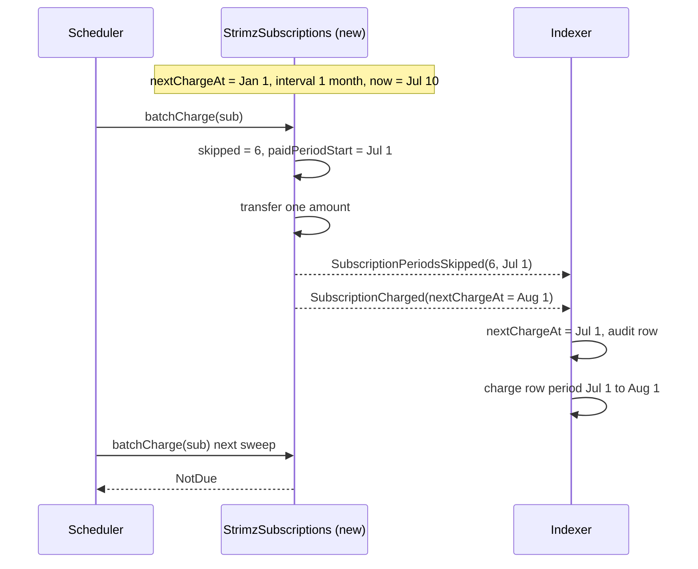

# ADR: Charge one period after a gap and drop the missed ones

- **Status:** Accepted 2026-10-03
- **Date:** 2026-10-03
- **Scope:** `packages/contracts` (`StrimzSubscriptions`, `IStrimzSubscriptions`: one
  behaviour change in `_charge` and one new event), `apps/indexer` (ABI and one new
  projection), `apps/scheduler` (ABI copy), `apps/web` (merchant docs). No database,
  API, queue payload, webhook payload or published-package change. Deploying the new
  contract is not part of this change; it ships with the testnet redeploy in #142.

## Context

- A successful charge sets `sub.nextChargeAt += sub.interval`. If the subscription is
  several periods behind, the new `nextChargeAt` is still in the past, so the next
  sweep finds it due again. A subscription N periods behind is charged N times, one
  sweep after another. The code comment next to it says missed periods are dropped.
- Ways to fall behind: a scheduler outage longer than one interval, or a payer who
  fails a charge and pays on a later retry. The recovery docs retry for up to 7 days,
  so a daily or weekly plan that recovers on the last retry is charged several times
  back to back. Buantum operational note S/03 gives six missed months on a $50 plan,
  charged as $300 in a burst. Issue #114.
- `StrimzSubscriptions` is deployed directly, not behind a proxy. Payers grant their
  allowance to its address. A fix is a new contract; existing subscriptions stay on the
  old one.
- The indexer records the period a charge paid as `[Subscription.nextChargeAt,
event.nextChargeAt)` (#167). After this change a catch-up charge pays a later period
  than the stored `nextChargeAt`, so the indexer needs to learn the period start. The
  interval stored off-chain is an approximation of the on-chain seconds, so it cannot
  be derived by arithmetic.
- Since #118 the indexer projects all Strimz contract events in chain order.

## Decision

1. **One charge per gap, on the original schedule.** In `_charge`, before settling,
   compute the period being paid:
   - if `block.timestamp < nextChargeAt + interval`, the paid period starts at
     `nextChargeAt`, as today;
   - otherwise `skipped = (block.timestamp - nextChargeAt) / interval` periods are
     dropped and the paid period starts at `nextChargeAt + skipped * interval`.
     On a successful settlement `nextChargeAt` becomes `paidPeriodStart + interval`, which
     is always in the future. The billing day stays on the original anchor. A failed
     settlement changes nothing, as today.
2. **A new event records the drop.** When `skipped > 0` and the charge succeeds, emit
   `SubscriptionPeriodsSkipped(uint256 indexed subscriptionId, uint256 periodsSkipped,
uint64 paidPeriodStart)` immediately before `SubscriptionCharged` in the same call.
   Existing events keep their signatures, so the indexer and scheduler keep decoding the
   old contract unchanged.
3. **The indexer moves the period start.** A new projection for
   `SubscriptionPeriodsSkipped` sets `Subscription.nextChargeAt = paidPeriodStart` and
   writes an `AuditLog` row `subscription.periods_skipped` with the count, scoped to the
   merchant. Because it is projected just before the `SubscriptionCharged` from the same
   transaction, the existing charge projection then records the correct paid period
   with no change. An unknown subscription is unresolvable and parked, as for other
   subscription events.
4. **ABIs.** The contract ABI is regenerated into the indexer and the scheduler copies.
5. **Docs now, deployment later.** Until #142 deploys the new contract, the merchant
   subscription docs carry a short warning that a subscription which falls more than
   one period behind is charged once per missed period on recovery. #142 removes the
   warning when it switches the deployed address, and owns the plan for subscriptions
   on the old contract.
6. **Tests.** Foundry: charging after 1, 2 and 6 missed periods moves one `amount` and
   lands `nextChargeAt` on the next anchor in the future; a second sweep in the same
   period is `NotDue`; a charge within one interval of `nextChargeAt` behaves as today
   and emits no skip event; a failed transfer after a gap changes nothing; `endAt`
   still stops charging. A fuzz test: for any gap, after one successful charge
   `nextChargeAt > block.timestamp` and `(nextChargeAt - startAt) % interval == 0`.
   Indexer: the skip event moves `nextChargeAt` and the following charge row records
   the later period.

## Diagram

## Consequences

- A payer is never charged more than once for one sweep after a gap. Missed periods are
  not billed. Merchants lose that revenue, which matches the existing comment and the
  predictable-billing stance; they can see each drop in the audit log.
- `_charge` costs a few hundred more gas when it computes a gap. No new storage.
- The fix only protects subscriptions created on the new contract. Subscriptions on the
  deployed testnet contract keep the old behaviour until #142 decides how to move them.
- The contract changes after the Buantum audit and is part of the external re-review in
  #147.

## Alternatives considered

- **Restart the schedule at `block.timestamp + interval`.** Lost: the billing day would
  drift after every late payment, which payers and merchants do not expect.
- **Bill the missed periods, but in one charge.** Lost: still a surprise multi-period
  charge, the outcome the issue and the audit note ask to remove.
- **Change `SubscriptionCharged` to carry the period start.** Lost: a new signature
  means a new topic, and the indexer and scheduler would have to decode two versions of
  the event for as long as the old contract has live subscriptions.
- **Skip far-behind subscriptions in the scheduler.** Lost: the old contract cannot move
  `nextChargeAt` without charging, so those subscriptions could never be billed again.

## Verification

- Foundry tests and the fuzz test above, red first on `main`.
- Indexer store e2e for the new projection, red first.
- `forge build --sizes` stays under the contract size limit.
- After #142 deploys: on testnet, pause the scheduler for more than one interval on a
  daily plan, resume, and confirm one charge, one skip event and a `nextChargeAt` in the
  future.
