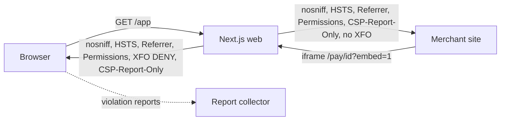

# ADR: Content-Security-Policy and checkout framing policy for the web app

- **Status:** Proposed, awaiting maintainer approval
- **Date:** 2026-10-03
- **Scope:** `apps/web/next.config.mjs` response headers, and possibly `apps/web/src/middleware.ts` if nonces are chosen. No API, SDK, contract or schema change.

## Context

Issue #132 found that the web app sends no security headers. The fix for #132 adds the
headers that need no product decision, on every route:

- `X-Content-Type-Options: nosniff`
- `Referrer-Policy: strict-origin-when-cross-origin`
- `Strict-Transport-Security: max-age=63072000` (no `includeSubDomains`, no `preload`)
- `Permissions-Policy: camera=(), microphone=(), geolocation=()`
- `X-Frame-Options: DENY` on every route except `/pay/*` and `/sub/*`

Two things are left out because they need a decision:

1. **A Content-Security-Policy (CSP).** A CSP lists the origins the browser may load
   scripts, styles, images, frames and network calls from. The app talks to several
   third parties, and a wrong list breaks login or checkout in production:
   - Privy (merchant login and embedded wallets): scripts, an iframe and API calls to
     Privy origins.
   - Reown AppKit / WalletConnect (payer wallets on `/pay` and `/sub`): relay
     WebSocket, explorer and API origins, plus wallet icons from remote hosts.
   - Arc RPCs from `@strimz/shared-config` (`rpc.testnet.arc.network`,
     `rpc.arc.network`) and `NEXT_PUBLIC_ARC_RPC_URL`.
   - The Strimz API (`NEXT_PUBLIC_API_URL`).
   - uploadthing (dashboard image upload, and the hosts that serve uploaded files).
   - Cloudflare Turnstile (`NEXT_PUBLIC_TURNSTILE_SITE_KEY`).
   - Merchant logos on checkout and product images on storefronts are rendered from
     stored URLs with a plain `` or `next/image` with `unoptimized`. Whether
     those URLs can only point at uploadthing hosts is not enforced in the web app, so
     `img-src` is either "uploadthing hosts only" (and older URLs break) or `https:`.
   - Next.js App Router injects inline scripts. A strict `script-src` needs either a
     per-request nonce from middleware (which makes every page dynamic) or
     `'unsafe-inline'`.
2. **Who may frame hosted checkout.** `@strimz/sdk-react` `StrimzCheckoutEmbed` loads
   `/pay/{sessionId}?embed=1` in an iframe on the merchant's site, and
   `StrimzPayButton` opens `/pay` and `/sub` in a popup. So `/pay/*` and `/sub/*` must
   stay frameable by merchant origins. Today they are frameable by any origin, which
   leaves checkout open to clickjacking by a hostile page.

## Decision

Proposed, for the maintainer to accept or change:

1. Ship a CSP in **Report-Only** mode first (`Content-Security-Policy-Report-Only`) on
   every route, with the origins above, `object-src 'none'`, `base-uri 'self'`,
   `form-action 'self'`, and `script-src 'self' 'unsafe-inline'` plus the third-party
   script origins. Add a `report-to` endpoint (choice of collector is part of the
   decision). Leave it for at least one release, read the reports, then switch to
   enforcing.
2. On routes other than `/pay/*` and `/sub/*`, add `frame-ancestors 'none'` to the
   CSP, matching the `X-Frame-Options: DENY` already shipped.
3. On `/pay/*` and `/sub/*`, keep `frame-ancestors *` for now. Restricting framing to
   each merchant's registered origins needs a per-merchant allowed-origins field and a
   dynamic header, and is a separate ADR.
4. HSTS: decide whether `includeSubDomains` and `preload` are safe for every
   `strimz.finance` subdomain before adding them.

## Diagram

## Consequences

- Report-Only cannot break anything; it only produces reports. It also blocks nothing
  until it is switched to enforcing.
- `'unsafe-inline'` scripts weaken the CSP against XSS. Nonces remove that but force
  dynamic rendering of every page and cost static caching.
- Checkout stays frameable by any origin until the per-merchant origin list exists.

## Alternatives considered

- **Enforce a CSP immediately.** Lost: one missing Privy or WalletConnect origin
  breaks login or payment in production with no warning.
- **Nonce-based strict CSP now.** Lost for the first step: it changes rendering for
  the whole app; better done after Report-Only data shows the real origin list.
- **Deny framing on checkout.** Lost: breaks `StrimzCheckoutEmbed` for every merchant.

## Verification

- A config test asserts the CSP header value and its routes, like
  `apps/web/src/__tests__/next-config-security.test.ts` does for the headers that
  shipped in #132.
- Log in with Privy, upload an image, open a payment session in a popup and in
  `StrimzCheckoutEmbed`, and pay on Arc testnet with an injected wallet and with
  WalletConnect. No CSP violation is reported.
