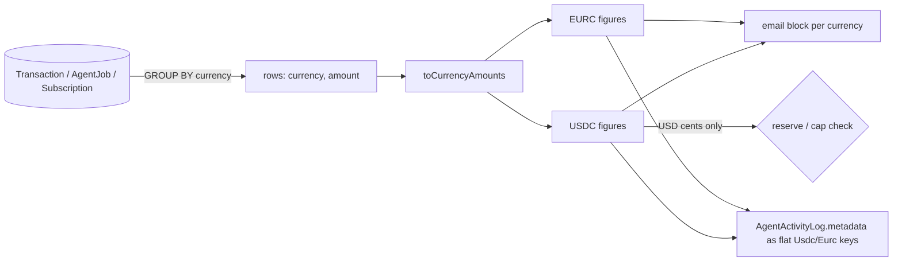

# ADR: Agent reports keep USDC and EURC apart

- **Status:** Accepted 2026-10-04
- **Amended:** 2026-10-06: option (a) and the decision 7 scope, approved by the maintainer.
- **Date:** 2026-10-04
- **Scope:** `apps/agent` capabilities `cashflow` (digest, anomaly, yield), `commerce` and
  `pricing`: their SQL, their emails and the `AgentActivityLog.metadata` they write. No
  contract, indexer, API, scheduler, queue payload, webhook payload, Prisma migration or
  published package change. The `AgentActivityLog.metadata` shapes are returned unchanged
  by `GET /v1/agents/activity`, so merchants reading that feed see the new keys. Every new
  key is flat and fits the published `metadataSchema`.

## Context

Issue #155 listed calculation bugs in the agent. The contained ones are fixed in the same
pull request without this ADR (see `docs/release-notes/2026-10-04-agent-calculations.md`):
commerce totals, the anomaly baseline and dedupe, the pricing forecast, cron
configuration, `/readyz` and `ARC_RPC_URL`.

What is left needs a decision. Every money row the agent reads carries a `currency`
column (`PaymentCurrency`: `USDC`, `EURC`, both 6 decimals), and every agent aggregate
ignores it. AGENTS.md, audit item 5: "USDC and EURC are never summed together." PR #206
fixed the API side (`currencyAmountsSchema` in `packages/shared-types/src/analytics.ts`,
`toCurrencyAmounts` in `apps/api/src/common/money/currency-amounts.ts`); the agent was
left as it was.

| Capability       | What is summed across currencies                                                                    | Where it shows                                                                                                                  | File                                                                        |
| ---------------- | --------------------------------------------------------------------------------------------------- | ------------------------------------------------------------------------------------------------------------------------------- | --------------------------------------------------------------------------- |
| Cashflow digest  | `Transaction.amount`, `feeAmount`, `netAmount` for yesterday                                        | email rows labelled `USDC`; metadata `revenue`, `fees`, `net` (strings)                                                         | `capabilities/cashflow/digest.service.ts:109-157,182-184`                   |
| Cashflow anomaly | `Transaction.amount` for the last hour and for the 30-day same-hour baseline                        | email "Actual" and "Typical" labelled `USDC`; metadata `actualRevenue`, `expectedMean`, `stddev`, `zScore`; `AuditLog` `zScore` | `capabilities/cashflow/anomaly.service.ts` (`computeStats`, email)          |
| Cashflow yield   | all-time `Transaction.netAmount` minus completed `Refund.amount`, compared with a USD-cents reserve | email `$` surplus; metadata `balanceCents`, `surplusCents`                                                                      | `capabilities/cashflow/yield-recommendation.service.ts:116-133`             |
| Commerce         | `AgentJob.amount` per vendor and in total, compared with a USD-cents spend cap                      | email `$` totals and vendor rows; metadata `totalSpendCents`, `capUtilisationPct`                                               | `capabilities/commerce/commerce.service.ts` (`computeSummary`)              |
| Pricing          | `Subscription.amount` into one MRR; daily `Transaction.netAmount` into one forecast                 | email rows labelled `USDC`; writes no activity row                                                                              | `capabilities/pricing/pricing.service.ts` (`computeMrr`, `computeForecast`) |

Three further facts shape the choices:

- The yield reserve (`cashflowMinimumLiquidReserveCents`) and the commerce cap
  (`commerceMonthlySpendCapUsdCents`) are in US dollar cents. The platform has no EUR/USD
  price source, and adding one is out of scope.
- Every agent aggregate also mixes `mode = 'test'` with `mode = 'live'` rows, and the
  digest, anomaly and forecast include confirmed `kind = 'refund'` transactions. The API
  filters both since PR #206. This is listed as decision 7 because it changes the same
  numbers. `AgentJob` has no `mode` column, so commerce cannot be filtered by mode without
  a migration.
- `AgentActivityLog.metadata` reaches merchants typed as `agentActivityLogSchema` from
  `@strimz/shared-types`, whose `metadata` is `metadataSchema`: a flat record of string,
  number, boolean or null values. The published SDK parses every row of
  `GET /v1/agents/activity` with it (`packages/sdk/src/resources/agents.ts`), and the
  `agent.action_executed` webhook envelope uses it (`packages/shared-types/src/events.ts`).
  A nested object in metadata would make `sdk.agents.listActivity()` throw.

Red tests for decisions 2 to 6 were written and run against this branch; all five fail
(Appendix). They are held out of the pull request so the preflight stays green, and land
with the implementation once this ADR is approved.

## Decision

1. **One money shape.** Every agent aggregate is computed `GROUP BY currency` and mapped
   into `CurrencyAmounts` (`{ USDC, EURC }`, base-unit strings, both keys always present)
   from `@strimz/shared-types`. An unknown or repeated currency throws, as
   `toCurrencyAmounts` does in the API. The helper is copied into `apps/agent/src/common/money/`
   (apps do not import apps). No amount is converted between currencies. Activity metadata
   carries per-currency amounts as flat keys with a `Usdc` or `Eurc` suffix, base-unit
   strings, never as nested objects.
2. **Digest.** Revenue, fees and net are reported per currency. The email shows one
   block per currency with activity; when neither has activity it shows a single USDC
   block of zeros (same rule as `formatCurrencyTotals` in the web app). Metadata
   `revenue`, `fees` and `net` are replaced by `revenueUsdc`, `revenueEurc`, `feesUsdc`,
   `feesEurc`, `netUsdc` and `netEurc`, base-unit strings. `count` and `uniqueCustomers`
   stay totals.
3. **Anomaly.** Each currency is scored on its own: last hour, baseline, mean and
   standard deviation per currency, with the per-currency baseline fixed in this PR (zero
   hours counted from that currency's first confirmed transaction). A drop in either
   currency flags. Metadata gains `currency`; the dedupe key becomes
   `(merchant, hour, currency)`; the email subject and body name the currency; the
   `AuditLog` metadata gains `currency`. A merchant with both currencies dropping gets two
   alerts for that hour.
4. **Yield.** Only the USDC balance is compared with the USD-cents reserve. The EURC
   balance is reported in the email as a separate line and never recommended for yield.
   Metadata `balanceCents` and `surplusCents` become USDC-only; a new `eurcBalance`
   (base units) records the EURC side.
5. **Commerce.** Spend is reported per currency, in total and per vendor (a vendor paid in
   both currencies appears once per currency). Only USDC spend counts towards the
   USD-cents cap. Metadata `totalSpendCents` is replaced by `spendUsdc` and `spendEurc`,
   base-unit strings; `capUtilisationPct` is computed from USDC only. The email labels amounts with their
   currency instead of `$`.
6. **Pricing.** MRR and forecast are per currency, matching `GET /v1/stats/mrr` and
   `GET /v1/stats/forecast` (`byCurrency`). The email shows one MRR and one forecast block
   per currency with data. Churn stays one rate (it counts subscriptions, not money).
7. **Live mode and refunds.** Every agent aggregate over `Transaction`, `Refund` and
   `Subscription` filters `mode = 'live'` (digest, anomaly, yield, MRR, churn, forecast),
   and revenue aggregates (digest, anomaly, forecast) exclude `kind = 'refund'`, as the API
   does. Commerce is not filtered by mode, because `AgentJob` has no `mode` column. This
   changes numbers for merchants who test against their live account.

## Diagram

## Consequences

- Emails and activity metadata are correct for merchants who take EURC.
- `GET /v1/agents/activity` returns new metadata keys for `cashflow_digest_sent`,
  `cashflow_anomaly_flagged`, `cashflow_yield_converted` and the commerce monthly summary.
  Every key is flat, so rows still parse with the published `agentActivityLogSchema` and
  the SDK; no published package changes. Rows written before the change keep the old keys
  (`revenue`, `fees`, `net`, `totalSpendCents`), so a reader must handle both.
- Commerce spend still counts AgentJobs created in test mode, since jobs carry no mode.
- The yield reserve and commerce cap stay USD-only. A merchant who spends or holds only
  EURC is never capped and never gets a yield recommendation. Supporting EUR caps needs a
  config column (a Prisma migration) and is not part of this ADR.
- Two anomaly alerts are possible for one hour.

## Alternatives considered

- **Convert EURC to USD with a fixed or fetched rate.** Rejected: no price source exists,
  and a hard-coded rate is a hidden fallback (Directive 4).
- **USDC only everywhere, ignore EURC.** Simpler, but the digest and pricing emails would
  under-report revenue for EURC merchants.
- **Keep summing and relabel as "stablecoin".** Rejected: AGENTS.md audit item 5.
- **A single anomaly score over both currencies.** Rejected: one currency's surge hides
  the other's drop (Appendix, test 2).
- **Nested `CurrencyAmounts` objects in metadata (the original wording of decisions 2 and
  5).** Rejected on 2026-10-06: `metadataSchema` accepts only flat values, so the SDK
  would throw on these rows, and widening it is a published-package and webhook-schema
  change.
- **Add `mode` to `AgentJob`.** Rejected for this ADR: it needs a Prisma migration.

## Verification

- The five red tests in the Appendix pass, plus a test per decision 7 (a `test`-mode
  transaction and a `refund` transaction leave the digest unchanged), and a test that
  digest and commerce activity rows parse with `agentActivityLogSchema`.
- Existing agent e2e tests keep passing, with metadata assertions updated to the new
  shapes.
- Manual: run `POST /admin/run/cashflow-digest` and `POST /admin/run/commerce-monthly`
  against a local stack with one USDC and one EURC payment, and read both emails in the
  stub log.

## Appendix: red tests

Written as `apps/agent/test/e2e/currency-separation.e2e.test.ts` and run on
`fix/agent-calculations`; result `5 failed (5)`:

| Test                                                        | Failure today                                                  |
| ----------------------------------------------------------- | -------------------------------------------------------------- |
| digest reports revenue per currency                         | email contains `150 USDC` (100 USDC + 50 EURC)                 |
| anomaly baseline of one currency is not lifted by the other | `flagged` is 0: an EURC payment hides a USDC drop to zero      |
| yield compares only USDC with the USD reserve               | `recommended` is 1: 600 USDC + 600 EURC beats a $1,000 reserve |
| commerce reports spend per currency and caps only USDC      | metadata has no `spendUsdc` or `spendEurc`                     |
| pricing reports MRR per currency                            | email shows MRR `40 USDC` for 20 USDC + 20 EURC                |
