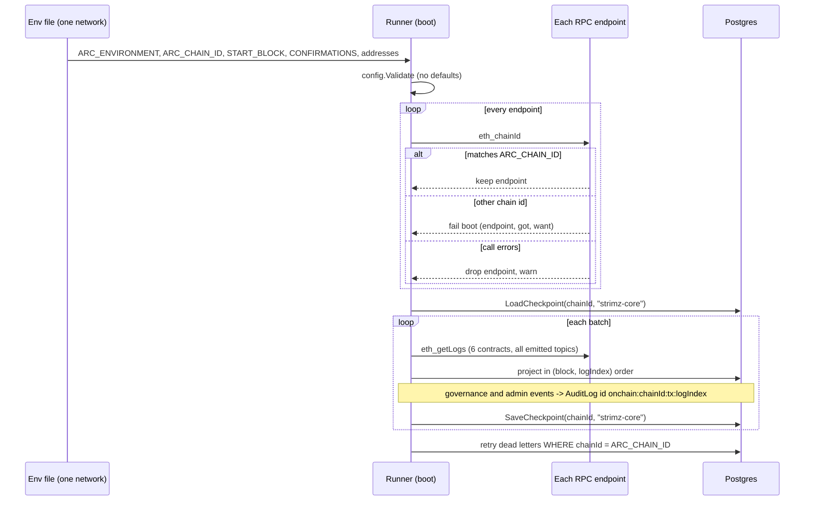

# ADR: Bind the indexer to one chain, key its bookmarks by chain, and index every event the contracts emit

- **Status:** Accepted 2026-10-04
- **Date:** 2026-10-04
- **Scope:** `apps/indexer` (config, chain client, runner, projector, store, health, embedded
  ABIs, Makefile), `packages/db` (one migration on `IndexerCursor` and `IndexerDeadLetter`),
  indexer env files (`apps/indexer/.env.example`, `infra/lightsail/env.example`,
  `docker-compose.yml`). No contract, API route, scheduler, web, BullMQ payload or webhook
  payload change. Issue #143.

## Context

Verified on `main` at `8d6eac4`.

**Configuration.**

- `CONFIRMATIONS` defaults to `5` and `START_BLOCK` to `0`
  (`apps/indexer/internal/config/config.go`). The Lightsail env sets `1` and `51147731`.
  The `docker-compose.yml` indexer sets neither, so it runs on the defaults.
- `START_BLOCK=0` means "unset": with no cursor, the core stream starts at block 1 and a
  mainnet indexer would scan from genesis.
- There is no chain id anywhere in the indexer. `ARC_ENVIRONMENT` (`testnet` or `mainnet`)
  only selects the projection mode (`test` or `live`) and labels rows.

**RPC endpoints.**

- `NewRunner` dials `ARC_RPC_URL` plus `ARC_FALLBACK_RPC_URLS` and treats them as
  interchangeable replicas (`internal/chain/client.go`). Nothing checks that they serve the
  same chain, or the chain the operator meant. An endpoint for the wrong network is
  indexed as if it were right, and its blocks advance the real cursor.
- Checked live on 2026-10-04 with `eth_chainId`: `https://rpc.testnet.arc.network`
  returns `0x4cef52` (5042002); `https://rpc.mainnet.arc.io` returns `0x13b2` (5042).
  `@strimz/shared-config` declares `ARC_MAINNET_CHAIN_ID = 5040001` and
  `rpc.arc.network`, which is wrong (`.claude/skills/strimz-engineering-standards` already
  says 5042). The compose stack runs anvil with `--chain-id=31337` and labels it `testnet`.

**Bookmarks.**

- `IndexerCursor` has primary key `contractAddress` alone
  (`packages/db/prisma/schema/operations.prisma`). Since #188 it holds the `strimz-core`
  stream row, one row per stablecoin address, and the five pre-#188 per-contract rows that
  the cutover reads. `SaveCheckpoint` upserts `ON CONFLICT ("contractAddress")`.
- The same key on another chain is the same row: a database pointed at a second chain, or
  a testnet that is relaunched with a new chain id, resumes the other chain's cursor and
  skips or replays blocks.
- `IndexerDeadLetter` is unique on `(txHash, logIndex)` and retried by `environment`. A
  letter parked from another chain in the same environment would be replayed against
  this chain's data.
- The admin health endpoint (`apps/api/src/modules/admin/admin.service.ts`) lists cursor
  rows; the web admin health page renders them keyed by environment and address.

**Events.** Every event in `packages/contracts/src` compared with
`internal/abi/events.go` (`SubscribedEvents`) and `internal/processor/projector.go`:

| Contract                        | Event                                                                                                        | Indexed today                              | Proposal                                      |
| ------------------------------- | ------------------------------------------------------------------------------------------------------------ | ------------------------------------------ | --------------------------------------------- |
| StrimzRegistry                  | `MerchantOwnershipTransferInitiated`                                                                         | no                                         | merchant audit row                            |
| StrimzRegistry                  | `MerchantOwnershipTransferAccepted`                                                                          | no                                         | merchant audit row                            |
| StrimzRegistry                  | `MerchantOwnershipTransferCancelled`                                                                         | no                                         | merchant audit row                            |
| StrimzRegistry                  | `MerchantPayoutChangeInitiated`                                                                              | no                                         | merchant audit row                            |
| StrimzRegistry                  | `MerchantPayoutChangeCancelled`                                                                              | no                                         | merchant audit row                            |
| StrimzRegistry                  | `MerchantMaxFeeBpsLowered`                                                                                   | no                                         | merchant audit row                            |
| StrimzRegistry                  | `MerchantOwnerTransferred` (legacy)                                                                          | yes, audit row                             | stop subscribing and projecting               |
| Payments, Subscriptions, Escrow | `Paused`, `Unpaused`                                                                                         | no                                         | admin audit row                               |
| Payments, Subscriptions, Escrow | `DependencyUpdated`                                                                                          | no                                         | admin audit row                               |
| FeeCollector                    | `FeeWithdrawn`                                                                                               | no                                         | admin audit row                               |
| TokenWhitelist                  | `TokenAdded`, `TokenRemoved`, `TokenCapabilitiesSet`                                                         | no; contract not watched, ABI not embedded | watch the contract, admin audit row           |
| all upgradeable contracts       | `RoleGranted`, `RoleRevoked`, `RoleAdminChanged`, `Upgraded`                                                 | no                                         | out of scope, see decision D11                |
| all upgradeable contracts       | `Initialized`                                                                                                | no                                         | ignore: emitted once at deploy                |
| StrimzSubscriptions             | `EIP712DomainChanged`                                                                                        | no                                         | ignore: never emitted by this contract's code |
| StrimzAgentRegistry             | `AgentRegistered`, `AgentCredentialRotated`, `AgentReputationAdjusted`, `AgentDeactivated`, `AgentActivated` | no; contract not watched                   | out of scope, see D11                         |
| IERC20                          | `Approval`                                                                                                   | no                                         | ignore: no Strimz state depends on it         |

Every other event (`MerchantRegistered`, `MerchantPayoutAddressUpdated`,
`MerchantFeeBpsUpdated`, `MerchantActiveSet`, `PaymentExecuted`, the five subscription
events, the eleven `Job*` events, `FeeAccrued`, stablecoin `Transfer`) is indexed.
`MerchantRegistered` carries `maxFeeBps` and `parentMerchantId`, which the decoder drops;
nothing reads them today.

Facts behind the table:

- The registry's two-step flows (#68, #203) emit `MerchantOwnershipTransferInitiated`,
  `...Accepted`, `...Cancelled`, `MerchantPayoutChangeInitiated` and
  `MerchantPayoutChangeCancelled`. `acceptMerchantOwnership` emits
  `MerchantPayoutChangeCancelled` before `MerchantOwnershipTransferAccepted` when a change
  was pending. `setMaxFeeBps` emits `MerchantFeeBpsUpdated` (already indexed) before
  `MerchantMaxFeeBpsLowered` when it clamps the fee.
- The runbook `docs/runbooks/merchant-ownership-transfer.md` asks operations to react to
  any unexpected `...Initiated` event. Today nothing in Strimz records one.
- The dashboard reads owner, pending owner, pending payout and the acceptance time live
  from the registry (`MerchantChainService.getOnchainState`), so no database column is
  needed to render them.
- `Merchant.walletAddress` is the Privy embedded wallet, written on every auth sync
  (`auth.service.ts`: `wallet ?? existing?.walletAddress`). It is not the on-chain owner
  after a transfer, and the indexer writing it would be overwritten at the next sign-in.
- `MerchantOwnerTransferred` was emitted by the one-step transfer removed in #68
  (`832c104`). `IStrimzRegistry` keeps the declaration "so old indexers can still decode
  historical logs". The live testnet registry proxy `0x23bb…1ae3` points at implementation
  `0x61b9…66a9`; its bytecode contains the topic hashes of
  `MerchantOwnershipTransferAccepted`, `MerchantPayoutChangeInitiated` and
  `MerchantMaxFeeBpsLowered`, and does not contain the topic hash of
  `MerchantOwnerTransferred`, so the current implementation cannot emit it. A full log
  scan of the proxy's history was attempted and did not complete (the public RPC caps
  `eth_getLogs` at under 10,000 blocks and rate-limits), so earlier implementations of
  that proxy are inferred from the deployment log, not scanned.
- `Paused`, `Unpaused`, `DependencyUpdated` and `FeeWithdrawn` are in the embedded ABIs, so
  `Decode` finds their topic and then fails in `materialise` ("no materialiser"). If one
  ever reached the projector it would be parked as a decode failure. Today none does,
  because the `eth_getLogs` topic filter is `SubscribedTopics()`.
- `TokenWhitelist` is not in the Makefile's `CONTRACTS`, not embedded, and its address is
  not in the indexer config. A token added to the whitelist but missing from
  `STABLECOIN_ADDRESSES` is only discovered when its first payment is parked with "token
  is not in STABLECOIN_ADDRESSES".
- Every audit row the indexer writes uses `gen_random_uuid()` for its id, so a replayed
  range writes it again (noted in ADR-2026-10-02-indexer-ordered-stream). Nothing in the
  API or web reads `AuditLog` today (the admin service and the admin bootstrap CLI only
  write to it); the rows are an operator record queried in SQL.

## Decision

1. **Configuration per network.** One indexer process indexes one chain, configured by
   its own env file. Variables, all validated in `config.Validate`, none with a default:
   - `ARC_ENVIRONMENT`: `testnet` or `mainnet` (unchanged).
   - `ARC_CHAIN_ID`: new, required, a positive base-10 integer. Testnet `5042002`,
     mainnet `5042`, local anvil `31337`. The indexer holds no chain id table (D1).
   - `START_BLOCK`: required, `>= 1`, the block the core contracts were deployed at. The
     `default:"0"` tag is removed.
   - `CONFIRMATIONS`: required, any `uint64`. The `default:"5"` tag is removed. `1` on
     both Arc networks (deterministic finality).
   - `TOKEN_WHITELIST_ADDRESS`: new, required, a 0x-prefixed 20-byte hex address (D10).
     A missing or malformed value fails `Load` with an error that names the variable.
     `.env.example`, `infra/lightsail/env.example` and the compose indexer service gain the
     new variables.
2. **Chain id check at boot.** `chain.Client` gains `ChainID(ctx) (uint64, error)`
   (`eth_chainId`). `NewRunner` calls it on every dialled endpoint before it opens the
   store or writes anything. Any endpoint that answers with a chain id other than
   `ARC_CHAIN_ID` fails boot with an error naming the redacted endpoint, the id it
   returned and the id configured. An endpoint whose `eth_chainId` call errors is dropped
   from the failover set with a warning (D2). Boot fails if no endpoint is left. The check
   runs once per process start.
3. **Bookmarks keyed by chain.** `IndexerCursor` gains `chainId Int` and its primary key
   becomes `(chainId, contractAddress)`. The column keeps its name and keeps holding either
   an address or the `strimz-core` stream key (D4). `environment` stays as a label.
   `LoadCheckpoint`, `SaveCheckpoint`, the cutover's legacy-cursor read and the freshness
   monitor filter by `chainId` instead of `environment`; `SaveCheckpoint` upserts
   `ON CONFLICT ("chainId", "contractAddress")`.
4. **Dead letters keyed by chain.** `IndexerDeadLetter` gains `chainId Int`; its unique key
   becomes `(chainId, txHash, logIndex)` and its retry index
   `(chainId, resolvedAt, blockNumber)`. Parking writes the runner's chain id; retry and
   the `/readyz` count read only the runner's chain (D5).
5. **Migration that keeps the running testnet state.** One hand-written migration:

   ```sql
   ALTER TABLE "IndexerCursor" ADD COLUMN "chainId" INTEGER;
   UPDATE "IndexerCursor" SET "chainId" = 5042002 WHERE environment = 'testnet';
   UPDATE "IndexerCursor" SET "chainId" = 5042 WHERE environment = 'mainnet';
   ALTER TABLE "IndexerCursor" ALTER COLUMN "chainId" SET NOT NULL;
   ALTER TABLE "IndexerCursor" DROP CONSTRAINT "IndexerCursor_pkey";
   ALTER TABLE "IndexerCursor" ADD CONSTRAINT "IndexerCursor_pkey"
     PRIMARY KEY ("chainId", "contractAddress");

   ALTER TABLE "IndexerDeadLetter" ADD COLUMN "chainId" INTEGER;
   UPDATE "IndexerDeadLetter" SET "chainId" = 5042002 WHERE environment = 'testnet';
   UPDATE "IndexerDeadLetter" SET "chainId" = 5042 WHERE environment = 'mainnet';
   ALTER TABLE "IndexerDeadLetter" ALTER COLUMN "chainId" SET NOT NULL;
   DROP INDEX "IndexerDeadLetter_txHash_logIndex_key";
   CREATE UNIQUE INDEX "IndexerDeadLetter_chainId_txHash_logIndex_key"
     ON "IndexerDeadLetter"("chainId", "txHash", "logIndex");
   DROP INDEX "IndexerDeadLetter_environment_resolvedAt_blockNumber_idx";
   CREATE INDEX "IndexerDeadLetter_chainId_resolvedAt_blockNumber_idx"
     ON "IndexerDeadLetter"("chainId", "resolvedAt", "blockNumber");
   ```

   The two `UPDATE`s are the only place chain ids are written as literals, and they only
   relabel rows that exist today. `ArcEnvironment` has two values, so `SET NOT NULL`
   cannot fail on a real database. On the Lightsail box this keeps the `strimz-core`
   cursor, the stablecoin cursors, the five pre-#188 cursors and every dead letter with
   their block numbers and hashes. A developer database that indexed anvil under
   `testnet` gets `5042002` on its rows; with `ARC_CHAIN_ID=31337` the local indexer then
   starts fresh from `START_BLOCK`, which is the correct outcome for a chain that is not
   Arc testnet. The Prisma schema becomes `@@id([chainId, contractAddress])` and
   `@@unique([chainId, txHash, logIndex])`; `prisma migrate diff` from the migrated
   database to the schema must be empty.

   The migration is forward only: a pre-change indexer binary cannot write to the new
   tables (its `ON CONFLICT ("contractAddress")` no longer matches a constraint and it
   does not set `chainId`). Rollback is the reverse SQL, run by hand before the old
   binary starts: drop the new indexes and key, restore the old ones, drop `chainId`.
   This only works while no second chain's rows exist.

6. **Merchant governance events become merchant audit rows.** One projection per event,
   written in the batch transaction like every other projection:

   | Event                                | `action`                                        | `metadata` beyond the common keys       |
   | ------------------------------------ | ----------------------------------------------- | --------------------------------------- |
   | `MerchantOwnershipTransferInitiated` | `merchant.ownership_transfer_initiated_onchain` | `currentOwner`, `pendingOwner`          |
   | `MerchantOwnershipTransferAccepted`  | `merchant.ownership_transfer_accepted_onchain`  | `previousOwner`, `newOwner`             |
   | `MerchantOwnershipTransferCancelled` | `merchant.ownership_transfer_cancelled_onchain` |                                         |
   | `MerchantPayoutChangeInitiated`      | `merchant.payout_change_initiated_onchain`      | `newPayoutAddress`, `commitAt` (unix s) |
   | `MerchantPayoutChangeCancelled`      | `merchant.payout_change_cancelled_onchain`      |                                         |
   | `MerchantMaxFeeBpsLowered`           | `merchant.max_fee_bps_lowered_onchain`          | `newMaxFeeBps`                          |

   Category `merchant`, `targetType` `Merchant`. Common metadata keys:
   `onchainMerchantId`, `transactionHash`, `logIndex`, `blockNumber`. Addresses are
   lowercase. When the on-chain merchant id is linked, `merchantId` and `targetId` are the
   Merchant row's id; when it is not, `merchantId` is null and `targetId` is
   `onchain:<id>`, and the log is not parked (D8). No `Merchant` column changes (D7):
   `MerchantPayoutAddressUpdated` already moves `payoutAddress` when a change commits, and
   an accepted ownership transfer does not touch `walletAddress`. No webhook (D7). Each
   `...Initiated` projection also logs at `warn` with the merchant id and the new address,
   so log-based alerting can implement the runbook's "unexpected change" check.

7. **Contract operations become admin audit rows.** Category `admin`, `merchantId` null,
   `targetType` `Contract`, `targetId` the emitting contract's lowercase address:
   `Paused` and `Unpaused` → `contract.paused` / `contract.unpaused` with `account`;
   `DependencyUpdated` → `contract.dependency_updated` with `name` and `newAddress`;
   `FeeWithdrawn` → `fees.withdrawn` with `token`, `to` and `amount` (base units, decimal
   string); `TokenAdded`, `TokenRemoved`, `TokenCapabilitiesSet` →
   `token_whitelist.token_added`, `token_whitelist.token_removed`,
   `token_whitelist.capabilities_set` with `token` and, for the last, `capabilities`. A
   `TokenAdded` for a token not in `STABLECOIN_ADDRESSES` also logs at `error`, because
   that token's payments will park until the config is updated.
8. **Idempotent audit rows.** Every row from decisions 6 and 7 has the id
   `onchain:<chainId>:<txHash>:<logIndex>` and is inserted `ON CONFLICT (id) DO NOTHING`,
   so a replayed range or a reset cursor does not write it twice (D9). Existing audit
   projections (`fees.accrued`, `merchant.fee_bps_changed_onchain`, agent job events)
   keep random ids in this change.
9. **The legacy owner event is retired.** `MerchantOwnerTransferred` leaves
   `SubscribedEvents` and the projector's dispatch; `LogMerchantOwnerTransfer` and the
   `MerchantOwnerTransferred` payload type are deleted. The event stays in the embedded
   registry ABI, so a stray log still decodes by name and falls to the projector's
   default branch (a warning, no write) instead of failing decode (D6).
10. **The token whitelist is watched.** `TokenWhitelist` joins the Makefile's
    `CONTRACTS` and the embedded ABIs, and `TOKEN_WHITELIST_ADDRESS` joins the core
    stream's address set, so its events are ordered with the rest.
11. **Topic filter and decoder.** Every event in decisions 6, 7 and 10 gets a constant,
    a typed payload, a `materialise` case and a `SubscribedEvents` entry, so the
    `eth_getLogs` filter returns them and `Decode` never parks them.

## Diagram



## Consequences

- An indexer pointed at the wrong network, or with one fallback on the wrong network,
  refuses to start instead of writing that network's events into this one's tables.
- A database can hold bookmarks and parked logs for several chains without collisions.
  Projection tables (`Merchant.onchainMerchantId`, `Transaction`, `Subscription`) are still
  not chain-scoped, so this change does not make one database safe for two networks; the
  deployment stays one database per network (see D13).
- Every merchant-security event the registry emits is recorded with its transaction, so
  the runbook's checks have data, and a replay does not duplicate the record.
- Operators must set four more variables per environment. Deploying without them fails at
  boot with the variable named, not silently on defaults.
- `ARC_CHAIN_ID` is checked against the RPC, not against `ARC_ENVIRONMENT`. An env file
  that says `testnet` with mainnet RPCs and `ARC_CHAIN_ID=5042` boots and projects in test
  mode. That pairing is left to the env file review (D1).
- The migration cannot be undone by redeploying the old binary; rollback needs the
  reverse SQL first.
- The audit rows have no dashboard surface. They are visible to operators in SQL and to
  log alerting through the `warn` lines.
- Tests that construct a `Config`, a `Checkpoint` or a `DeadLetter`, or call
  `LoadCheckpoint` and `UnresolvedDeadLetters`, change signature with the store API:
  `config_test.go` `validConfig`, `store_e2e_test.go` checkpoint and dead letter tests,
  `runner_e2e_test.go` `newTestRunner` and the cutover test.
- Comments that become false (listed for a human to correct, Directive 6): the `Config`
  doc comment in `config.go` ("Optional fields have sensible defaults"), the `Checkpoint`
  doc in `checkpoint.go` ("bookmark for a single contract address"), the
  `SubscribedEvents` doc in `events.go`, and the `LogMerchantOwnerTransfer` doc in
  `projections.go` (deleted with the function).

## Decisions for the maintainer

- **D1. Where the chain id comes from.** (a) `ARC_CHAIN_ID` required in env, checked only
  against `eth_chainId`; (b) a Go table `testnet → 5042002`, `mainnet → 5042` that also
  rejects a mismatched `ARC_ENVIRONMENT`; (c) derive the id from `ARC_ENVIRONMENT` alone.
  **Recommend (a).** Checklist item 7 forbids chain ids hardcoded in an app, the Go
  indexer cannot import `@strimz/shared-config`, and (a) lets the compose stack keep anvil
  on 31337. (b) catches the env-pairing mistake in Consequences at the cost of a second
  chain id source that has to track `shared-config`.
- **D2. An endpoint that errors on `eth_chainId` at boot.** (a) drop it with a warning and
  boot on the verified ones; (b) fail boot. **Recommend (a).** A fallback provider that is
  down at deploy time should not crash-loop the indexer, which is what fallbacks are for.
  A wrong chain id always fails boot.
- **D3. `START_BLOCK` and `CONFIRMATIONS`.** (a) required, no defaults; (b) defaults per
  environment in code. **Recommend (a)**, per Directive 4 (no silent fallback on
  configuration). The Lightsail env already sets both.
- **D4. Cursor key column.** (a) keep `contractAddress` and add `chainId`; (b) rename it
  `key`. **Recommend (a).** (b) touches the admin API response and the web admin types for
  a name change only.
- **D5. Dead letters get `chainId`.** (a) yes; (b) leave them keyed by environment.
  **Recommend (a).** Without it a letter parked on one chain is replayed against another
  chain's state.
- **D6. Legacy `MerchantOwnerTransferred`.** (a) stop subscribing and projecting, keep it in
  the ABI; (b) keep projecting it. **Recommend (a).** The live implementation cannot emit
  it, and its projection writes an unscoped row whose `newOwner` contradicts the two-step
  model.
- **D7. What governance events change besides the audit log.** (a) audit rows and `warn`
  logs only; (b) also add `Merchant.onchainOwnerAddress` and pending-change columns; (c)
  also emit merchant webhooks. **Recommend (a).** The dashboard already reads pending state
  from the chain; columns would duplicate it and can go stale; a new webhook type is a new
  public payload (Directive 2) with no consumer asking for it. `walletAddress` stays the
  Privy wallet.
- **D8. Governance event for a merchant Strimz has not linked.** (a) unscoped audit row;
  (b) park it as unresolvable until the merchant links. **Recommend (a).** Merchants
  registered outside the Strimz flow never link, so (b) would leave letters parked and
  `/readyz` degraded forever, and a security event should be recorded, not held.
- **D9. Audit row idempotency.** (a) deterministic ids for the new rows only; (b) also move
  `fees.accrued`, `merchant.fee_bps_changed_onchain` and agent job audit rows to
  deterministic ids. **Recommend (a)** for this change and (b) as a follow-up issue, to keep
  this diff to the network and event work.
- **D10. Token whitelist.** (a) watch it with a required `TOKEN_WHITELIST_ADDRESS`; (b) leave
  it out. **Recommend (a).** It is the only way the indexer learns a token was enabled
  before that token's first payment parks.
- **D11. Role, upgrade and agent registry events.** (a) out of scope here, follow-up issue
  for on-chain admin monitoring with alerting; (b) add audit rows now. **Recommend (a).** A
  role grant or an implementation upgrade needs a page to a person, which a database row
  does not give; agent registry state has no off-chain table to project into.
- **D12. `@strimz/shared-config` mainnet constants.** `ARC_MAINNET_CHAIN_ID = 5040001`,
  `rpc.arc.network` and `arcscan.app` disagree with the live mainnet RPC (5042,
  `rpc.mainnet.arc.io`). **Recommend** a separate issue with a changeset, because it changes
  a published package used by the API, web and SDK. This ADR does not depend on it under
  D1 (a).
- **D13. One database per network.** **Recommend** recording it as the deployment rule.
  Making projections chain-scoped (`Merchant.onchainMerchantId` unique per chain, and so
  on) is a larger schema change for its own ADR.

## Alternatives considered

- **Prefixed variables (`TESTNET_START_BLOCK`, `MAINNET_START_BLOCK`) in one env file.**
  Lost: each network already runs as its own process with its own env file, and two sets
  of variables in one file make it easier to start a process on the wrong set.
- **Key the cursor by environment instead of chain id.** Lost: an environment can map to
  more than one chain over time (a testnet relaunch, anvil labelled `testnet`), and the
  chain id is what the RPC can prove.
- **Check the chain id on every batch.** Lost: a provider changing networks behind the same
  URL mid-run is far less likely than a misconfigured env file, and the batch's block-hash
  check already stops on rewritten history.
- **Generated migration from `prisma migrate dev`.** Lost: Prisma drops and recreates the
  primary key without the backfill, which fails on `NOT NULL` with existing rows.

## Verification

- Red first, run on `main` at `8d6eac4` on 2026-10-04:
  - Unit, `apps/indexer/internal/config/network_test.go`: `ARC_CHAIN_ID` missing or not a
    positive integer, `START_BLOCK` missing or zero, `CONFIRMATIONS` missing,
    `TOKEN_WHITELIST_ADDRESS` missing or malformed each fail `Load` with the variable named.
    7 tests fail on `main` because `Load` accepts all of them; the canonical testnet and
    mainnet pairs load on both.
  - Unit, `apps/indexer/internal/abi/network_events_test.go`: the `TokenWhitelist` ABI is
    embedded; `SubscribedTopics` contains the 13 events in decisions 6, 7 and 10 and not
    `MerchantOwnerTransferred`; each of the 13 decodes to a payload. 4 tests fail on
    `main`: ABI missing, 13 topics missing, legacy topic present, 10 decode errors ("no
    materialiser") and 3 topics no ABI declares.
  - Store e2e, `apps/indexer/internal/store/network_e2e_test.go`: the same cursor key and
    the same `(txHash, logIndex)` dead letter can exist on two chains, a duplicate on one
    chain violates the unique key, and a cursor row without `chainId` is rejected. 3 tests
    fail on `main` with `column "chainId" ... does not exist` or an accepted insert.
  - Runner e2e, `apps/indexer/internal/processor/network_e2e_test.go`: boot refuses a
    primary or a fallback RPC whose `eth_chainId` differs (fails on `main`: no error); the
    runner built from env watches `TOKEN_WHITELIST_ADDRESS` and every emitted topic (fails:
    address and 13 topics absent); a `strimz-core` cursor on another chain is not resumed,
    parked logs carry the chain id, and another chain's dead letter is not retried (fail:
    no `chainId` column); the six governance events and seven contract-operation events
    produce the audit rows above with the right scope, and an unlinked merchant's event is
    recorded, not parked (fail: no rows, and on `main` the logs are parked as decode
    failures); a replayed range writes one row (fails: zero rows); `MerchantOwnerTransferred`
    writes nothing (fails: one row on `main`). 11 tests fail; the boot test with two
    matching endpoints passes on `main` and guards the happy path.
- Green: the same tests pass, the updated existing tests pass, `pnpm test:e2e` and
  `./scripts/preflight.sh` pass.
- Migration: apply it to a copy of the Lightsail database (or a dump) and confirm every
  `IndexerCursor` and `IndexerDeadLetter` row is still present with `chainId = 5042002` and
  unchanged blocks and hashes; `prisma migrate diff` shows no drift.
- On testnet after deploy: the indexer logs the verified chain id, `strimz-core` resumes
  from its previous block (no rescan from `START_BLOCK`), `/readyz` reports the same dead
  letter count as before, and a test `transferMerchantOwnership` on a test merchant
  produces one `merchant.ownership_transfer_initiated_onchain` row and a `warn` line.
