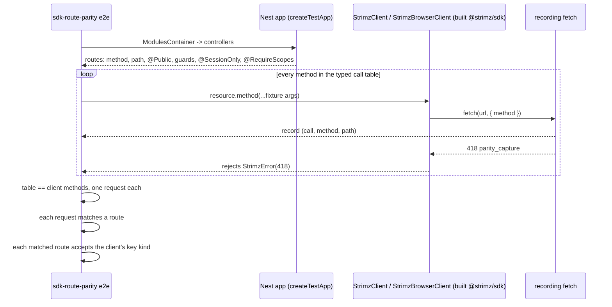
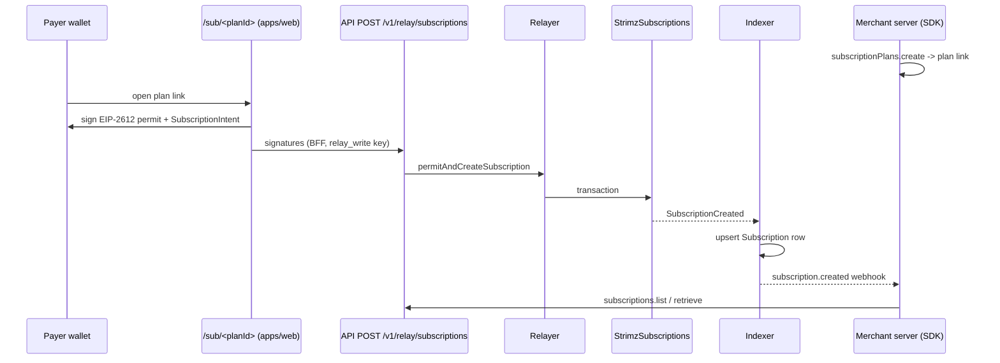

# ADR: Remove the SDK methods the API cannot serve and test SDK-to-route parity

- **Status:** Accepted 2026-10-04
- **Date:** 2026-10-04
- **Scope:** `packages/sdk` (remove `subscriptions.create`, `merchants.update`,
  `merchants.changeTier`; README), `packages/shared-types` (remove
  `createSubscriptionInputSchema` and its two types), `apps/api` (one new e2e test, no
  production change), `apps/web/content/docs` (pages that describe the removed methods).
  No contract, Prisma, queue payload, webhook payload, relay or indexer change.

## Context

- Issue #198. `StrimzClient.subscriptions.create`
  (`packages/sdk/src/resources/subscriptions.ts`) sends `POST /v1/subscriptions`. The
  API registers `GET /v1/subscriptions`, `GET /v1/subscriptions/:id` and
  `POST /v1/subscriptions/:id/cancel` only. Every call fails with a 404. The method has
  never worked against any deployed API.
- A subscription exists only after the payer signs on chain. The hosted page
  `/sub/<planId>` (`apps/web`) collects an EIP-2612 permit and a `SubscriptionIntent`
  signature from the payer's wallet, the web BFF (`apps/web/src/lib/strimz-bff.ts`)
  posts them to `POST /v1/relay/subscriptions` (`ApiKeyGuard`, `relay_write`), the
  relayer calls `permitAndCreateSubscription`, and the indexer projects
  `SubscriptionCreated` (`UpsertSubscriptionFromOnchain` in
  `apps/indexer/internal/store/projections.go`) into the `Subscription` row. A
  merchant's server holds neither signature, so it cannot create a subscription on the
  payer's behalf.
- `createSubscriptionInputSchema` (`packages/shared-types/src/subscriptions.ts`) is
  read by `subscriptions.create`, by the `CreateSubscriptionInput` re-export in
  `packages/sdk/src/index.ts`, and by `packages/sdk/tests/input-types.test-d.ts`.
  Nothing in `apps/` uses it. Its `gracePeriodHours` cannot take effect anywhere: the
  indexer writes `48` into every projected subscription.
- `merchants.update` (`PATCH /v1/merchants/me`) and `merchants.changeTier`
  (`POST /v1/merchants/me/tier`) hit routes marked `@SessionOnly()` by
  ADR-2026-10-03-api-key-scope-enforcement. `MerchantAuthGuard` returns 403
  `permission_denied` to every API key there, and `StrimzClient` accepts only secret
  keys. The `@strimz/sdk` 0.6.0 changelog deprecated both and promised removal "in the
  next minor release". 0.7.0 and 0.7.1 shipped without removing them.
- No test compares the SDK with the API. The SDK's tests stub `fetch`; the API's e2e
  suite does not import the SDK's resources. `apps/api` already depends on
  `@strimz/sdk` (`apps/api/package.json`). Packages must not depend on apps (AGENTS.md
  checklist item 11).
- `apps/api/test/e2e/route-access-declared.e2e.test.ts` already walks every registered
  controller through `ModulesContainer` and reads Nest's path, method, guard, scope and
  session-only metadata. The CI `e2e` job runs the API e2e suite after building
  `@strimz/api`'s dependencies, which include `@strimz/sdk`.
- `apps/demo-merchant` calls `subscriptionPlans.list`, `subscriptionPlans.create` and
  `paymentSessions.create`, and sends payers to `/sub/<planId>`. It does not call any
  method this ADR removes.

### Every SDK method against the API on `main`

`StrimzClient` (secret key). "Key ok" means `MerchantAuthGuard` or `ApiKeyGuard`, not
session only, with at least one scope, or `@Public`.

| SDK method                                                                        | Request                                                                             | API route                        | Key ok                     |
| --------------------------------------------------------------------------------- | ----------------------------------------------------------------------------------- | -------------------------------- | -------------------------- |
| `merchants.me`                                                                    | `GET /v1/merchants/me`                                                              | `MerchantsController.me`         | yes, `merchants_read`      |
| `merchants.update`                                                                | `PATCH /v1/merchants/me`                                                            | `MerchantsController.update`     | **no, `@SessionOnly`**     |
| `merchants.changeTier`                                                            | `POST /v1/merchants/me/tier`                                                        | `MerchantsController.changeTier` | **no, `@SessionOnly`**     |
| `apiKeys.list` / `retrieve`                                                       | `GET /v1/api-keys`, `/:id`                                                          | `ApiKeysController`              | yes, `api_keys_read`       |
| `apiKeys.create` / `revoke`                                                       | `POST /v1/api-keys`, `/:id/revoke`                                                  | `ApiKeysController`              | yes, `api_keys_write`      |
| `customers.retrieve` / `list`                                                     | `GET /v1/customers/:id`, `/v1/customers`                                            | `CustomersController`            | yes, `customers_read`      |
| `customers.upsert`                                                                | `POST /v1/customers`                                                                | `CustomersController.upsert`     | yes, `customers_write`     |
| `paymentSessions.create` / `cancel` / `expire`                                    | `POST /v1/payment-sessions`, `/:id/cancel`, `/:id/expire`                           | `PaymentSessionsController`      | yes, `sessions_write`      |
| `paymentSessions.retrieve` / `list`                                               | `GET /v1/payment-sessions/:id`, `/v1/payment-sessions`                              | `PaymentSessionsController`      | yes, `sessions_read`       |
| `transactions.retrieve` / `list`                                                  | `GET /v1/transactions/:id`, `/v1/transactions`                                      | `TransactionsController`         | yes, `transactions_read`   |
| `subscriptionPlans.create` / `archive`                                            | `POST /v1/subscription-plans`, `/:id/archive`                                       | `SubscriptionPlansController`    | yes, `subscriptions_write` |
| `subscriptionPlans.retrieve` / `list`                                             | `GET /v1/subscription-plans/:id`, `/v1/subscription-plans`                          | `SubscriptionPlansController`    | yes, `subscriptions_read`  |
| `subscriptions.create`                                                            | `POST /v1/subscriptions`                                                            | **none**                         | n/a                        |
| `subscriptions.retrieve` / `list`                                                 | `GET /v1/subscriptions/:id`, `/v1/subscriptions`                                    | `SubscriptionsController`        | yes, `subscriptions_read`  |
| `subscriptions.cancel`                                                            | `POST /v1/subscriptions/:id/cancel`                                                 | `SubscriptionsController.cancel` | yes, `subscriptions_write` |
| `refunds.create` / `submitSignature`                                              | `POST /v1/refunds`, `/:id/signature`                                                | `RefundsController`              | yes, `refunds_write`       |
| `refunds.retrieve` / `list`                                                       | `GET /v1/refunds/:id`, `/v1/refunds`                                                | `RefundsController`              | yes, `refunds_read`        |
| `webhookEndpoints.create` / `disable` / `enable` / `rotateSecret`                 | `POST /v1/webhook-endpoints`, `/:id/disable`, `/:id/enable`, `/:id/rotate-secret`   | `WebhooksController`             | yes, `webhooks_write`      |
| `webhookEndpoints.retrieve` / `list`                                              | `GET /v1/webhook-endpoints/:id`, `/v1/webhook-endpoints`                            | `WebhooksController`             | yes, `webhooks_read`       |
| `webhookDeliveries.retrieve` / `list`                                             | `GET /v1/webhook-deliveries/:id`, `/v1/webhook-deliveries`                          | `WebhooksController`             | yes, `webhooks_read`       |
| `webhookDeliveries.replay`                                                        | `POST /v1/webhook-deliveries/:id/replay`                                            | `WebhooksController`             | yes, `webhooks_write`      |
| `invoices.create` / `send` / `void`                                               | `POST /v1/invoices`, `/:id/send`, `/:id/void`                                       | `InvoicesController`             | yes, `invoices_write`      |
| `invoices.retrieve` / `list`                                                      | `GET /v1/invoices/:id`, `/v1/invoices`                                              | `InvoicesController`             | yes, `invoices_read`       |
| `storefronts.retrieve` / `listProducts` / `retrieveProduct`                       | `GET /v1/storefront`, `/products`, `/products/:id`                                  | `StorefrontsController`          | yes, `storefronts_read`    |
| `storefronts.upsert` / `publish` / `archive` / `createProduct` / `archiveProduct` | `POST /v1/storefront`, `/publish`, `/archive`, `/products`, `/products/:id/archive` | `StorefrontsController`          | yes, `storefronts_write`   |
| `agents.retrieveConfig` / `listActivity` / `listJobs` / `retrieveJob`             | `GET /v1/agents/config`, `/activity`, `/jobs`, `/jobs/:id`                          | `AgentsController`               | yes, `agents_read`         |
| `agents.updateConfig` / `createJob` / `approveJob`                                | `PATCH /v1/agents/config`, `POST /v1/agents/jobs`, `/jobs/:id/approve`              | `AgentsController`               | yes, `agents_write`        |

`StrimzBrowserClient` (publishable key). Every route must be `@Public` or unguarded,
because `MerchantAuthGuard` rejects publishable keys.

| SDK method                    | Request                                          | API route            | Public |
| ----------------------------- | ------------------------------------------------ | -------------------- | ------ |
| `checkout.session`            | `GET /v1/checkout/sessions/:id`                  | `CheckoutController` | yes    |
| `checkout.plan`               | `GET /v1/checkout/plans/:id`                     | `CheckoutController` | yes    |
| `checkout.merchant`           | `GET /v1/checkout/merchants/:id`                 | `CheckoutController` | yes    |
| `checkout.subscriptionStatus` | `GET /v1/checkout/plans/:id/subscription?payer=` | `CheckoutController` | yes    |
| `checkout.planTerms`          | `GET /v1/checkout/plans/:id/terms?payer=`        | `CheckoutController` | yes    |
| `tokens.retrieve`             | `GET /v1/tokens/:address`                        | `TokensController`   | yes    |
| `tokens.permitNonce`          | `GET /v1/tokens/:address/permit-nonce`           | `TokensController`   | yes    |

Three mismatches out of 65 methods: `subscriptions.create` (no route),
`merchants.update` and `merchants.changeTier` (route refuses every key the client can
hold). API routes without an SDK method (`apiKeys` rotate, `merchants/me/onboard`,
`/live-mode-eligibility`, `/chain-status`, `/onchain-state`, `/balance`, `/v1/stats/*`,
`/v1/relay/*`, notifications, checkout `POST .../payer`, the public `/store/*` routes,
compliance, auth and admin) are coverage gaps or dashboard routes, not defects, and
this ADR does not add methods for them.

### Docs that describe methods that do not exist

| Page                                                               | Claim                                                                                                                                                                                                                                                   |
| ------------------------------------------------------------------ | ------------------------------------------------------------------------------------------------------------------------------------------------------------------------------------------------------------------------------------------------------- |
| `apps/web/content/docs/subscriptions/recovery.mdx`                 | `subscriptions.create({ planId, customerId, payerAddress, gracePeriodHours: 168 })`. None of `customerId`, `payerAddress`, or `168` passes the schema; the page also says the value is read from plan metadata at enrolment, but the indexer writes 48. |
| `apps/web/content/docs/subscriptions/plans.mdx`                    | Line 71: "the API refuses new `subscriptions.create` against the plan". Line 85: "You don't need to call `subscriptions.create`".                                                                                                                       |
| `packages/sdk/README.md`                                           | Line 77 lists `create` under `subscriptions`; line 71 lists `update` and `changeTier` as deprecated.                                                                                                                                                    |
| `apps/web/content/docs/authentication.mdx`                         | Line 102: the two merchant methods "will be removed from `@strimz/sdk` in the next minor release".                                                                                                                                                      |
| `apps/web/content/docs/subscriptions/lifecycle.mdx`                | `subscriptions.pause`, `subscriptions.resume`, `subscriptions.cancel({ id, immediate: true })`. None exists in the SDK or the API.                                                                                                                      |
| `apps/web/content/docs/subscriptions/charging.mdx`, `recovery.mdx` | `subscriptions.chargeNow`. Exists in neither.                                                                                                                                                                                                           |
| `apps/web/content/docs/sdks/server.mdx`                            | `subscriptions.listAll`. The SDK has no resource method that returns an `AutoPagingIterator`.                                                                                                                                                           |

## Decision

1. **Remove `subscriptions.create` from `@strimz/sdk`.** `SubscriptionsResource` keeps
   `retrieve`, `list` and `cancel`. Subscriptions are created by the payer through the
   plan link; the SDK's job is to create the plan (`subscriptionPlans.create`) and read
   the result (`subscriptions.list`, the `subscription.created` webhook). No API route
   is added.
2. **Remove `createSubscriptionInputSchema`, `CreateSubscriptionInput` and
   `CreateSubscriptionParsed` from `@strimz/shared-types`,** the
   `CreateSubscriptionInput` re-export from `packages/sdk/src/index.ts`, and the three
   assertions on them in `packages/sdk/tests/input-types.test-d.ts`.
3. **Remove `merchants.update` and `merchants.changeTier` from `@strimz/sdk`,**
   honouring the 0.6.0 deprecation. `MerchantsResource` keeps `me`.
   `updateMerchantInputSchema` and `changeTierInputSchema` stay in shared-types: the
   API's DTOs use them.
4. **Add `apps/api/test/e2e/sdk-route-parity.e2e.test.ts`.** It boots the API with
   `createTestApp()`, collects every route of every controller registered in
   `ModulesContainer` with its HTTP method, full path, `@Public`, guards,
   `@SessionOnly` and `@RequireScopes`, and drives every method of a real
   `StrimzClient` and `StrimzBrowserClient` through an injected `fetch` that records
   the method and path and answers 418. It asserts:
   - every method of both clients has an entry in a typed call table, and the table
     has nothing else. The table is typed from the client classes, so adding,
     removing or re-typing an SDK method fails `tsc` until the table matches;
   - every method sends exactly one request;
   - every `StrimzClient` request matches a registered route (`:param` segments match
     one path segment; the most literal route wins, as in Fastify);
   - every matched `StrimzClient` route accepts a secret key: `@Public`, unguarded, or
     guarded only by `MerchantAuthGuard`/`ApiKeyGuard`, not session only, with at
     least one scope;
   - every `StrimzBrowserClient` request matches a `@Public` or unguarded route.
     The test lives in the API because the API is the only workspace that can see both
     sides without a package importing an app. It reads the built `@strimz/sdk`, which
     the CI `e2e` job builds before it runs.
5. **Versions.** One changeset: `@strimz/sdk` minor (0.7.1 to 0.8.0) and
   `@strimz/shared-types` minor (0.8.0 to 0.9.0). Both are 0.x, where a minor bump is
   the breaking bump. No deprecation cycle for `subscriptions.create`: it has returned
   404 on every call, so no working integration loses behaviour, only a compile-time
   symbol.
6. **Docs in this change.** Remove the `subscriptions.create` example and the false
   grace-period paragraph from `recovery.mdx`, reword `plans.mdx` lines 71 and 85, drop
   the removed methods from `packages/sdk/README.md`, and change the sentence in
   `authentication.mdx` from "will be removed" to "were removed in 0.8.0".
   `docs/release-notes/2026-10-04-sdk-route-parity.md` with `scenario-impact: none`.
7. **The other docs drift goes to a new issue,** not this change: `pause`, `resume`,
   `chargeNow`, `cancel({ immediate })` and `listAll`. Each is either a missing feature
   or a paragraph to delete, and choosing which is a product decision.

## Decisions the maintainer must make

- **D1. Remove `subscriptions.create` or give `POST /v1/subscriptions` a meaning?**
  Recommend remove (Decision 1). The only meaning a server route can have is an
  enrolment link, which is a new feature with its own schema and return type.
- **D2. Remove `createSubscriptionInputSchema` and its types from shared-types too?**
  Recommend yes (Decision 2): no app uses them and the `gracePeriodHours` they carry is
  not honoured anywhere. Alternative: keep them deprecated for one minor, at the cost of
  a published schema that describes a request nothing accepts.
- **D3. Remove `merchants.update` and `changeTier` in the same release?** Recommend yes
  (Decision 3); the removal was promised for 0.7.0. Alternative: a separate PR, with
  the parity test's reachability assertion landing red until then, or an allowlist,
  which the alternatives below reject.
- **D4. Where does the parity test live?** Recommend the API e2e suite (Decision 4).
  Alternatives: a generated manifest read by an SDK unit test, or a source scan; both
  are weighed below.
- **D5. Check auth reachability as well as route existence?** Recommend yes. Without
  it the test passes on main for `merchants.update` and `changeTier`, which fail on
  every call exactly like `subscriptions.create`.
- **D6. Version bump.** Recommend `@strimz/sdk` 0.8.0 and `@strimz/shared-types`
  0.9.0 with no deprecation window (Decision 5).
- **D7. Fix the other docs drift here or in a new issue?** Recommend a new issue
  (Decision 7). Fixing it here means deciding whether pause, resume, `chargeNow`,
  immediate cancel and `listAll` are features to build or paragraphs to delete.

## Diagram

## Consequences

- An integrator can no longer write code that compiles and then 404s or 403s on every
  call. TypeScript users on 0.7.x who reference the three methods or
  `CreateSubscriptionInput` get a compile error on upgrade to 0.8.0, and the changeset
  says what to use instead.
- Any future SDK method whose path, verb or auth does not match a registered route
  fails the API e2e suite in CI, and any new SDK method fails `tsc` until it has a call
  in the table.
- The call table needs a valid input for every mutating method, because the SDK
  validates inputs with zod before sending. A schema tightening that invalidates a
  fixture fails the "one request each" assertion with the zod message, not silently.
- The check runs in the e2e job (Docker, Postgres), not in `pnpm test`. A developer
  editing only `packages/sdk` sees the failure in CI, or locally with
  `pnpm --filter @strimz/api test:e2e`.
- Route parity says nothing about request or response bodies. A body the API rejects
  with 400 still passes. Body parity is a separate problem, partly covered by
  ADR-2026-10-03-sdk-input-types.
- The plan link stays the only way to enrol. A merchant who wants a per-customer link
  (prefilled email, external reference) has no API for it today; see the last
  alternative below.

## Alternatives considered

- **Implement `POST /v1/subscriptions` as "create an enrolment link".** The route would
  store a pending enrolment (plan, customer, metadata, expiry) and return a URL that
  the hosted page binds to. Lost for this issue: it needs a new table, a migration, a
  binding step in the `/sub` page and the relay, and an expiry policy, and its return
  type is a link, not a `Subscription`, so the published method signature breaks
  either way. If wanted, it ships as its own feature under its own name.
- **Implement `POST /v1/subscriptions` as a server-side create.** Not possible: the
  contract needs the payer's permit and intent signatures, which a merchant server
  does not hold.
- **Deprecate `subscriptions.create` for one minor before removing it.** Lost: the
  method has never succeeded, so a deprecation window protects no working code, and
  the 0.6.0 deprecation of the merchant methods shows windows get missed.
- **Keep `merchants.update` and `changeTier` and allowlist them in the parity test.**
  Lost: an allowlist in a parity test is where drift goes to live. The promise to
  remove them is already overdue.
- **Generate a route manifest from Nest metadata into `packages/sdk` and test against
  it in the SDK's unit suite.** Runs without Docker, but adds a generated file that
  must itself be checked for freshness by an API test, so two tests and a committed
  artefact replace one test. Lost on cost.
- **Scan the SDK's source for `this.get('/v1/...')` literals.** Needs no fixtures, but
  misses paths built from variables or helpers, and does not prove the method sends
  the request at all. Lost on fidelity.
- **Probe the routes with `app.inject` using a real seeded key.** Proves the most, but
  every call needs seeded rows to avoid ambiguous 404s (a missing route and a missing
  record both return 404). Lost on cost; the metadata check answers the question asked.

## Verification

- Red, run on `main` in this worktree
  (`pnpm --filter @strimz/api exec vitest run --config vitest.e2e.config.ts test/e2e/sdk-route-parity.e2e.test.ts`):
  - "maps every StrimzClient method to a registered API route" fails with
    `subscriptions.create -> POST /v1/subscriptions`.
  - "maps every StrimzClient method to a route a secret key may call" fails with
    `merchants.update -> PATCH /v1/merchants/me (MerchantsController.update)` and
    `merchants.changeTier -> POST /v1/merchants/me/tier (MerchantsController.changeTier)`.
  - The other five assertions pass: the table matches all 65 methods, each sends one
    request, and every browser method lands on a public route.
- Green: remove the three methods, their entries in the call table, the schema and
  the type assertions; the parity test passes, `route-access-declared` still passes,
  and `tsc` on `apps/api` and `packages/sdk` is clean.
- `./scripts/preflight.sh` passes in full.
- `rg "subscriptions\.create|CreateSubscriptionInput|merchants\.(update|changeTier)"`
  over `apps`, `packages` and `docs` returns only changelogs, earlier ADRs and release
  notes.
- `apps/demo-merchant` builds against the new SDK and its subscribe button still
  returns a `/sub/<planId>` link.
