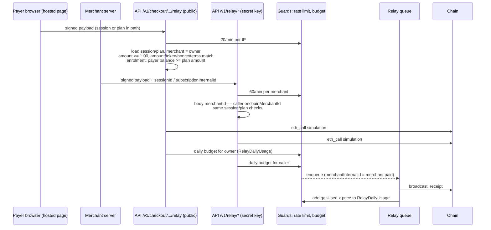

# ADR: Bind every relayed transaction to its merchant and bound what the relayer can be made to spend

- **Status:** Accepted 2026-10-10
- **Date:** 2026-10-08
- **Scope:** `apps/api` (relay module, checkout module, rate-limit interceptor, one new
  service for the daily relay budget, payment-session / plan / storefront-product /
  invoice creation validation), `packages/db` (one migration adding `RelayDailyUsage`),
  `apps/web` (hosted checkout hooks call the API directly; the checkout BFF routes and
  `strimz-bff.ts` are deleted), `apps/web/content/docs` (relay reference), release notes.
  No Solidity change. No BullMQ job payload change (`merchantInternalId`, `sessionId` and
  `subscriptionInternalId` already exist on the relay job). No webhook payload change. No
  published package change unless decision D7 picks the shared constant.

## Context

Issue #125. Verified against `main` at `b77c7e1`.

### Already fixed on `main`, not redone here

- `RelayPermanentError` extends BullMQ `UnrecoverableError`
  (`apps/api/src/modules/relay/relay-job-runner.ts:44`), and a reverted receipt throws it
  (`relay-job-runner.ts:264`). A reverted transaction is not retried with a higher tip
  (#185).
- When `subscriptionInternalId` is sent, `EnrolmentTermsService.verify` checks the plan
  exists, is `active`, belongs to the calling merchant, and that on-chain merchant id,
  token, amount, interval, `startAt` and `endAt` match the plan
  (`apps/api/src/modules/subscription-plans/enrolment-terms.service.ts:58-86`, #186).
- Relay keys are derived from the signed calldata (`relay.service.ts:45-47`), every call
  is simulated with `eth_call` before it is queued and refused with
  `400 relay_simulation_failed` if it would revert (`relay.service.ts:136,203`,
  `relay-chain-probe.ts:18-25`), a session's EIP-3009 nonce is fixed to
  `checkoutPaymentNonce(sessionId)` (`relay.service.ts:458-465`), one attempt per session
  or (plan, payer) is live at a time, and `GET /v1/relay/submissions/:key` is scoped to
  the caller (#204).

### What is still open

1. **Merchant checks are optional.** `POST /v1/relay/payments` runs
   `assertSessionPayable` and the nonce rule only `if (input.sessionId)`
   (`relay.service.ts:125-134`); `sessionId` is optional and documented as "Diagnostic
   only" (`relay.dto.ts:73-74`). `POST /v1/relay/subscriptions` verifies the plan only
   `if (body.subscriptionInternalId)` (`relay.controller.ts:127-149`;
   `relay.dto.ts:103`). Nothing compares the body's on-chain `merchantId` with the
   calling key's merchant: the controller passes `ctx.merchantId` only as
   `merchantInternalId` for attribution (`relay.controller.ts:106,174`). Even with a
   `sessionId`, `assertSessionPayable` checks the session's merchant against the body's
   on-chain id, not against the caller (`relay.service.ts:360-368`), so any key relays
   for any merchant's session.
   **Reproduced:** in `apps/api/test/e2e/relay-abuse.e2e.test.ts`, merchant A's
   `relay_write` key posts a payment of `1` base unit to merchant B's on-chain id, signed
   by the attacker's own wallet, with no `sessionId`. `main` answers `201` and queues
   it. The contract accepts it: it rejects only a zero amount, a non-whitelisted token
   and an intent not signed by `auth.from` (`StrimzPayments.sol:150-160,234`), all of
   which the attacker controls. The relayer pays gas for a gas limit of 280,000
   (`relay.service.ts:33-36`) at a `maxFeePerGas` between 21 Gwei (Arc floor plus 1 Gwei
   tip) and the 200 Gwei safety cap (`gas-pricing.service.ts:16,24`). Arc's native gas
   token is USDC with 18 decimals, so each such transaction costs the relayer up to
   0.0059 USDC at the floor and up to 0.056 USDC at the cap. The attacker spends 0.000001
   USDC, which lands in a merchant's payout address; the fee rounds to zero. That is a
   ratio of at least 5,880 to 1, repeatable without limit.
2. **The hosted checkout relays with one merchant's key.** The browser posts to the
   unauthenticated BFF route `POST /api/checkout/sessions/:sessionId/submit`
   (`apps/web/src/app/api/checkout/sessions/[sessionId]/submit/route.ts:74-147`), which
   forwards to `/v1/relay/*` with `Authorization: Bearer ${STRIMZ_INTERNAL_API_KEY}`
   (`apps/web/src/lib/strimz-bff.ts:20,103-110`). **Whose key it is:** nothing in the
   repository says. `apps/web/.env.example:33-38` describes it only as "Strimz internal
   API key ... Holds `relay_write` + `relay_read` scopes". The API has no platform
   credential: `ApiKeyGuard` resolves every key to a `MerchantApiKey` row and its
   merchant (`apps/api/src/common/guards/api-key.guard.ts:61-84`). So the value in
   Vercel is a secret key of one ordinary merchant account. The only script in the
   repository that mints a `relay_write` key outside the dashboard is
   `apps/api/scripts/seed-test-merchant.mjs:34-54,100-107`, which creates the "Smoke Test
   Co" merchant (`smoke@strimz.test`); which account's key is deployed cannot be
   verified from the repository and must be confirmed by the maintainer. Every hosted
   checkout therefore shares that one merchant context, which is also noted in
   `docs/adr/ADR-2026-10-03-checkout-idempotency.md:17-20`.
3. **Hosted subscription checkout is broken today for every merchant except the key's
   owner.** The BFF sends the plan id as `subscriptionInternalId`
   (`route.ts:137`), and since #186 `EnrolmentTermsService.verify` requires
   `plan.merchantId === ctx.merchantId` (`enrolment-terms.service.ts:63`), where
   `ctx` is the BFF key's merchant. **Reproduced** with a throwaway e2e probe: merchant
   A's key enrolling a payer into merchant B's plan returns
   `400 enrolment_terms_mismatch` "enrolment does not match the plan: plan". A plain
   "body merchant must equal caller" rule on the payment path would break hosted
   one-shot checkout the same way.
4. **Rate limits.** `@RateLimit` is used only on three admin routes
   (`admin.controller.ts:209,222,293`) and `tokens.permitNonce`
   (`tokens.controller.ts:56`). Neither `/v1/relay/*` nor the BFF has one. The only bound
   is the global `@fastify/rate-limit` at 600 requests a minute per IP
   (`apps/api/src/main.ts:44`), far above anything useful, and all BFF traffic reaches
   the API from Vercel egress addresses, so it shares those buckets. `keyBy: 'actor'`
   reads `req.user` (`rate-limit.interceptor.ts:85-92`), but `ApiKeyGuard` sets
   `req.merchant` (`api-key.guard.ts:79`) and the admin guard sets `req.admin`
   (`admin-auth.guard.ts:119`); nothing sets `req.user`, so every `actor` limit is
   per IP today (#133). The interceptor's buckets live in process memory, which is
   correct for the single Lightsail container. `trustProxy: true` (`main.ts:19`) makes
   `req.ip` the left-most `X-Forwarded-For` entry; nginx appends
   (`infra/lightsail/nginx.conf:65`), so per-IP limits are only as good as the host
   Caddy's handling of a client-supplied `X-Forwarded-For`. The Caddyfile is not in the
   repository.
5. **Storefront sessions.** `POST /store/:slug/products/:productId/checkout` is public
   (`storefronts.controller.ts:116-127`) and mints a live session whose amount is the
   product price (`storefronts.service.ts:263-270`). Once the session check applies, a
   relayed payment for such a session must equal that price, use that session's nonce,
   and pay that merchant, so a third party can only drain gas by paying the merchant's
   real price. It is not a new path, with one exception: amounts are any non-negative
   integer string (`packages/shared-types/src/common.ts:45-47`), so a merchant can list a
   product, plan or session at 1 base unit and anyone, including that merchant, can then
   relay real but worthless payments to it. Separately, the public route decrements
   stock without auth; that is a stock-exhaustion issue, not gas, and is out of scope.
6. **Two further gaps found while verifying.**
   - `assertSessionPayable` never compares the body's `token` with the session's
     currency (`relay.service.ts:328-375`). A USDC session can be relayed with any other
     whitelisted EIP-3009 token of the same amount. Reproduced in the red suite.
   - `permitAndCreateSubscription` moves no money: it records the subscription and sets
     an allowance through the permit, without a balance check
     (`packages/contracts/src/core/StrimzSubscriptions.sol:173-229`). Charging happens
     later through the scheduler. A sybil with fresh, empty wallets can enrol into any
     public plan once per wallet, and every enrolment is pure relayer gas, then a
     scheduler charge attempt that skips for insufficient funds
     (`StrimzSubscriptions.sol:386-389`). Plan binding does not stop this; a balance
     check does.

- Out of scope, flagged: the relay ABI for `permitAndCreateSubscription`
  (`apps/api/src/modules/relay/abi.ts:48-90`) has no `nonce` argument, while the contract
  signature gained `bytes32 nonce` in #207 (`StrimzSubscriptions.sol:173-184`). Relayed
  enrolments will hit the wrong selector once the #207 contracts are deployed.
- `@strimz/sdk` has no relay method (`packages/sdk/src` has no `/v1/relay` call;
  `RelayPath` in `resources/tokens.ts:55-65` only selects a signing path). The BFF uses a
  hand-rolled fetch. No published SDK method is affected by any option below.

## Decision

1. **Hosted checkout relays through public, session-bound API routes, with no API key.**
   New `@Public()` routes in the checkout module:
   - `POST /v1/checkout/sessions/:id/relay`: body is today's payment body without
     `sessionId`. The session comes from the path.
   - `POST /v1/checkout/plans/:id/relay`: body is today's enrolment body without
     `subscriptionInternalId`. The plan comes from the path.
   - `GET /v1/checkout/sessions/:id/submissions/:key` and
     `GET /v1/checkout/plans/:id/submissions/:key`: scoped with the existing
     `jobInScope` to the session or plan and its owning merchant; anything else is `404`.

   Each POST runs every check the merchant path runs (decision 2), with the merchant
   taken from the session or plan instead of from a key: session payable, on-chain
   merchant equals the session's merchant, amount equals the session amount, token equals
   the session currency's token, nonce is `checkoutPaymentNonce(sessionId)`; for a plan,
   `EnrolmentTermsService.verify(plan.merchantId, ...)`, the active-subscription check,
   and decision 3. The relay job's `merchantInternalId` is the session's or plan's
   merchant, so attribution and the budget land on the merchant who is paid. The routes
   sit under `/v1/checkout/`, so `PUBLIC_CORS_PREFIXES` (`cors-policy.ts:7`) already
   lets the hosted page call them from the browser. `use-pay-checkout.ts` and
   `use-subscription-checkout.ts` call them directly; the BFF routes
   `api/checkout/sessions/[sessionId]/submit` and `.../submissions/[key]`, and
   `lib/strimz-bff.ts`, are deleted; `STRIMZ_INTERNAL_API_KEY` is removed from
   `.env.example` and Vercel, and the deployed key is revoked. Calling the API directly
   also means the API sees the payer's address, which per-IP limits need.

2. **The merchant-key relay routes are bound to the caller.**
   - `merchantId` in the body must equal the caller's `Merchant.onchainMerchantId`,
     otherwise `403 merchant_mismatch`, before any database lookup of the session or
     plan and before simulation. A caller with no on-chain id gets the same `403`.
   - `sessionId` becomes required on `POST /v1/relay/payments` and
     `subscriptionInternalId` on `POST /v1/relay/subscriptions` (`400 invalid_request`
     from the DTO). A session or plan of another merchant is therefore refused (by the
     `merchant_mismatch` rule, because `onchainMerchantId` is unique,
     `packages/db/prisma/schema/merchants.prisma:8`).
   - `token` must equal the session currency's token: `400 token_mismatch`.
3. **Every relayed transaction moves at least 1.00 of a stablecoin.**
   - A payment's signed amount and a plan's amount must be at least `1_000_000` base
     units (1.00 USDC or EURC, both 6 decimals): `400 amount_below_minimum`, on both
     paths, before simulation.
   - The same floor is enforced when a payment session, plan, storefront product or
     invoice is created or updated, so merchants cannot create something nobody can pay.
   - An enrolment requires `token.balanceOf(payer) >= plan.amount` at submission time,
     read with one `eth_call` (`400 insufficient_balance`), trial plans included.
   - At the free tier fee of 1.5% (`packages/shared-config/src/tiers.ts:33`), one
     1.00 USDC payment earns Strimz 0.015 USDC against at most 0.0059 USDC of gas at the
     floor, so a payment that passes the floor no longer costs Strimz money at normal
     gas prices. At the business tier fee of 0.5% it earns 0.005 USDC, about break-even.
4. **Rate limits.**
   - `POST /v1/checkout/sessions/:id/relay` and `POST /v1/checkout/plans/:id/relay`: 20
     a minute per IP, per route. `GET .../submissions/:key`: 120 a minute per IP (the
     hosted page polls every few seconds).
   - `POST /v1/relay/payments` and `POST /v1/relay/subscriptions`: 60 a minute per
     merchant, per route, counted across all source addresses.
   - The per-merchant limit needs `keyBy: 'actor'` to read `req.merchant.merchantId`
     (and `req.admin` for admins). That one-function fix in
     `rate-limit.interceptor.ts:85-92` lands here; #133 keeps the rest of its scope.
5. **A per-merchant daily relay budget with an alert.**
   - New table `RelayDailyUsage` (`merchantId`, `day` as a UTC date, `submissions` int,
     `gasUsedWei` numeric, `warnedAt` and `exhaustedAt` nullable), unique on (`merchantId`, `day`).
   - Before a new job is queued (not on a replay or an already-paid short-circuit), one
     conditional upsert increments `submissions` only while it is below the merchant's
     daily quota; no row returned means `429 relay_budget_exhausted`, and nothing is
     queued.
   - Quotas by tier: free 500, growth 5,000, business 50,000, enterprise 50,000 per UTC
     day. Free sits above its own volume cap: $10,000 a month (`tiers.ts:35`) is about 333
     payments of 1.00 a day.
   - When `submissions` crosses 80% of the quota, and again at 100%, the API logs at
     `warn` / `error` with `relay.budget` and the merchant id, and sends one email to an
     operator address (new optional env `OPS_ALERT_EMAIL`); `warnedAt` and `exhaustedAt` make each alert fire once a day.
   - The relay processor adds `gasUsed * effectiveGasPrice` from each receipt to
     `gasUsedWei`, so the operator can see what each merchant cost. Enforcement uses
     the count, which is known before broadcast; gas is reported, not enforced.
   - Worst case per merchant per day at the cap gas price: free 500 x 0.056 = 28 USDC.
6. **Errors.** New codes: `merchant_mismatch` (403), `token_mismatch` (400),
   `amount_below_minimum` (400), `insufficient_balance` (400),
   `relay_budget_exhausted` (429, with `retryAfterSec` to the next UTC midnight).
   `rate_limited` (429) is unchanged.

## Diagram

## Consequences

- No credential that can relay for every merchant exists any more. The hosted page needs
  no secret, and a relayed transaction is always attributed to, and counted against, the
  merchant who receives the money.
- Hosted subscription checkout works again for every merchant (Context item 3).
- The cheapest gas drain left is a real 1.00 payment, which costs the attacker the fee
  and capital, or a funded wallet per enrolment; both are capped per merchant per day.
- A merchant's daily quota can be exhausted by a third party paying it real money or
  enrolling funded wallets; that blocks the merchant's checkout until midnight UTC. The
  operator alert at 80% is there so a person sees it before it happens.
- The relay HTTP API changes for merchants that call it directly: `sessionId` and
  `subscriptionInternalId` become required, the body merchant must be their own, and
  amounts below 1.00 are refused. No SDK method calls these routes.
- Existing sessions, plans, products and invoices below 1.00 become unpayable. They must
  be counted before deploy (decision D7).
- Per-IP limits trust the proxy chain (Context item 4); per-merchant limits and the
  budget do not.
- One table, one env var, five error codes. The API sends one more `eth_call` per
  enrolment.

## Alternatives considered

### (a) How hosted checkout relays without a shared merchant key

- **Chosen: public session-bound routes on the API.** Strict by construction: the
  session or plan in the path decides the merchant, the amount and the nonce, and the
  payer's address is visible to per-IP limits.
- **A platform-scoped internal key the API recognises.** Keep the BFF and give it a
  credential that is not a merchant key (a hashed env secret or a key row with no
  merchant), accepted only with a `sessionId` or plan id, merchant taken from the
  session. Lost: it keeps a powerful shared secret on Vercel, and every request reaches
  the API from Vercel egress addresses, so per-IP limits need the BFF to forward the
  client address and the API to trust a header only from that key; that is more code
  and one more thing to get wrong than calling the API directly.
- **Per-merchant keys in the BFF.** Lost: the web app would hold every merchant's secret
  key, or mint one per merchant, which is worse than today.
- **Keep the BFF as a keyless proxy to the public routes.** Lost: same egress-address
  problem, for no benefit; the routes are already CORS-public.

### (b) Merchant-key relay

- **Chosen: body merchant must equal the caller, and `sessionId` /
  `subscriptionInternalId` become required.** Without the ids, the merchant check alone
  still lets a merchant relay 1-unit payments to itself; the ids bring in the session
  amount, the nonce rule and the attempt pointer, and the minimum (decision 3) closes
  the rest.
- **Merchant check only, ids stay optional.** Lost: self-relay remains possible without a
  session, the nonce and amount checks never run, and the 1.00 floor would have to be
  enforced on a raw amount with no session to tie it to.
- **Remove `/v1/relay/*` entirely.** Lost: it is a documented route
  (`apps/web/content/docs/api-reference.mdx:80-84`) for merchants who host their own
  checkout; the bounds make it safe to keep.

### (c) Gas bounds

- **Chosen: per-IP and per-merchant rate limits, a 1.00 floor, an enrolment balance check,
  and a counted daily budget with an alert.** Each covers a hole the others leave: rate
  limits stop bursts, the floor makes payments fee-positive, the balance check makes
  enrolments cost the attacker something, and the budget caps a slow drain.
- **A gas-denominated budget enforced at enqueue.** Lost: the gas is known only after the
  receipt; the count is known before broadcast. Gas is still recorded for reporting.
- **Budget counter in Redis (`INCR` with a 48-hour TTL), no migration.** Lost by a small
  margin: cheaper, but it disappears on a Redis flush and has no history for the
  operator or a later dashboard. It remains a valid fallback if the maintainer prefers
  no migration (D5).
- **A lower floor (0.10) or none.** Lost: at 0.10 the free-tier fee is 0.0015 USDC, below
  the floor-price gas of 0.0059 USDC.
- **Rate limits only.** Lost: 20 a minute per IP across many addresses is still unbounded
  per day.

## Decisions for the maintainer

- **D1. Hosted checkout path.** Recommended: public session-bound routes (decision 1);
  alternative: platform-scoped internal key.
- **D2. Required ids on `/v1/relay/*`.** Recommended: required. Breaking for any direct
  integration that omits them.
- **D3. Minimum amount.** Recommended: 1.00 (`1_000_000` base units) on payments and plan
  amounts, enforced at creation and at relay. Alternative: 0.50.
- **D4. Enrolment balance check, trial plans included.** Recommended: yes. Alternative:
  skip on trial plans, accepting sybil enrolments into trial plans up to the budget.
- **D5. Budget store.** Recommended: Postgres `RelayDailyUsage` (migration). Alternative:
  Redis counter, no migration.
- **D6. Numbers.** Recommended: 20/min per IP on hosted relay POSTs, 120/min per IP on
  hosted polls, 60/min per merchant on `/v1/relay/*`, daily quotas free 500 / growth
  5,000 / business 50,000 / enterprise 50,000, alerts at 80% and 100%.
- **D7. Where the floor lives and existing rows.** Recommended: an API-local constant (no
  published package change), plus a pre-deploy count of active sessions, plans, products
  and unpaid invoices below 1.00, shared with the maintainer before release; those rows
  are left as they are and fail at relay with `amount_below_minimum`. Alternative: put
  the constant in `@strimz/shared-config` so the dashboard form can use it (changeset,
  minor).
- **D8. Actor-keyed rate limiting.** Recommended: fix the `actor` subject lookup here,
  because decision 4 depends on it; #133 keeps the rest.
- **D9. Confirm whose key `STRIMZ_INTERNAL_API_KEY` is in Vercel**, so it can be revoked
  after the web switch.
  Answered 2026-10-10: the maintainer created it on their own merchant account for live
  testing. It is revoked after PR 2 deploys.

All of D1 to D8 were approved as recommended on 2026-10-10.

## Existing integrations and rollout

- Vercel deploys the web app on merge; the API is deployed by hand
  (`infra/lightsail/deploy.sh`). The order must keep checkout working:
  1. **PR 1, API:** public routes, the floor, token check, balance check, rate limits,
     actor fix, budget and migration. The merchant-key path keeps today's optional ids
     and caller check, so the old BFF keeps working. Deploy the API.
  2. **PR 2, web + API:** hosted hooks call the public routes; BFF routes,
     `strimz-bff.ts` and `STRIMZ_INTERNAL_API_KEY` removed; on the API, decision 2
     (caller check and required ids). Merging deploys the web first, which only needs PR
     1's routes; then deploy the API. Revoke the old key.
- Merchants calling `/v1/relay/*` directly: after PR 2 they must send `sessionId` or
  `subscriptionInternalId` and may only relay for themselves. No SDK release is needed;
  the API reference and release notes say so.

## Migration, versioning, docs

- **Migration:** one, adding `RelayDailyUsage` (D5). No change to existing tables.
- **Semver:** no published package changes under the recommended D7. `apps/api` and
  `apps/web` are not published. The relay HTTP API change is announced in release
  notes as breaking for direct integrations.
- **Docs:** `apps/web/content/docs/api-reference.mdx` relay section (required ids, own
  merchant only, floor, new error codes, limits, budget) and a checkout section for the
  public relay routes; `apps/web/.env.example` loses `STRIMZ_INTERNAL_API_KEY`;
  `docs/release-notes/<date>-relay-abuse.md` with `scenario-impact: updated`.
- **Comments a human must correct** (Directive 6; the agent will not edit them):
  `relay.dto.ts:73` ("Diagnostic only"), the class comment in `relay.controller.ts:32-58`
  ("all merchant-authenticated", "The API auth gates may THIS merchant submit"), the
  route comment in `submit/route.ts:6-27` and `strimz-bff.ts:5-18` (deleted with the
  files), and `rate-limit.decorator.ts:3-11` if the actor wording changes.

## Verification

- Red first, failing on `main` (`apps/api/test/e2e/relay-abuse.e2e.test.ts`, 13 tests,
  all fail on `b77c7e1`):
  - merchant key: a self-signed 1-unit payment to another merchant's on-chain id is
    `403 merchant_mismatch` with nothing queued or simulated (`main`: 201); a payment
    without `sessionId` is `400` (`main`: 201); a payment for another merchant's session
    is `403` (`main`: 201); an enrolment without `subscriptionInternalId` is `400`
    (`main`: 201); a session payment of 999,999 base units is
    `400 amount_below_minimum` (`main`: 201); a token other than the session's is
    `400 token_mismatch` (`main`: 201); the 61st call in a minute from one merchant
    across 61 addresses is `429` (`main`: 201).
  - hosted, no key: a payment for merchant B's session and an enrolment into merchant B's
    plan are `201` and attributed to B (`main`: 404); a payment naming the wrong merchant
    is `400`; an enrolment into a plan below the floor is `400 amount_below_minimum`; the
    submission is visible under its own session and `404` under another; the 21st POST
    in a minute from one address is `429` (`main`: 404 for all, the routes do not exist).
- Added during build, red before the code that satisfies them:
  - budget: with a quota lowered through the tier table in a test, the call after the
    quota is `429 relay_budget_exhausted` and nothing is queued; a replay of the
    identical payload does not count; the alert fires once at 80%. Needs the migration,
    so it cannot be written red against `main` without the table.
  - enrolment balance: extend `StubChainService` to answer `balanceOf`; an empty payer is
    `400 insufficient_balance`.
  - creation-time floor on sessions, plans, products and invoices.
  - rate-limit interceptor unit test: `actor` keys on `req.merchant` and `req.admin`.
  - web: the hosted hooks post to `${NEXT_PUBLIC_API_URL}/v1/checkout/.../relay` and
    poll the public submissions route; no file reads `STRIMZ_INTERNAL_API_KEY`.
  - existing relay suites (`relay-checkout-idempotency`, `subscription-trials`,
    `relay-controller` unit) are updated only where they omit the now-required ids.
- `./scripts/preflight.sh` in full.
- On Arc testnet after deploy: pay a hosted session and enrol into a plan of a merchant
  that is not the old key's owner, with the transaction hashes; confirm a 1-unit
  self-signed payment to another merchant is refused; revoke the old key and confirm
  hosted checkout still works.
