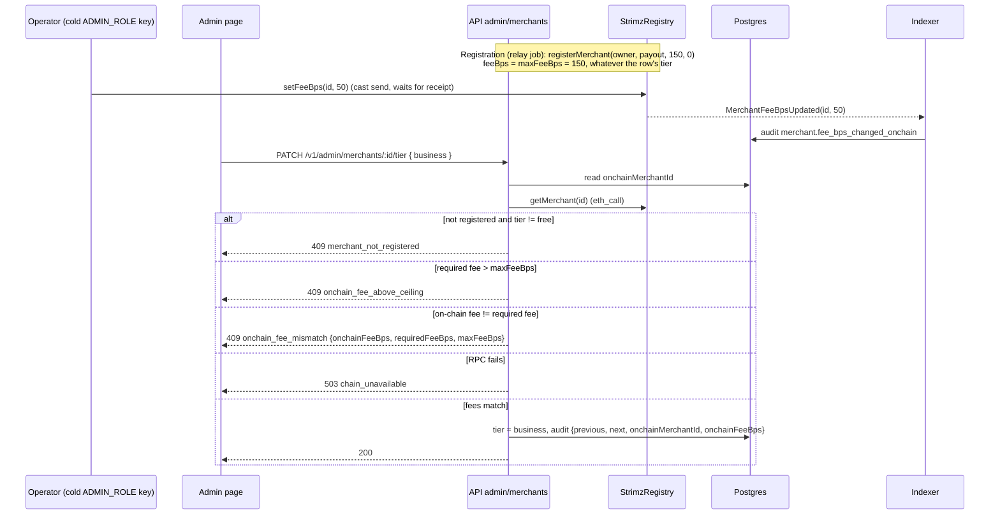

# ADR: Merchants cannot choose their tier, and an admin tier change follows the on-chain fee

- **Status:** Accepted 2026-10-10
- **Date:** 2026-10-10
- **Scope:** `apps/api` (merchants module: the self-serve tier route is removed and
  registration writes the default fee; admin module: the tier change reads the Registry
  before it writes), `apps/web` (settings page and admin merchant page copy;
  `content/docs/authentication.mdx`), one read-only pre-deploy audit script, release
  notes. No Solidity change. No Prisma migration. No BullMQ job payload change (the
  `registerMerchant` job carries only `merchantInternalId`, and the runner reads the
  merchant row). No webhook payload change. No published package change under the
  recommended D7.

## Context

Issue #128. Verified against `main` at `8a52d2d`. The issue cites
`merchants.service.ts:183` and `merchant-chain.service.ts:197` from `729e4d7`; the code has
moved, and the fee is now encoded in `registration.ts`, not `merchant-chain.service.ts`.

### How a tier is set today

- **Merchant route.** `POST /v1/merchants/me/tier`
  (`apps/api/src/modules/merchants/merchants.controller.ts:48-53`) is `@SessionOnly()`
  behind `MerchantAuthGuard`, so any signed-in dashboard session can call it; API keys get
  `403` (`docs/adr/ADR-2026-10-03-api-key-scope-enforcement.md`).
  The body is `{ tier }` with `tier` one of `free | growth | business | enterprise`
  (`packages/shared-types/src/merchants.ts:90-92`, `common.ts:101`).
  `MerchantsService.changeTier` (`merchants.service.ts:187-193`) writes the tier to the
  row and returns. No billing step, no admin approval, no check of on-chain registration
  status, no audit log entry. It works before and after registration.
- **No billing exists.** `TIERS` gives Growth `$49` and Business `$199` a month
  (`packages/shared-config/src/tiers.ts:42,52`), but nothing in `apps/` or `packages/`
  reads `monthlyFeeUsdCents`, and there is no payment provider or subscription for
  Strimz's own fees. Paid tiers cannot be bought; they can only be picked.
- **No dashboard UI calls the route.** `rg "me/tier" apps/web/src` finds nothing. The
  settings page shows the tier as a badge and says "Tier upgrades happen automatically
  based on rolling 30-day volume"
  (`apps/web/src/app/(dashboard)/app/settings/page.tsx:315-320`); no such job exists in
  `apps/api`, `apps/scheduler` or `apps/indexer`. The same page says the free tier is
  "0.5% per transaction" (`settings/page.tsx:400`), while `tiers.ts:33` says 1.5%. The
  public docs say "Change your profile, payout address, and tier in the dashboard"
  (`apps/web/content/docs/authentication.mdx:129`). The route is reachable by anyone who
  copies their Privy bearer token from the browser.
- **Admin route.** `PATCH /v1/admin/merchants/:id/tier` (`admin.controller.ts:129-138`,
  roles `super_admin` and `admin`) calls `AdminService.setMerchantTier`
  (`admin.service.ts:297-319`): it writes the row and an audit entry
  `merchant.tier_changed` with `{ previous, next }`. It does not touch the chain. The
  admin page offers a tier select with the copy "Changes apply to new payments
  immediately" (`apps/web/src/app/(admin)/admin/merchants/[id]/page.tsx:213-237`), which
  is not true once the merchant is registered (below).

### What the tier controls

| Consumer                          | Where                                                                               | Effect of the DB tier                                                                                                           |
| --------------------------------- | ----------------------------------------------------------------------------------- | ------------------------------------------------------------------------------------------------------------------------------- |
| On-chain fee at registration      | `registration.ts:36-43`, called from `relay-job-runner.ts:152`; tier read at `:115` | `registerMerchant(owner, payout, effectiveFeeBps(tier,'one_shot') ?? 150, 0)`: free 150, growth 80, business 50, enterprise 150 |
| Daily relay quota                 | `relay-budget.service.ts:8-13,54`                                                   | free 500, growth 5,000, business 50,000, enterprise 50,000 submissions a day                                                    |
| Fee preview on a session          | `payment-sessions.service.ts:60-63`                                                 | `feeAmount` and `netAmount` stored on the session                                                                               |
| Fee preview on an invoice         | `invoices.service.ts:45-47`                                                         | `feeAmount` and `netAmount` stored on the invoice                                                                               |
| Volume caps, white-label, support | `tiers.ts:20-25`                                                                    | none: no code reads `monthlyVolumeCapUsdCents`, `whiteLabelEligible` or `prioritySupport`                                       |
| Agents                            | `apps/api/src/modules/agents`                                                       | none                                                                                                                            |

### What the chain does with the fee

- Registration is enqueued when onboarding completes (`merchants.service.ts:147-163`,
  `startRegistrationIfEligible`) or lazily on the first session, plan or invoice
  (`merchant-chain.service.ts:43-55`, called from `payment-sessions.service.ts:48`,
  `subscription-plans.service.ts:59`, `invoices.service.ts:35`). The relay runner reads
  the tier when the job runs (`relay-job-runner.ts:107-163`), so a tier picked any time
  before the job runs is written.
- `StrimzRegistry.registerMerchant` stores `feeBps` and sets `maxFeeBps = feeBps`
  (`packages/contracts/src/core/StrimzRegistry.sol:85-118`). `maxFeeBps` is "the ceiling
  the merchant consented to at registration" (`IStrimzRegistry.sol:11-13`).
- `setFeeBps` is `onlyRole(ADMIN_ROLE)` and reverts above `maxFeeBps`
  (`StrimzRegistry.sol:123-129`). There is no other fee setter for Strimz.
- `setMaxFeeBps` is callable by the merchant owner only, can only lower, and snaps
  `feeBps` down with it (`StrimzRegistry.sol:132-142`; covered by
  `packages/contracts/test/StrimzRegistry.t.sol:108-117`).
- At payment time the contracts charge the Registry fee, not the tier:
  `StrimzPayments.pay` and the EIP-3009 path use `m.feeBps`
  (`StrimzPayments.sol:122-128,184`), subscriptions use `m.feeBps`
  (`StrimzSubscriptions.sol:401-404`).
- The relayer key holds only `MERCHANT_REGISTRAR_ROLE`
  (`packages/contracts/script/grant-operator-roles.sh:8-9,87-90`). `ADMIN_ROLE` stays on
  the cold deployer key (`StrimzRegistry.sol:42-50`). The API therefore cannot call
  `setFeeBps` today.
- The indexer projects `MerchantFeeBpsUpdated` only as an audit entry
  `merchant.fee_bps_changed_onchain` (`apps/indexer/internal/processor/projector.go:97-99`,
  `internal/store/projections.go:75-90`). `MerchantMaxFeeBpsLowered` is logged the same
  way (`projector.go:142-146`). Nothing writes a fee or a tier back to `Merchant`.

### The defect, in its two shapes

1. **Before registration: a merchant buys nothing and gets a permanent discount.** Pick
   `business`, then finish onboarding: the Registry stores 50 bps and a ceiling of 50.
   Strimz loses two thirds of the free-tier fee on every payment and every subscription
   charge for that merchant. Because the ceiling can only be lowered, no admin action can
   restore 150 bps (`setFeeBps(id, 150)` reverts with `Registry__FeeExceedsMax`); the
   only path is a new merchant id and re-enrolling subscribers, which is #146's open
   question.
2. **After registration: the database and the chain disagree.** Any later tier change,
   from either route, updates only the row. The chain keeps charging the registration fee.
   The DB tier still drives the relay quota and the fee previews, so:
   - a self-upgrade to `business` or `enterprise` raises the merchant's daily relay quota
     from 500 to 50,000 at no cost. That undoes the per-merchant bound from #125: at the
     200 Gwei cap, 50,000 x 0.056 USDC is about 2,800 USDC of relayer gas a day for one
     merchant, against 28 USDC for a free merchant
     (`docs/adr/ADR-2026-10-08-relay-abuse.md`, decision 5);
   - session and invoice `feeAmount` / `netAmount` show a fee the chain does not charge.
   - an admin "upgrade" on the admin page gives the merchant nothing on-chain, despite
     the page copy.

**Reproduced** in `apps/api/test/e2e/merchant-tier-control.e2e.test.ts` (route returns
`201` and the row becomes `business` / `enterprise`) and
`apps/api/test/unit/modules/merchants/registration-fee.test.ts` (a `growth` merchant
registers at 80 bps, `business` at 50).

### Production state, as far as it can be checked

- The current Arc testnet Registry (`0x23bb2531...71ae3`, entry 9 in
  `packages/contracts/deployments/5042002.json`, also in `infra/lightsail/env.example:32`)
  has three merchants. Read with `cast call ... getMerchant(i)` on 2026-10-10: ids 1, 2
  and 3 all have `feeBps = 150` and `maxFeeBps = 150`. No registration so far used a
  discounted tier, and no merchant lowered its ceiling.
- The production database could not be read from here. Whether any row has a tier other
  than `free`, and whether it came from `/me/tier` (no audit row) or the admin route
  (audit row `merchant.tier_changed`), is unknown. D6 covers it.

### Adjacent, out of scope

- **#146.** `maxFeeBps` can only be lowered, and a merchant can call
  `setMaxFeeBps(id, 0)` from its own wallet, which sets its fee to 0 with no Strimz
  involvement (`StrimzRegistry.sol:132-142`). The owner is the merchant's Privy embedded
  wallet (`registration.ts:41`). That is a direct on-chain way for a merchant to choose
  its fee, and it bypasses everything in this ADR. It is a contract question and belongs
  to #146; this ADR only makes sure the API does not make it worse and that the audit in
  D6 reports any merchant whose on-chain fee is below its tier.
- **Three different price lists.** `tiers.ts` (Free 1.5%, Growth 0.8%, Business 0.5%),
  the marketing page (`apps/web/src/app/(marketing)/pricing/page.tsx:30-90`: Free 0%,
  Starter 0.5%, Growth 0.4%, Enterprise custom) and the settings page (free "0.5%"). The
  chain follows `tiers.ts`. This ADR treats `tiers.ts` as canonical (D8) and fixes only
  the dashboard copy that describes tier control; the marketing page needs its own issue.
- **Subscription premium.** `tiers.ts:34` adds 20 bps on recurring payments, but the
  contracts have one `feeBps` per merchant, so the premium is never charged. Separate
  issue.
- **Billing for paid tiers**, volume caps and white-label enforcement do not exist. Out of
  scope; this ADR makes tiers operator-controlled so a later billing system has one place
  to hook into.
- **#145** (agent escrow and CCTP launch scope) does not touch tiers or fees.

## Decision

1. **Merchants cannot change their tier.** `POST /v1/merchants/me/tier`,
   `MerchantsService.changeTier` and `ChangeTierDto` are removed. The route answers `404`
   like any unknown route. A merchant's tier is set only by an admin.
2. **Registration always writes the default fee.** `registerMerchantCallData` encodes
   `effectiveFeeBps(DEFAULT_TIER, 'one_shot')` (150 bps, `tiers.ts:33,71`) whatever the
   row's tier is, and `RegistrationCandidate` drops `tier`; the runner stops selecting it
   (`relay-job-runner.ts:115`). Every new merchant consents to the published Free price
   as its ceiling, so an admin can later set any standard tier (all at or below 150) and
   move the merchant back to Free.
3. **An admin tier change follows the chain; the API never writes the fee.**
   `AdminService.setMerchantTier` changes the row only when the Registry already charges
   that tier's fee:
   - **Not registered** (`onchainMerchantId` is null): only `free` is accepted. Any other
     tier is `409 merchant_not_registered`, nothing is written.
   - **Registered:** the API reads `getMerchant(onchainMerchantId)` through
     `MerchantChainService` (the read already exists, `merchant-chain.service.ts:122-179`;
     a new method returns `feeBps` and `maxFeeBps` and throws instead of returning `null`
     on a failed read).
     - For `free`, `growth`, `business`:
       `requiredFeeBps = effectiveFeeBps(tier, 'one_shot')`. If it is above `maxFeeBps`:
       `409 onchain_fee_above_ceiling`. Else if the on-chain `feeBps` differs: `409 onchain_fee_mismatch`. Both carry
       `details: { onchainMerchantId, onchainFeeBps, requiredFeeBps, maxFeeBps }`, so the
       operator knows which `setFeeBps(id, bps)` to send.
     - For `enterprise`: any on-chain fee is accepted; the custom rate is whatever the
       operator set on-chain (D5).
     - RPC failure: `503 chain_unavailable`, nothing written.
   - On success the audit entry `merchant.tier_changed` also records
     `onchainMerchantId` and `onchainFeeBps`.
4. **The on-chain fee change is an operator action with the cold admin key.** The
   runbook (`packages/contracts/README.md`, next to `grant-operator-roles.sh`) gains the
   `cast send <registry> "setFeeBps(uint256,uint16)" <id> <bps>` step: the operator sends
   it, waits for the receipt, then changes the tier in the admin page. The indexer keeps
   logging `merchant.fee_bps_changed_onchain`. The relayer gets no new role.
5. **Copy and docs.** The settings page states that Strimz sets the tier and shows the
   tier's fee from `@strimz/shared-config` instead of "upgrades happen automatically" and
   "0.5%"; the admin page explains the on-chain step and shows the `409` details through
   the existing toast (`use-mutation-with-toast.ts:116-119`);
   `content/docs/authentication.mdx` drops `POST /v1/merchants/me/tier` and the sentence
   about changing the tier in the dashboard.
6. **A read-only pre-deploy audit** (`apps/api/scripts/audit-merchant-tiers.mjs`, run
   by the maintainer against production with a read-only database URL and the public
   RPC) lists:
   - every merchant whose tier is not `free`, with whether an admin audit row
     `merchant.tier_changed` explains it;
   - for every registered merchant, `tier`, `effectiveFeeBps(tier)`, on-chain `feeBps`
     and `maxFeeBps`, flagging any mismatch and any on-chain fee below the tier fee.

   It writes nothing. The maintainer decides each flagged row (D6).

## Diagram

## Consequences

- A merchant can no longer lower its own fee or raise its relay quota through the API.
  The only self-serve fee lever left is `setMaxFeeBps` on-chain (#146).
- For every merchant registered after this ships, the row's tier and the Registry fee
  agree, except where the merchant lowers its own ceiling on-chain; the audit script finds
  those.
- Tier changes become a two-step operator task with the cold key. That is slow, and that
  is acceptable while no one can pay for a tier; it also keeps the hot relayer key unable
  to deactivate merchants (`setActive` is also `ADMIN_ROLE`, `StrimzRegistry.sol:147`).
- An admin can no longer pre-assign a paid tier before registration. They wait for the
  merchant to register, then set the fee on-chain and the tier.
- Every registration now costs Strimz's ceiling of 150 bps of consent from the merchant.
  A merchant on Growth or Business is still charged its lower fee once the operator sets
  it; the ceiling only allows Strimz to move it back to Free later.
- Fee previews on sessions and invoices remain derived from the tier. They are correct
  whenever the tier is correct, which this ADR makes the normal case.
- One more `eth_call` per admin tier change. No new table, role, job or event.

## Alternatives considered

### (a) Who may change a tier

- **Chosen: admins only.** No billing exists, so a self-serve paid tier is a free
  discount.
- **Self-serve, but only to `free`.** Lost: nobody needs it (no UI, and Free is the
  default), and a downgrade from a discounted registration still needs an on-chain write
  the API cannot make.
- **Self-serve with a billing step.** Lost: there is no billing system; building one is
  a product project, not a launch fix.

### (b) Who writes the fee on-chain after registration

- **Chosen: the operator with the cold admin key; the API verifies with a read.** No
  contract change, no new hot-key power, no migration.
- **Grant `ADMIN_ROLE` on the Registry to the relayer and send `setFeeBps` from the
  admin route as a relay job.** Lost: the hot key would also hold `setActive`, so a
  compromised API server could deactivate every merchant and halt all payments. It also
  needs a new `RelayJob` variant (a BullMQ payload change) and a pending-tier state.
- **A new `FEE_MANAGER_ROLE` that can only call `setFeeBps`, granted to the relayer.**
  Lost for now: a Registry upgrade through `UPGRADER_ROLE`, plus the relay job and pending
  state above. It is the right shape once tiers are sold; it fits the contract redeploy
  that #146 already points at.
- **A sync job that compares DB and chain and fixes the chain.** Lost: same key problem
  as the relayer option, and it would act on a DB value no one approved.
- **Make the chain the source of truth: the indexer projects `MerchantFeeBpsUpdated`
  into a new `Merchant.onchainFeeBps` column and the tier is derived.** Lost for this
  issue: a migration and a Go projection, and a fee does not map back to a tier for
  Enterprise. Worth doing later for drift alerts (D9).

### (c) What fee registration writes

- **Chosen: always the default (Free) fee.** Keeps every standard tier reachable later,
  because the ceiling is the highest standard fee.
- **The row's tier fee, as today, with tiers admin-only.** Lost: an admin who pre-assigns
  Business before registration locks that merchant's ceiling at 50 bps forever.
- **The contract maximum (500 bps) as ceiling, with the fee set separately.** Lost: needs
  a contract change (`registerMerchant` sets both to the same value) and asks merchants
  to consent to 5%.

## Decisions for the maintainer

- **D1. Remove `POST /v1/merchants/me/tier`?** Recommended: remove (`404`).
  Alternative: keep it returning `403` with a "contact support" code, or accept only
  `free`.
- **D2. Registration always writes 150 bps?** Recommended: yes, independent of the row's
  tier. Alternative: keep writing the tier fee, now that only admins set tiers.
- **D3. Who sends `setFeeBps`?** Recommended: the operator with the cold admin key, API
  verifies by reading the Registry. Alternatives: a `FEE_MANAGER_ROLE` for the relayer in
  the contract redeploy (with a relay job and pending state); `ADMIN_ROLE` for the relayer
  (not recommended).
- **D4. Admin tier change on an unregistered merchant.** Recommended: only `free`
  (`409 merchant_not_registered` otherwise). Alternative: allow it, and have the
  registration job enqueue a follow-up fee change, which needs D3's relayer option.
- **D5. Enterprise.** Recommended: accept any on-chain fee for `enterprise`, recorded in
  the audit entry. Alternative: require the admin to type the agreed bps and refuse a
  mismatch.
- **D6. Existing rows.** Recommended: run the read-only audit before the API redeploy and
  share it. Then: an unregistered merchant with a non-free tier and no
  `merchant.tier_changed` audit row is reset to `free` by a one-off SQL the maintainer
  runs; a registered merchant whose on-chain fee matches some tier is set to that tier; a
  registered merchant whose on-chain fee is below Free with a ceiling below 150 is listed
  for a per-merchant decision under #146. The current testnet Registry has no such
  merchant (Context).
- **D7. `changeTierInputSchema`, `ChangeTierInput`, `ChangeTierParsed` in
  `@strimz/shared-types`.** Nothing uses them after decision 1. Recommended: leave them
  this release (no package change, no changeset) and remove them in the next planned
  shared-types minor. Alternative: remove now with a minor changeset and update
  `packages/sdk/tests/input-types.test-d.ts:135,202`.
- **D8. Canonical price list.** Recommended: `packages/shared-config/src/tiers.ts`, which
  the chain already follows; the dashboard copy in decision 5 reads from it; the
  marketing pricing page and the subscription premium get their own issues.
- **D9. Drift detection.** Recommended: out of scope now; open an issue to project
  `MerchantFeeBpsUpdated` and `MerchantMaxFeeBpsLowered` into the merchant row and alert
  when the on-chain fee drops below the tier fee.
- **D10. Announce `setMaxFeeBps` risk now.** Recommended: add this finding to #146 so the
  redeploy decision covers it; no change here.

## Existing integrations and rollout

- **API (Lightsail, deployed by hand).** Decisions 1 to 3 ship together in one PR. The
  self-serve route stays live in production until the maintainer redeploys, which is
  deferred until the launch fixes are done; until then any merchant can still pick a
  tier, and a pick before registration still locks a discounted ceiling on-chain. Running
  the D6 audit right before the redeploy catches anything that happened in the gap.
- **Web (Vercel, deploys on merge).** No web code calls `/me/tier`, and the admin page
  only gains copy and error display, so the web and the API can merge and deploy in any
  order. Settings copy that says "Strimz sets your tier" is true of production only after
  the API redeploy; shipping the web first is harmless because no UI offered the change.
- **SDK.** `@strimz/sdk` removed `merchants.changeTier` in 0.8.0
  (`packages/sdk/CHANGELOG.md:25`); no published client calls the route.
- **Direct HTTP callers** of `/v1/merchants/me/tier` with a dashboard session: none
  known; the release note says the route is gone.

## Migration, versioning, docs

- **Migration:** none.
- **Semver:** no published package changes under the recommended D7. `apps/api` and
  `apps/web` are not published.
- **Docs:** `apps/web/content/docs/authentication.mdx:120-129`; the contracts README
  operator runbook (setFeeBps step); `docs/release-notes/<date>-merchant-tier-control.md`
  with `scenario-impact: updated`.
- **Tests that change with the removal:** `api-key-scope-enforcement.e2e.test.ts:53,97`
  list `/v1/merchants/me/tier` as a session-only route and expect `403` for keys; after
  removal it is `404`, so the two entries are deleted.
  `route-access-declared.e2e.test.ts:90` lists `MerchantsController.changeTier` and loses
  that entry.
- **Comments a human must correct** (Directive 6; the agent will not edit them):
  - `apps/indexer/internal/store/projections.go:75-78` says fee bps lives in "per-tier
    defaults + per-merchant overrides ... elsewhere"; there are no overrides anywhere.
  - `apps/web/src/hooks/api/use-merchant.ts:20-21` lists "tier change" among things that
    change the merchant record from the dashboard.
  - `packages/db/prisma/schema/admins.prisma:3` "change-tier" stays true; listed only so
    the reviewer can confirm.
  - `packages/shared-config/src/tiers.ts:1-7` is unchanged by this ADR but describes a
    subscription premium the contracts do not charge (out of scope).

## Verification

- **Red first, failing on `main` at `8a52d2d`:**
  - `apps/api/test/e2e/merchant-tier-control.e2e.test.ts`, 7 tests, all fail:
    - a dashboard session posting `{ tier: 'business' }` to `/v1/merchants/me/tier` gets
      `404` and the row stays `free` (`main`: `201`);
    - posting `{ tier: 'enterprise' }` leaves the row `free` (`main`: row becomes
      `enterprise`, quota 50,000);
    - admin sets `business` on a registered merchant whose Registry fee is 150:
      `409 onchain_fee_mismatch` with
      `{ onchainMerchantId: '7', onchainFeeBps: 150, requiredFeeBps: 50, maxFeeBps: 150 }`,
      row unchanged (`main`: `200`);
    - admin sets `free` on a merchant whose ceiling is 50:
      `409 onchain_fee_above_ceiling`, row stays `business` (`main`: `200`);
    - admin sets `business` when the Registry fee is already 50: `200`, audit metadata
      includes `onchainMerchantId: '9'` and `onchainFeeBps: 50` (`main`: `200` but the
      metadata is only `{ previous, next }`);
    - admin sets `growth` on an unregistered merchant: `409 merchant_not_registered`
      (`main`: `200`);
    - admin sets `growth` while the Registry read fails: `503 chain_unavailable`, row
      unchanged (`main`: `200`).

    The suite overrides `readContract` on the test app's `StubChainService` for
    `getMerchant` only, inside the test file; no shared helper changes.

  - `apps/api/test/unit/modules/merchants/registration-fee.test.ts`, 5 tests: `growth`
    and `business` fail (`main` encodes 80 and 50, expected 150); `free`, `enterprise`
    and the default-fee check pass on `main` and guard the change.

- **Not written red against `main`:** the audit script (decision 6) has no code to test
  yet; it gets a unit test over a fixture of rows and Registry records during build. The
  web copy changes are checked by hand.
- **Existing suites updated during build:** the two scope-enforcement entries and the
  route-access entry above; `relay-job-runner.e2e.test.ts` keeps passing (its fake
  receipt already uses 150).
- `./scripts/preflight.sh` in full.
- **On Arc testnet after the API redeploy:** a new merchant onboards and registers;
  `getMerchant` shows `feeBps = maxFeeBps = 150`. `POST /v1/merchants/me/tier` returns
  `404`. In the admin page, setting `business` returns the `409` with
  `requiredFeeBps: 50`; the operator sends `setFeeBps(id, 50)` (record the transaction hash); the admin
  retries and gets `200`; a payment for that merchant shows a 0.5% fee in its
  `PaymentExecuted` event. Setting `free` again requires `setFeeBps(id, 150)` first and
  then succeeds.
