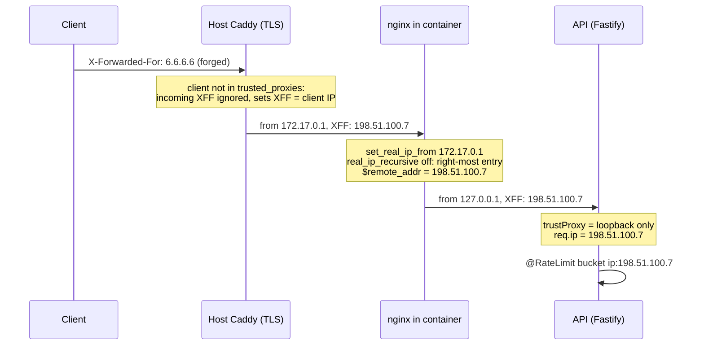
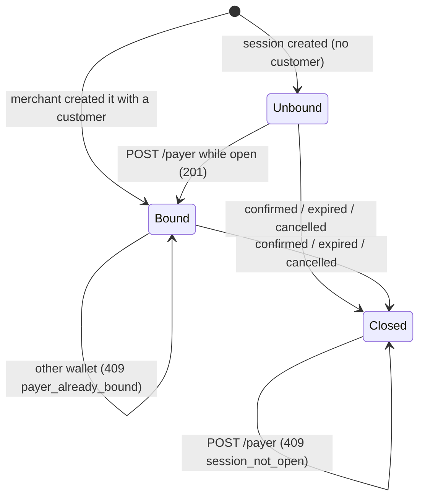

# ADR: Harden the public API surface: payer binding, rate limits, client address, bot checks and compliance scope

- **Status:** Accepted 2026-10-10
- **Date:** 2026-10-10
- **Scope:** `apps/api` (checkout payer routes, customers service, `@RateLimit` on every
  unguarded route, a trusted-proxy setting in `main.ts`, contact module, tokens metadata
  cache, Turnstile adapter, auth controller, compliance service), `infra/lightsail`
  (`nginx.conf` realip, `deploy.sh` port binding, README), `apps/web` (hosted checkout
  error copy, contact form Turnstile widget, signup page, `content/docs` compliance page),
  `packages/shared-types` (contact input gains `turnstileToken`), one operator change in
  the Privy dashboard and one check of the host Caddyfile. No Solidity change. No Prisma
  migration under the recommended decisions. No BullMQ job payload change. No webhook
  payload change.

## Context

Issue #133, written against `729e4d7`. Verified against `main` at `cda8f34`.

### Already fixed on `main`, not redone here

- **Per-admin limits no longer fall back to the IP.** The issue's claim is false on
  `cda8f34`. #125 (#222) changed `RateLimitInterceptor.subjectKey` to read
  `req.merchant` and `req.admin`
  (`apps/api/src/common/interceptors/rate-limit.interceptor.ts:85-91`). The two admin
  routes with `keyBy: 'actor'` (`admin.controller.ts:212,225`) sit behind the class
  guard `@UseGuards(AdminAuthGuard)` (`admin.controller.ts:61`), which sets `req.admin`
  (`common/guards/admin-auth.guard.ts:119-123`). Nest runs guards before interceptors,
  so the bucket is the admin id. Covered by
  `apps/api/test/unit/common/rate-limit-interceptor.test.ts:79` ("counts one admin
  across source addresses").
- **Hosted relay and relay API are limited.** `POST /v1/checkout/sessions/:id/relay` and
  `/plans/:id/relay` allow 20 a minute per IP, the two submission lookups 120 a minute
  per IP (`checkout.controller.ts:189,209,231,248`), and `/v1/relay/payments` and
  `/v1/relay/subscriptions` 60 a minute per merchant (`relay.controller.ts:76,97`),
  plus the daily relay budget (`docs/adr/ADR-2026-10-08-relay-abuse.md`).
- **Permit nonce reads are limited.** `GET /v1/tokens/:address/permit-nonce` allows 30 an
  hour per IP (`tokens.controller.ts:56`). The issue's "/v1/tokens have no rate limit"
  is half true: the metadata route is unlimited (item 3).

### What is still open

1. **`POST /v1/checkout/sessions/:id/payer` rebinds any session to anyone.** The route
   has no guard and no limit (`checkout.controller.ts:140-154`). It loads the session
   with `retrievePublic`, which ignores status and expiry
   (`payment-sessions.service.ts:129-140`), upserts a `Customer` for
   (session merchant, body wallet) and calls `linkCustomer`, an unconditional
   `UPDATE ... SET customerId` (`payment-sessions.service.ts:142-147`). So anyone holding
   a session id can:
   - rebind an open session that already has a payer, or one the merchant created with
     its own customer (`payment-sessions.service.ts:66-88`), to another wallet and email;
   - attach a customer to a session that is already `confirmed`. The indexer confirms a
     session without touching `customerId` (`apps/indexer/internal/store/projections.go:236-246`).
   - **Why it matters:** the scheduler mails the payment receipt to
     `session.customer.email` for every `confirmed` session with `customerNotifiedAt`
     null (`apps/scheduler/src/crons/payer-notifications/payer-notifications.service.ts:58-72,101`).
     A confirmed session whose payer never typed an email has no customer and is never
     notified, so an attacker can attach one later and have Strimz send a receipt
     (amount, merchant) to any address, from Strimz's sending domain.
   - **The email overwrite is wider than the session.** `upsertFromCheckout` replaces
     `Customer.email` for an existing (merchant, wallet) with whatever the body says
     (`customers.service.ts:69-84`). Wallet addresses are public on-chain, and plan ids
     are in public `/sub/:planId` URLs, so the plan variant (`checkout.controller.ts:165-178`)
     lets anyone redirect a known subscriber's future mail: subscription-charged receipts
     (`payer-notifications.service.ts:190-235`), refund receipts (`:250-302`) and agent
     recovery mail (`apps/agent/src/capabilities/recovery/recovery.service.ts:94`). The
     victim stops receiving them.
   - **Reproduced** in `apps/api/test/e2e/public-endpoint-hardening.e2e.test.ts` (Verification).
2. **The contact form has no rate limit and no bot check.** The browser posts straight to
   the API (`apps/web/src/components/marketing/contact-form.tsx:46`).
   `POST /v1/contact` (`contact.controller.ts:12-20`) has no guard, no `@RateLimit` and no
   Turnstile; the schema has no token field (`packages/shared-types/src/contact.ts:14-20`).
   Each request sends one email through Resend to `RESEND_REPLY_TO` with an
   attacker-chosen `replyTo` (`contact.service.ts:34-46`). The only bound is the global
   600 a minute per IP (`main.ts:44`). The path is not in `PUBLIC_CORS_PREFIXES`
   (`common/http/cors-policy.ts:7`), which stops other browser origins but not a script.
   A Resend failure is logged and the caller still gets `{ ok: true }`
   (`contact.service.ts:50-59`).
3. **`GET /v1/tokens/:address` is unlimited and uncached.** It is browser-public
   (`cors-policy.ts:7`), has no `@RateLimit` (`tokens.controller.ts:38-43`), and each call
   makes up to six RPC reads (`isWhitelisted`, `getCapabilities`, `name`, `symbol`,
   `decimals`, then `eip712Domain` or `version`; `tokens.service.ts:54-120`). Caching is
   off by design (`tokens.service.ts:23-27`). At 600 requests a minute per address that
   is up to 3,600 RPC reads a minute against Strimz's provider quota, per attacker IP.
4. **The client address the limits key on.** Every per-IP bucket, in the interceptor
   (`rate-limit.interceptor.ts:90`) and in `@fastify/rate-limit` (default key
   `request.ip`), uses `req.ip`.
   - `trustProxy: true` (`main.ts:19`). Fastify 5.8.4 (installed) then trusts every hop
     and `req.ip` is the left-most `X-Forwarded-For` entry. Checked against the installed
     package: with socket `127.0.0.1` and `X-Forwarded-For: 6.6.6.6, 198.51.100.7` the IP
     is `6.6.6.6`.
   - nginx appends (`$proxy_add_x_forwarded_for`, `infra/lightsail/nginx.conf:65`), so
     whatever arrives at nginx is kept and extended.
   - The host Caddy is not in the repository. Its docs say that for `X-Forwarded-*`
     headers "by default, the proxy will ignore their values from incoming requests, to
     prevent spoofing", unless the peer is listed in `trusted_proxies`
     ([Caddy `reverse_proxy` docs, Defaults](https://caddyserver.com/docs/caddyfile/directives/reverse_proxy)).
     `api.strimz.finance` resolves to `3.227.73.167` and answers with `via: 1.1 Caddy`,
     with no CDN in front (checked 2026-10-10). So **in production today the left-most
     entry is probably the real client**, but only because of a Caddyfile nobody can
     review here: a `trusted_proxies` line or a `header_up X-Forwarded-For` would make
     every per-IP limit forgeable.
   - `deploy.sh:94` publishes the container with `-p "$HTTP_PORT:80"`, on all interfaces.
     Port 8080 did not answer from outside on 2026-10-10 (Lightsail firewall), but if it
     were opened, a client could reach nginx directly and write its own left-most entry.
   - Fastify's current docs say a numeric hop count "is disabled because it cannot
     validate the immediate peer"
     ([Fastify server docs, trustProxy](https://fastify.dev/docs/latest/Reference/Server/#trustproxy));
     5.8.4 still accepts it, but `fastify: ^5.2.1` (`apps/api/package.json`) can pick up
     a release that does not.
5. **Bot protection on signup is cosmetic.**
   - The signup page verifies its Turnstile token against the web app's own route
     `POST /api/auth/turnstile/verify` (`apps/web/src/app/(auth)/signup/page.tsx:116-160`),
     which returns `{ ok: true, mode: 'disabled' }` when `TURNSTILE_SECRET_KEY` is unset
     (`apps/web/src/app/api/auth/turnstile/verify/route.ts:43-49`).
   - The check gates only the browser opening Privy. The login page opens Privy with no
     Turnstile at all (`apps/web/src/app/(auth)/login/page.tsx:15-20`); a new email that
     logs in there gets a merchant from `POST /v1/auth/sync`
     (`apps/web/src/app/(auth)/callback/page.tsx:39`), which only verifies the Privy token
     (`auth.controller.ts:38-47`, `auth.service.ts:50-53`). The Privy webhook also creates
     merchants on `user.authenticated` (`privy-webhook.service.ts:7-13,38`). This is the
     "not checked server-side on sync" in the issue: true, and wider than sync.
   - The API's own `POST /v1/auth/turnstile/verify` (`auth.controller.ts:30-36`) is not
     called by any client (`rg turnstile/verify apps/web/src` finds only the web route).
     Its adapter passes every token when the secret is unset
     (`infra/turnstile/turnstile.service.ts:18-23,38`); the env var is optional
     (`config/env.schema.ts:28`). "Silently off" is accurate apart from one boot warning.
6. **Compliance screening never runs, and the docs say it does.**
   - `ComplianceService.screen` (`modules/compliance/compliance.service.ts:60-81`) has no
     caller: `rg "\.screen\(|ComplianceService" apps/api/src` finds only the module, its
     controller (log listing, `compliance.controller.ts:19-30`) and `app.module.ts:66`.
   - It would fail open if called: no key returns `clear`
     (`compliance.service.ts:111`, warned at boot `:53-57`); a provider error returns
     status `error` (`:132-135,153-156,178-180,196-198`) and nothing defines what a caller
     does with `error`. TRM is called with `chain: 'ethereum'` (`:130`). Production runs
     `COMPLIANCE_PROVIDER=disabled` by default (`env.schema.ts:91`,
     `infra/lightsail/env.example:87`).
   - The public docs describe a different system: screening at merchant signup and at
     payer connect, a Redis cache, Circle Compliance Engine, and "The `StrimzPayments`
     contract refuses to settle unless the screening endpoint returns a `cleared` decision"
     (`apps/web/content/docs/concepts/compliance.mdx:8-12,14-20,42-48,61-63`). None of that
     exists. The acceptable-use page says payer wallets are screened "when the compliance
     integration is enabled" (`apps/web/src/app/(marketing)/legal/acceptable-use/page.tsx:103-108`).
     Webhook types `compliance.wallet_flagged` and `compliance.wallet_blocked`
     (`packages/shared-types/src/webhooks.ts:39-40`) and SDK error `compliance_blocked`
     (`packages/sdk/src/errors.ts:22`) are published and never produced.
   - **What protects payments today:** Arc enforces Circle's USDC blocklist in the
     protocol: a blocklisted sender is rejected before the mempool, and a `transfer` or
     `transferFrom` with a blocklisted `from` or `to` reverts
     ([Arc docs, Monitor blocklist compliance](https://docs.arc.io/integrate/infrastructure/compliance)).
     The relay simulates every call with `eth_call` before queueing
     (`relay.service.ts:172`), so a blocklisted payer's payment is refused with
     `400 relay_simulation_failed` and costs no gas. This covers Circle's blocklist, not
     a risk score; whether EURC on Arc carries the same blocklist was not verified.

### Every route with no guard, and its limit today

Nest guards are per controller here; there is no global guard, so `@Public()` matters
only where a controller also has a guard. The table lists every handler with no guard
(found by `public-endpoint-hardening.e2e.test.ts`, "route declarations") plus the two raw
Fastify routes. "Global" is `@fastify/rate-limit`, 600 a minute per `req.ip`, in memory.

| Route                                              | Where                            | Cost per call                                     | Limit today | Proposed (per IP unless stated)       |
| -------------------------------------------------- | -------------------------------- | ------------------------------------------------- | ----------- | ------------------------------------- |
| `GET /health`, `GET /ready`                        | `health.controller.ts:19,25`     | none                                              | global      | global (exempt from `@RateLimit`)     |
| `GET /openapi.json`, `GET /docs`                   | `main.ts:77-105`                 | static                                            | global      | global                                |
| `POST /v1/auth/privy-webhook`                      | `privy-webhook.controller.ts:47` | signature check, Privy API call                   | global      | global (signature is the credential)  |
| `POST /v1/auth/sync`                               | `auth.controller.ts:38`          | Privy token verify, `getUser`, merchant upsert    | global      | 30 / min                              |
| `POST /v1/auth/turnstile/verify`                   | `auth.controller.ts:30`          | Cloudflare call                                   | global      | removed (D6)                          |
| `POST /v1/contact`                                 | `contact.controller.ts:12`       | one Resend email                                  | global      | 5 / hour, plus Turnstile (D7)         |
| `GET /v1/checkout/merchants/:id`                   | `checkout.controller.ts:65`      | one DB read                                       | global      | 120 / min                             |
| `GET /v1/checkout/sessions/:id`                    | `checkout.controller.ts:78`      | one DB read                                       | global      | 120 / min                             |
| `GET /v1/checkout/plans/:id`                       | `checkout.controller.ts:91`      | one DB read                                       | global      | 120 / min                             |
| `GET /v1/checkout/plans/:id/subscription`          | `checkout.controller.ts:105`     | two DB reads                                      | global      | 60 / min                              |
| `GET /v1/checkout/plans/:id/terms`                 | `checkout.controller.ts:121`     | DB reads                                          | global      | 60 / min                              |
| `POST /v1/checkout/sessions/:id/payer`             | `checkout.controller.ts:140`     | customer upsert, session write                    | global      | 10 / min, plus binding rules (D1, D2) |
| `POST /v1/checkout/plans/:id/payer`                | `checkout.controller.ts:165`     | customer upsert                                   | global      | 10 / min, plus D2                     |
| `POST /v1/checkout/sessions/:id/relay`, plan relay | `checkout.controller.ts:189,209` | simulation, relay job                             | 20 / min    | unchanged                             |
| `GET .../submissions/:key` (two)                   | `checkout.controller.ts:231,248` | DB / queue read                                   | 120 / min   | unchanged                             |
| `GET /v1/tokens/:address`                          | `tokens.controller.ts:38`        | up to 6 RPC reads                                 | global      | 60 / min, plus 10-minute cache (D9)   |
| `GET /v1/tokens/:address/permit-nonce`             | `tokens.controller.ts:56`        | one RPC read                                      | 30 / hour   | unchanged                             |
| `GET /store/:slug`                                 | `storefronts.controller.ts:102`  | DB reads                                          | global      | 120 / min                             |
| `POST /store/:slug/products/:productId/checkout`   | `storefronts.controller.ts:116`  | session insert, stock decrement, registration job | global      | 10 / min                              |
| `POST /v1/admin/invites/accept`                    | `admin.controller.ts:294-296`    | Privy session guard                               | 20 / 15 min | unchanged                             |

The interceptor's buckets are in process memory (`rate-limit.interceptor.ts:32`), which
is right for the single Lightsail container and resets on every restart.

## Decision

1. **Payer binding (D1, D2).** `POST /v1/checkout/sessions/:id/payer`:
   - answers `409 session_not_open` unless the session status is `created` or
     `awaiting_payment` and `expiresAt` is in the future;
   - binds with one conditional write
     (`UPDATE ... WHERE id = $1 AND status IN (open) AND (customerId IS NULL OR customerId = $customer)`);
     if the session is already bound to a customer with another wallet, it answers
     `409 payer_already_bound` and changes nothing; the same wallet again is idempotent
     (`201`, same `customerId`);
   - both payer routes create a `Customer` when none exists for (merchant, wallet), and
     set `email` on an existing one only when it is null. They never replace a non-null
     email. `emailHistory` is not extended by a refused change.
   - The plan route also refuses an archived plan with `409 plan_not_active`.
2. **Every unguarded route declares `@RateLimit`** with the values in the table, except
   `/health`, `/ready` and the Privy webhook. A test enumerates the routes and fails on
   any new unguarded handler without a limit.
3. **The client address comes from a fixed proxy chain (D4, D5).**
   - nginx resolves the client with the realip module and forwards one address:
     `set_real_ip_from 172.17.0.1;` (the Docker bridge gateway Caddy reaches the container
     through), `real_ip_header X-Forwarded-For;`, `real_ip_recursive off;` (take the
     right-most entry, the one Caddy wrote), and
     `proxy_set_header X-Forwarded-For $remote_addr;` in place of the append.
   - The API trusts only the local nginx:
     `trustProxy: TRUSTED_PROXIES` with `['127.0.0.1', '::1']`, exported from a new
     `apps/api/src/common/http/trust-proxy.ts`. A request whose socket is not loopback
     keeps its socket address whatever headers it carries.
   - Both changes ship in the same image (`Dockerfile.lightsail` copies `nginx.conf`), so
     they cannot be deployed apart.
   - `deploy.sh` binds the published port to loopback when a host proxy is in front
     (`-p "127.0.0.1:$HTTP_PORT:80"`, chosen by a `BIND_ADDR` variable that defaults to
     `127.0.0.1` when `HTTP_PORT` is not 80).
   - The operator confirms the Caddyfile (rollout).
4. **Signup bot check moves into Privy (D6).** Enable Privy's login CAPTCHA with Cloudflare
   Turnstile in the Privy dashboard; Privy then pre-validates every login attempt, on the
   signup page, the login page and any script
   ([Privy docs, CAPTCHA](https://docs.privy.io/authentication/user-authentication/captcha)).
   Remove the signup page's own widget, `apps/web/src/app/api/auth/turnstile/verify/route.ts`,
   and `POST /v1/auth/turnstile/verify` with `AuthService.verifyTurnstile`.
5. **Contact form (D7).** `contactRequestInputSchema` gains `turnstileToken`; the contact
   form renders the Turnstile widget with `action: 'contact'`; the API verifies it with
   `TurnstileService.verify(token, req.ip, 'contact')` and answers
   `403 bot_check_failed` before sending anything. `TurnstileService` throws at
   construction when `NODE_ENV=production` and `TURNSTILE_SECRET_KEY` is unset, so the
   API refuses to boot rather than run with the check off. A Resend failure answers
   `502 email_unavailable` instead of `{ ok: true }`.
6. **Token metadata (D9).** `TokensService.getMetadata` caches whitelisted results in
   process for 10 minutes, keyed by lowercase address; a `404 token_not_whitelisted` is
   not cached.
7. **Compliance (D8): the maintainer chooses; the recommendation is option A for launch**
   (Alternatives (e)): screening stays off, explicitly.
   - `ComplianceService` throws at construction when the provider is `trm` or `elliptic`
     and `COMPLIANCE_API_KEY` is unset, and logs `compliance screening disabled` at boot
     when the provider is `disabled`.
   - `screen()` and the adapters stay for option B, with one rule written into it: a
     result of `error` is a block.
   - `content/docs/concepts/compliance.mdx` is rewritten to what is true: Arc's protocol
     blocklist and relay simulation, no third-party screening, no compliance webhooks yet.
   - The acceptable-use and privacy pages keep "when enabled" and gain one sentence saying
     it is not enabled.

## Diagram

## Consequences

- A session id or plan id no longer lets a stranger read or redirect a payer's mail.
  The remaining exposure: someone holding an open session's URL can bind it first, and
  the real payer then gets `409` and needs a new link. Session ids are cuids
  (`packages/db/prisma/schema/payments.prisma:4`) and only travel in the checkout URL.
- A payer who connects wallet A, types an email, then switches to wallet B on the same
  session gets `409 payer_already_bound`. The hosted page shows "This checkout is linked
  to another wallet. Reconnect it, or ask the merchant for a new link." Today that switch
  silently rebinds.
- A payer whose email changed cannot update it through checkout once the merchant knows
  them, and the customers API has no update route today (`customers.controller.ts:19-37`
  is create, retrieve, list). Strimz support changes it by hand until D1 option (b).
- Per-IP limits key on the real client wherever Caddy runs as documented. If the
  realip address is wrong (Docker gateway not `172.17.0.1`), every client shares one
  bucket; the rollout checks this before relying on it.
- Busy shared NATs (offices, mobile carriers) can meet the per-IP limits. The checkout
  limits are well above one payer's needs (a checkout makes about 5 reads and 1 to 3
  attaches).
- The API refuses to boot in production without `TURNSTILE_SECRET_KEY`, and with a
  compliance provider but no key. Both are louder than today, on purpose (Directive 4).
- Signup loses its visible widget; Privy shows its own invisible CAPTCHA. The web CSP
  already allows `challenges.cloudflare.com` (`apps/web/next.config.mjs:21`); Privy's
  CSP guide may require more.
- Compliance under option A: Strimz's relayer still submits for any address that is not
  on Circle's blocklist. Payers with high risk scores but no blocklist entry pay
  normally. That is the cost of A; B or C reduce it.

## Alternatives considered

### (a) Payer binding

- **Chosen: open sessions only, first bind wins, same wallet is idempotent, never replace
  a known email.** No migration, no extra wallet prompt.
- **Signed proof.** The hosted page asks the wallet to sign an EIP-712
  `AttachPayer(sessionId, email)` message and the API checks the signer equals
  `walletAddress`; rebinding and email changes are then allowed. Lost for launch: one
  more wallet prompt in checkout and a new typed-data definition in
  `@strimz/shared-crypto` (published, minor). The right end state for email changes.
- **Carry the email in the relay request.** The relay body already holds a signature
  only the payer has; the API links the customer for `auth.from` when it accepts the
  relay, and the two public payer routes go away. Lost for launch: relay DTO and both
  checkout pages change, and a payer who closes the page before signing leaves no
  email. Worth doing with the signed-proof work.
- **Rate limit only.** Lost: one request is enough to redirect a subscriber's mail.

### (b) Client address

- **Chosen: nginx realip with the Caddy hop listed; API trusts loopback only.** The
  right-most entry is taken at each hop, so a forged left-most entry is ignored even if
  Caddy were changed to append.
- **API trusts loopback plus `172.17.0.1`, nginx keeps appending.** Same result today;
  lost because it puts a Docker detail in the API and still depends on Caddy dropping
  client headers.
- **`trustProxy: 2` (hop count).** Lost: Fastify documents hop counts as unsafe and
  disabled in current docs; it also trusts whatever sits two hops away.
- **Leave `trustProxy: true` and rely on Caddy.** Lost: correct only while an
  unreviewed file stays as it is.

### (c) Signup bot check

- **Chosen: Privy CAPTCHA.** Enforced by Privy on every login attempt, so it covers the
  login page, the webhook path and scripts.
- **Require a Turnstile token on `/v1/auth/sync` for a new merchant and stop the
  webhook from creating merchants.** Lost: a Turnstile token expires after 300 seconds
  and is single use, but email OTP login sits between the widget and sync; it needs a
  signed "bot check passed" ticket shared between web and API.
- **Keep the web-only check and make it fail closed.** Lost: still bypassed by the login
  page and by scripts.

### (d) Contact form

- **Chosen: Turnstile verified by the API plus 5 an hour per IP.**
- **Rate limit only.** Lost: rotating addresses spam the support inbox at Resend's cost.
- **Move the form to a Vercel route with Vercel Firewall rate limiting.** Lost: a new
  surface and a second secret; the API already has the adapter.

### (e) Compliance scope

- **A. No third-party screening at launch, explicitly (recommended).** Arc's blocklist
  and relay simulation cover Circle-blocklisted payers at no cost. Work: the config
  checks, the boot log, and the docs rewrite, one small PR. Cost: no risk scoring;
  Strimz relays for addresses that are not blocklisted but are high risk.
- **B. Screen payer and merchant wallets with a named provider, fail closed.** Screen
  `auth.from` (hosted relay, both routes) and the permit owner before simulation, and
  the merchant payout address when onboarding completes; `blocked`, `flagged` above
  threshold, or `error` refuses with `403 wallet_screening_failed` and writes a
  `ComplianceLog`; results cached 24 hours. Provider choice: Chainalysis's free
  sanctions API (sanctions lists only, no risk score; key and endpoint not verified
  here), or TRM / Elliptic under contract (the adapters exist but call TRM with
  `chain: 'ethereum'`, and neither was tested against a live account). Cost: about 3 to
  5 days with tests, one outbound call per relay (latency), payments stop when the
  provider is down, and vendor terms for B with TRM or Elliptic.
- **C. Index Arc's `Blocklisted` / `UnBlocklisted` events and refuse blocklisted payers
  before simulation, and refuse onboarding of a blocklisted payout address**
  ([Arc docs, Index blocklist events](https://docs.arc.io/integrate/infrastructure/indexing-events#step-5-index-blocklist-events)).
  Adds a clear error and a log to what the chain already enforces; no vendor. Cost: a new
  indexer projection and table (migration). Mostly cosmetic under A.

## Decisions for the maintainer

- **D1. Payer binding rule.** Recommended: open sessions only, first bind wins, same
  wallet idempotent (`409 session_not_open`, `409 payer_already_bound`). Alternatives:
  signed proof; email in the relay request (Alternatives (a)).
- **D2. Existing customer email.** Recommended: public routes fill a null email and never
  replace one. Alternative: replace only with a signed proof (D1 (b)).
- **D3. Limits.** Recommended: the "Proposed" column of the table, all per IP in the
  interceptor; global 600 a minute stays. Alternative values are a one-line change each.
- **D4. Client address.** Recommended: nginx realip (`set_real_ip_from 172.17.0.1`,
  right-most entry) and API `trustProxy` loopback only. Alternatives: API trusts loopback
  plus the Docker gateway; hop count (not recommended).
- **D5. Port binding.** Recommended: `deploy.sh` publishes on `127.0.0.1` when a host proxy
  fronts the container. Alternative: leave it and rely on the Lightsail firewall.
- **D6. Signup bot check.** Recommended: Privy CAPTCHA with Turnstile, remove Strimz's
  signup Turnstile (web route, widget, API endpoint). Alternative: sync-time check with a
  signed ticket (Alternatives (c)).
- **D7. Contact form.** Recommended: API-verified Turnstile (`action: 'contact'`), 5 an
  hour per IP, boot failure without the secret in production, and `502` when Resend
  fails. Alternative: rate limit only.
- **D8. Compliance scope for launch.** Recommended: A, with the docs corrected before any
  further marketing of screening, and B (Chainalysis free sanctions API) revisited before
  live-mode volume grows or if counsel asks. Alternatives: B now; C.
- **D9. Token metadata cache.** Recommended: in process, 10 minutes, positive results
  only. Alternative: Redis, shared with nothing else today.
- **D10. Published compliance types.** Recommended: keep `compliance.wallet_*` webhook
  types and `compliance_blocked` in the packages (removing them is a major change), and
  say in the docs they are not emitted yet. Alternative: deprecate in the next minor.

## Existing integrations and rollout

- **Suggested split into five PRs**, each small and independently safe:
  1. **API + nginx: client address and limits.** Decision 2, 3 and 6. One image.
  2. **API + web: payer binding.** Decision 1 and the hosted page's `409` copy.
  3. **shared-types + web + API: contact form.** Decision 5. Web part merges first.
  4. **Web + Privy dashboard: signup bot check.** Decision 4. Operator enables Privy
     CAPTCHA before the web PR merges.
  5. **API + docs: compliance.** Decision 7. The docs part can merge on its own first.
- **API on Lightsail, redeployed by hand; the maintainer defers the redeploy until the
  launch fixes are done.** Until then production keeps every gap in Context: payer
  rebinding and email redirection, unlimited contact and token reads, signup without a
  server-side bot check. Nothing in this ADR needs a database change, so the redeploy is
  the image swap `deploy.sh` already does.
- **Web on Vercel, deploys on merge.** Safe order:
  - Contact: the web form sends `turnstileToken` first. The current API strips unknown
    keys (`createZodDto` over a non-strict `z.object`), so the old API keeps working.
    The API that requires the token must not reach Lightsail before that web deploy.
  - Payer: the web change only adds copy for the new `409` codes; it can ship before or
    after the API. Today's error path already shows the API message
    (`apps/web/src/lib/checkout-payer.ts:28-34`).
  - Signup: enable Privy CAPTCHA in the dashboard first, then merge the web PR that
    removes the widget. Removing the API endpoint is safe at any time (no caller).
  - Compliance docs: ship now; they only remove false claims.
- **Operator steps outside the repository:**
  1. On the Lightsail host, show the Caddy site block for `api.strimz.finance`
     (`sudo cat /etc/caddy/Caddyfile`) and `caddy version`. Confirm there is no
     `trusted_proxies` and no `header_up X-Forwarded-For` (or `X-Real-IP`). Caddy must be
     v2.x with the documented default; send the block to the PR for the record.
  2. Before the API redeploy, inside the new container: `nginx -V 2>&1 | tr ' ' '\n' | grep realip`
     shows `--with-http_realip_module`, and
     `docker network inspect bridge -f '{{(index .IPAM.Config 0).Gateway}}'` on the host
     prints `172.17.0.1`. If not, change `set_real_ip_from` before deploying.
  3. Redeploy with `deploy.sh` (now binding `127.0.0.1:8080`), then from outside:
     `curl -s https://api.strimz.finance/health -H 'X-Forwarded-For: 6.6.6.6'` and in
     `docker logs` the access line shows the real client address, not `6.6.6.6`.
  4. Privy dashboard: enable CAPTCHA (Cloudflare Turnstile) for the production app.
  5. Cloudflare: create a Turnstile widget for `strimz.finance` with action `contact` if
     the existing signup widget's hostname list does not cover the marketing site; set
     `NEXT_PUBLIC_TURNSTILE_SITE_KEY` on Vercel and `TURNSTILE_SECRET_KEY` in the
     Lightsail env file (`infra/lightsail/env.example:62`). The API will not boot in
     production without the secret.
- **SDK.** `@strimz/sdk` does not call the payer, contact or Turnstile routes. Its token
  metadata reads (`/v1/tokens/:address`) gain a `429` at 60 a minute per IP; one checkout
  reads it once or twice.

## Migration, versioning, docs

- **Migration:** none under the recommended D1, D2, D8. Option C or a payer-email column
  would add one.
- **Changesets:** `@strimz/shared-types` minor (contact input gains `turnstileToken`,
  optional in the type so old clients compile; the API requires it). No change to
  `@strimz/sdk`, `@strimz/sdk-react`, `@strimz/shared-config` or `@strimz/shared-crypto`
  under the recommended decisions; D1 (b) would add a `@strimz/shared-crypto` minor.
- **Docs:** `apps/web/content/docs/concepts/compliance.mdx` rewritten; the hosted checkout
  docs gain the two `409` codes; `infra/lightsail/README.md:83,103` explains the loopback
  binding and the Caddy check; `infra/lightsail/env.example` marks `TURNSTILE_SECRET_KEY`
  required; release notes `docs/release-notes/<date>-public-endpoint-hardening.md` with
  `scenario-impact: updated`.
- **Existing tests that change:** `apps/api/test/e2e/auth.e2e.test.ts:20-50` (three
  `/v1/auth/turnstile/verify` cases) are deleted with the route under D6; contact tests
  send `turnstileToken`.
- **Comments a human must correct** (Directive 6; the agent edits none):
  - `apps/api/src/common/decorators/rate-limit.decorator.ts:3-6` names only admin invite
    and permit nonce as tightened routes.
  - `apps/api/src/common/interceptors/rate-limit.interceptor.ts:22-25` says ten minutes
    is "well past the longest window we set today (1h ...)"; it is already shorter, and
    the contact limit adds another 1-hour window.
  - `apps/api/src/modules/contact/contact.service.ts:24-33,54-56` ("Deliberately do NOT
    rethrow") becomes false under D7.
  - `apps/api/src/modules/tokens/tokens.service.ts:23-27` ("Caching is deliberately
    omitted") becomes false under D9.
  - `apps/api/src/infra/turnstile/turnstile.service.ts:7-9,26,74` describe a disabled
    mode and a dev fail-open that D7 removes (line 74 is already wrong: it always
    returns false).
  - `apps/api/src/modules/auth/auth.service.ts:25-30` and
    `apps/web/src/app/(auth)/signup/page.tsx:124-131` go away with their code under D6;
    listed so the reviewer checks nothing else refers to them.
  - `packages/shared-types/src/compliance.ts:4-6` says every wallet "is screened"; false
    today and under A.
  - `apps/api/src/modules/checkout/checkout.dto.ts:4-9` stays true.

## Verification

- **Red first, failing on `main` at `cda8f34`** (run 2026-10-10, Docker testcontainers):
  - `apps/api/test/e2e/public-endpoint-hardening.e2e.test.ts`, 13 tests, 12 fail:
    - rebind an open session to another wallet: `409 payer_already_bound`, `customerId`
      unchanged (`main`: `201`, rebinds);
    - attach to a `confirmed` session: `409 session_not_open`, `customerId` stays null
      (`main`: `201`);
    - attach to an open session past `expiresAt`: `409 session_not_open` (`main`: `201`);
    - session route with a known customer's wallet and a new email: email unchanged
      (`main`: becomes `attacker@evil.test`);
    - plan route, same (`main`: overwritten);
    - session payer route: the 11th attach in a minute from one address is `429`
      (`main`: `201`);
    - contact without `turnstileToken`: `403 bot_check_failed`, no email sent (`main`:
      `201`, email sent);
    - contact: the 6th submission in an hour is `429` (`main`: `201`);
    - token metadata: the 61st read in a minute is `429` (`main`: `404`);
    - storefront checkout: the 11th in a minute is `429` (`main`: `201`);
    - `POST /v1/auth/turnstile/verify`: `404` (`main`: `200`);
    - every unguarded handler declares `@RateLimit` except health and the Privy webhook
      (`main`: 13 missing, `AuthController.sync` through `TokensController.getMetadata`).
    - Passes on `main` and guards the change: the same wallet attaching twice is `201`
      with the same `customerId`.
  - `apps/api/test/unit/common/trust-proxy.test.ts`, 4 tests, all fail: the two
    `TRUSTED_PROXIES` cases fail on the missing module
    `src/common/http/trust-proxy.ts` (expected: from `127.0.0.1` with
    `X-Forwarded-For: 6.6.6.6, 198.51.100.7` the IP is `198.51.100.7`; from `203.0.113.5`
    with a forged header the IP is `203.0.113.5`); the two `nginx.conf` checks fail on the
    missing realip lines and on `$proxy_add_x_forwarded_for`. Until the module exists,
    `tsc -p tsconfig.test.json` reports TS2307 for this file, so preflight is red by
    design between red and green.
  - `apps/api/test/unit/infra/turnstile-config.test.ts`, 2 tests: "refuses to start in
    production without a secret" fails (`main` only warns); the with-secret case passes.
  - `apps/api/test/unit/modules/compliance/compliance-config.test.ts`, 3 tests: `trm` and
    `elliptic` without a key fail (`main` only warns); `disabled` passes.
- **Not red against `main`:**
  - `main.ts` wiring of `TRUSTED_PROXIES` and the global limiter: `bootstrap` is not
    exported and the test app builds its own `FastifyAdapter`
    (`test/helpers/test-app.factory.ts:72`). Checked by hand after redeploy (operator
    step 3).
  - Privy CAPTCHA is dashboard configuration; checked by hand: a scripted
    `privy.login` without the CAPTCHA fails, and the login page shows the invisible
    challenge.
  - The hosted page's `409` copy and the contact widget are checked by hand in light and
    dark mode.
  - Compliance docs: reviewed by the maintainer. Option B or C get their own red tests
    if chosen.
  - The token metadata cache gets a unit test with a counting fake chain during build.
  - `409 plan_not_active` on the plan payer route: `retrievePublic` returns archived plans
    (`subscription-plans.service.ts:93-101`); its test is written during build.
- `./scripts/preflight.sh` in full.
- **On Arc testnet after the redeploy:** pay a hosted session end to end and record the
  transaction hash; receipt arrives at the typed email; a second attach from another
  wallet answers `409`; switching wallets mid-checkout shows the new copy; a burst of 11
  attaches from one machine sees `429`; operator step 3 shows the real client address.
